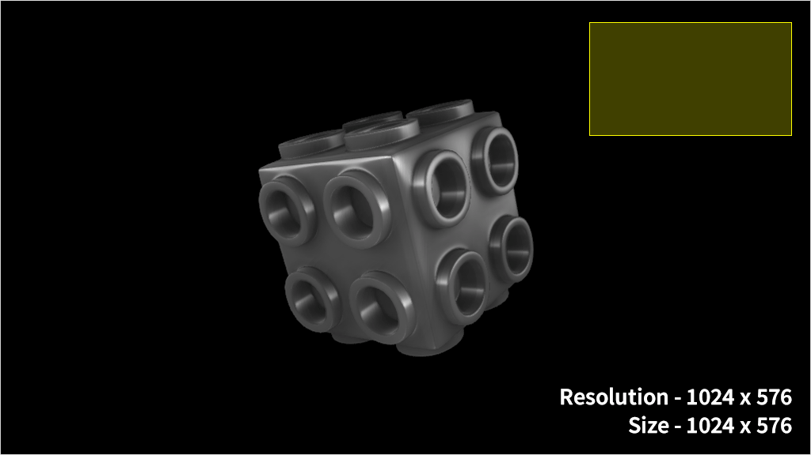
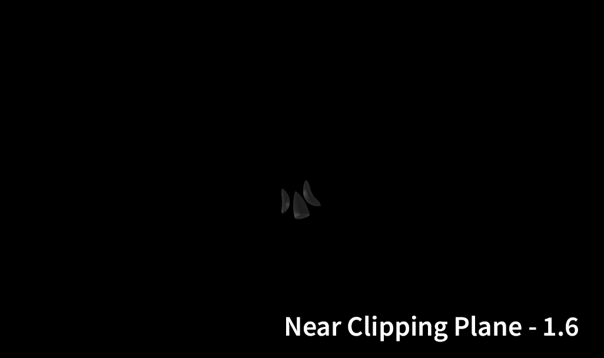

# Camera

## Size and Resolution

The relationship between `Size` and `Resolution` can be thought of as being like the relationship between your monitor's display resolution \(the physical pixel dimensions available\) and the resolution setting in your OS's display settings. You could have a 4K monitor, with a display resolution of 3840 x 2160 pixels, but have your OS's display resolution set to 800 x 600. This would stretch the much smaller display resolution to fit your display.

Similarly, `Resolution` defines, in pixels, the resolution of the targeted display, while `Size` defines the dimensions of the area of *3D* space, that will be shown on that display. If `Size` and `Resolution` are different values, then the image will be stretched and/or squashed. This may be okay for _3D_ elements, but _2D_ graphics are made up of pixels, and will have lower resolution when scaled up.

It is therefore recommended that you set `Size` to be the exact same value as `Resolution`, or at least the same _ratio,_ unless you have a good reason for doing otherwise.

## Angle of View

`Angle of View` determines how much of a **Scene** can be seen by the **Camera**, much like the focal length of a camera lens. Increasing the AOV will make off-camera **Objects** progressively appear in the periphery of the screen and will therefore increase the amount of perspective distortion. Conversely, lower AOV levels will show a smaller range of **Objects**, with lower perspective distortion, and are good for more orthographic views.

## Near / Far Clipping Plane

Clipping planes define the range that will be rendered, in relation to the position of the camera.

`Near Clipping Plane` determines the _minimum_ depth that will be rendered, while `Far Clipping Plane` determines the _maximum_ depth. Anything that falls outside of this range will be ignored when rendering the frame.

