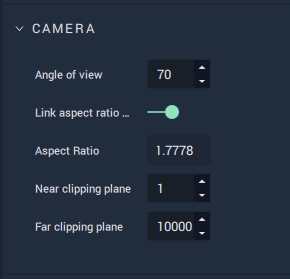
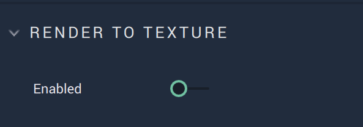
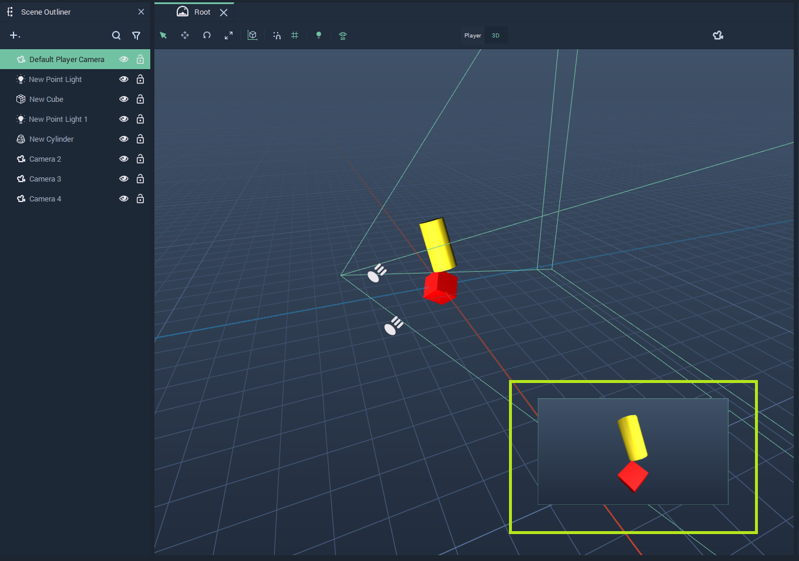
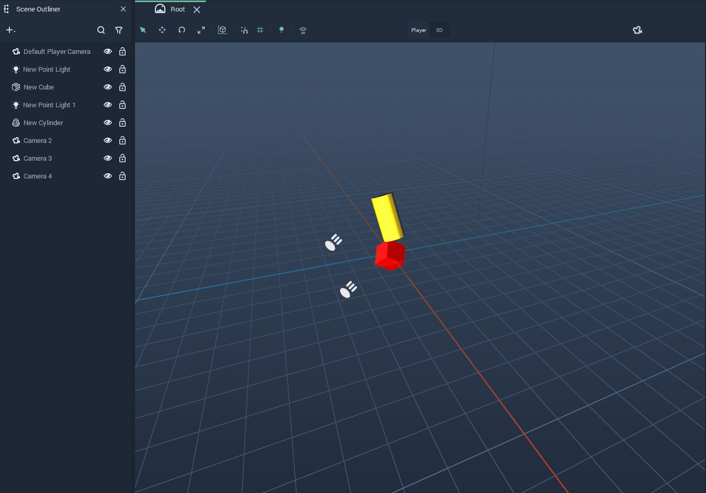
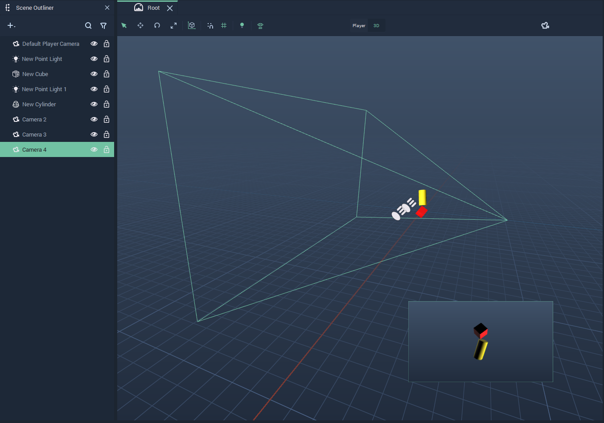

# Camera

**Camera** **Objects** determine which part of a **Scene** is shown on the **Screen** and how.

Every **Scene** comes with a default **Player Camera** that is created when the **Scene** is created. The **Player Camera** is the **Camera** that is played when a **Scene** starts, and it can be set on the **Attributes** of the **Scene**.

**Camera** **Objects** can be handled as any other **Object** in **Incari**, they have **Transformation Attributes** with which they can be *translated* and *rotated*.

Besides the usual **Attributes**, **Camera** **Objects** have a particular set of **Attributes** that allow the user to configure the **Camera**. These are described in detail in [**Camera Attributes**](#camera-attributes).

A **Scene** can have multiple **Cameras** and they are managed in the **Logic** using the [**Camera Nodes**](#camera-nodes).

There are several features that allow the user to know how a **Camera** will show the **Scene** while working on editing said **Scene**:

* In the **Viewport**, the [**Player mode**](#player-mode) shows what the **Player Camera** will show when running the **Project**.

* [**Picture-in-Picture**](#picture-in-picture): By selecting a **Camera** in the **Scene Outliner**, the user can see at the bottom-right corner of the **Viewport** how the **Scene** looks like through that **Camera**.

* [**Look Through**](#look-through): Mode that allows the user to see in the **Viewport** what a **Camera** shows.

<!-- ## Size and Resolution

The relationship between `Size` and `Resolution` can be thought of as being like the relationship between your monitor's display resolution \(the physical pixel dimensions available\) and the resolution setting in your OS's display settings. You could have a 4K monitor, with a display resolution of 3840 x 2160 pixels, but have your OS's display resolution set to 800 x 600. This would stretch the much smaller display resolution to fit your display.

Similarly, `Resolution` defines, in pixels, the resolution of the targeted display, while `Size` defines the dimensions of the area of *3D* space, that will be shown on that display. If `Size` and `Resolution` are different values, then the image will be stretched and/or squashed. This may be okay for _3D_ elements, but _2D_ graphics are made up of pixels, and will have lower resolution when scaled up.

It is therefore recommended that you set `Size` to be the exact same value as `Resolution`, or at least the same _ratio_, unless you have a good reason for doing otherwise.

 -->

## Camera Attributes

There are some **Attributes** that are specific for **Cameras**. These are the following:

### Angle of View

`Angle of View` determines how much of a **Scene** can be seen by the **Camera**, much like the focal length of a camera lens. Increasing the AOV will make off-camera **Objects** progressively appear in the periphery of the screen and will therefore increase the amount of perspective distortion. Conversely, lower AOV levels will show a smaller range of **Objects**, with lower perspective distortion, and are good for more orthographic views.

### Link Aspect Ratio to Screen

When this **Attribute** is enabled, the *aspect ratio* of the **Camera** is obtained from the **Screen**. If it is disabled, the `Aspect Ratio` **Attribute** can be directly edited.

### Aspect Ratio

This **Attribute** determines the *aspect ratio*. If `Link Aspect Ratio to Screen` is enabled, it is obtained from the **Screen's** **Attributes** and cannot be edited. Otherwise, it can be set at the user's discretion.

### Near / Far Clipping Plane

Clipping planes define the range that will be rendered, in relation to the position of the camera.

`Near Clipping Plane` determines the _minimum_ depth that will be rendered, while `Far Clipping Plane` determines the _maximum_ depth. Anything that falls outside of this range will be ignored when rendering the frame.

### Render to Texture

This **Attribute** is used to render the **Scene** from the viewpoint of the **Camera** into a texture. When enabled, the resulting texture is added to the **Asset Database** and can be used for all **Objects** which allow for textures (such as **Materials**, **Sprites**, or **Images**). It is removed again when the **Attribute** is disabled. 

This **Attribute** can also be used to draw multiple **Scenes**, combine them, or bring them into another **Scene**.

## Player Mode

The **Player Mode** shows what the **Player Camera** will show once the **Scene** starts playing. To access it, simply click `Player` on top of the **Viewport**. Then, to go back to the **3D View**, just click on `3D`:

## Picture in Picture

When a **Camera** is selected in the **Scene Outliner**, an inset window appears at the bottom-right of the **Viewport** showing what the selected **Camera** shows. The **Picture-in-Picture** inset window is highlighted in the picture below:

The example below shows the **Picture-in-Picture** feature throughout several **Cameras** in a **Scene**:

## Look Through

The **Look Through** mode allows the user to see in the **Viewport** what a **Camera** shows. To use it, right-click on a **Camera** and select `Look Through` from the drop-down menu. Then, to leave this mode, just click on the `Leave Look Through` button at the top right of the **Viewport**:

## Proxy

When a **Camera** is selected in the **Scene Outliner**, its **Proxy** appears in the **Viewport**, showing which part of the **Scene** the selected **Camera** will render:

## Camera Nodes

The [**Camera Nodes**](../../toolbox/incari/camera/README.md) allow the user to manage the **Cameras** in a **Scene**. These are:

* [**Get Active Cameras**](../../toolbox/incari/camera/get-active-camera.md)
* [**Get All Cameras**](../../toolbox/incari/camera/get-all-cameras.md)
* [**Set Active Camera**](../../toolbox/incari/camera/set-active-camera.md)

