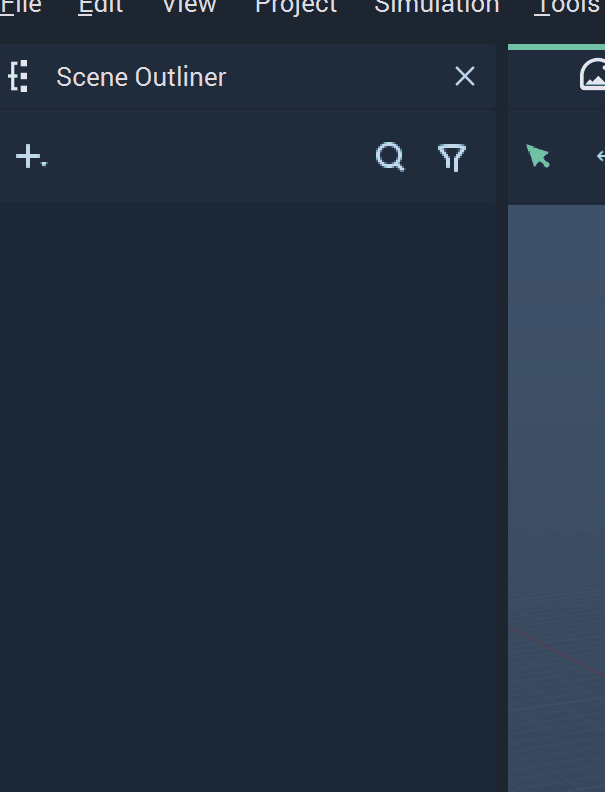
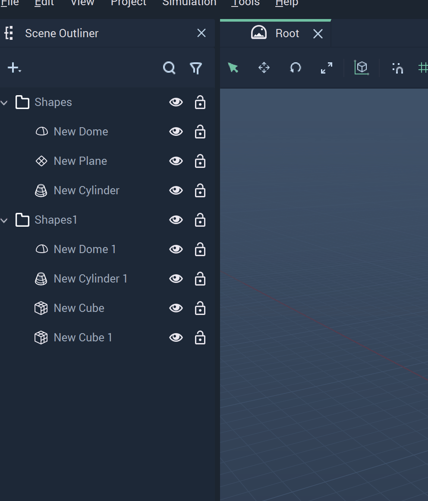

# Group

The **Group** **Object** works like a folder, as it allows you to structure and organize **Objects**, making **Scenes** with high amounts of different **Objects** more manageable.

## Create

There are a couple of ways to create **Groups**. 

* Select multiple **Objects** and right-click on `Create`. Select **Group**. 

* Right-click inside the **Scene** **Outliner**, select `Create` from the pop-up, and click on **Group**. Now **Objects** can be added one-by-one.

## Delete

A **Group** can be deleted in its entirety or one **Object** at a time. 

* To delete a **Group**, right-click the **Group** and select `Delete`.
* To delete one **Object** in a **Group**, simply right-click on that particular **Object** and select `Delete`. 

## Transformations

A useful function of the **Group** **Object** is that it allows you to transform multiple **Objects** relative to a single **Pivot Point**, as if they were are a single **Object**.

Like any other **Scene Object**, we can manipulate its **Transformation Attributes** and adjust its **Rotation Pivot**.

