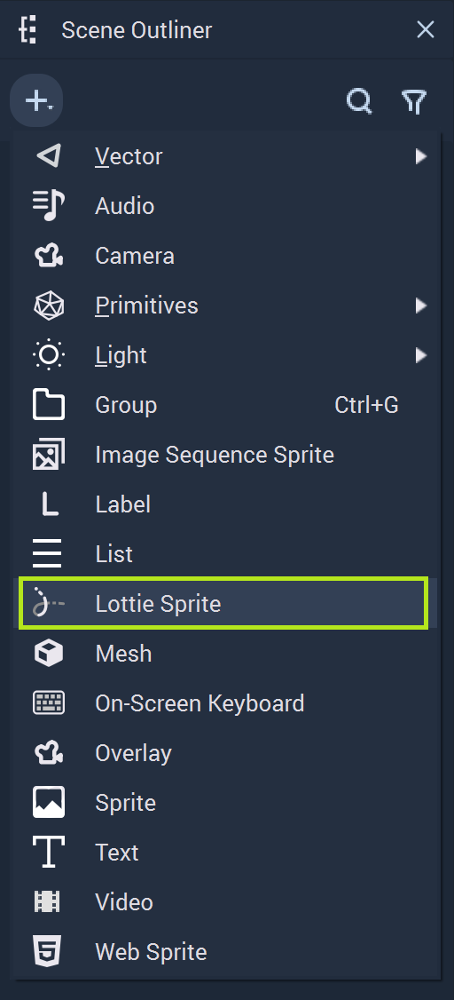
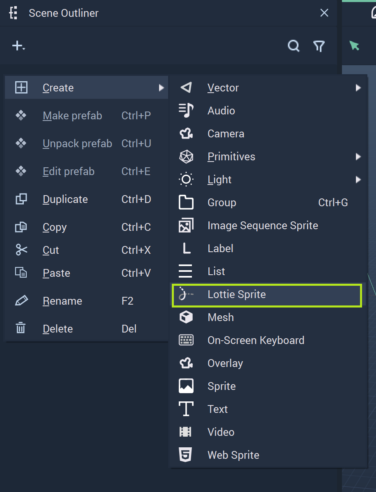
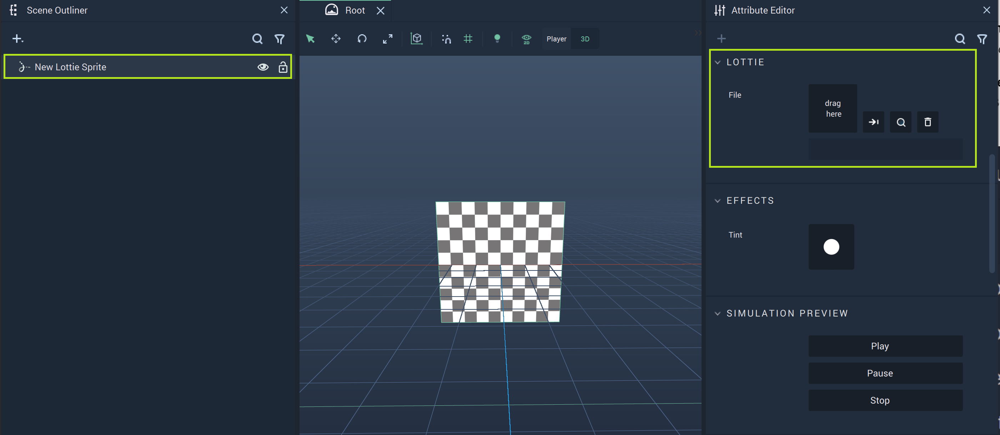
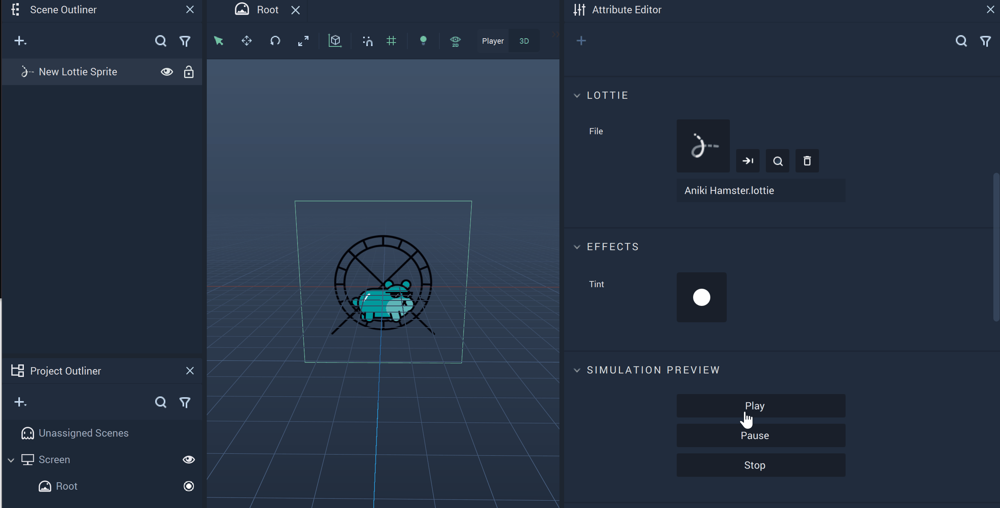

# Lottie Sprite

The **Lottie Sprite Object** is **Incari's** way of allowing the user to incorporate *Lottie* animations into a *User Interface*.

To create a **Lottie Sprite Object**, simply click the plus icon at the top of the **Scene Outliner** or right-click in the **Scene Outliner**, hover over `Create`, and locate **Lottie Sprite Object**. 

<figure><figcaption>
Create Lottie Sprite Object with Plus Icon.
</figcaption></figure>
<figure><figcaption>
Create Lottie Sprite Object with Right-Click and Create.
</figcaption></figure>

While the **Lottie Sprite Object** has several **Attributes** that alter its visual aspects, the most important is the `File` under `Lottie`. Here the user can select a `.lottie` file that has been placed in the **Asset Folder** of the **Project**. 

Above, the `File` **Attribute** has been highlighted for the **Lotte Sprite Object**. This is where the user can select the appropriate file after activating the pop-up Menu. 

For now, there are two options when choosing a file for the **Lottie Sprite Object**. The user can use a *Lottie JSON* file and rename it from `FileName.json` to `FileName.lottie`. Or the user can use a compressed *Lottie* file, uncompress it, and then rename it from `FileName.json` to `FileName.lottie`. 

When the *.lottie* file is selected, it is displayed in the viewport of the **Scene Outliner**.

There are several **Nodes** that are attributed to *Lottie* animations. More information can be found [here](../../toolbox/incari/lottie/README.md) and [here.](../../toolbox/events/lottie/README.md)

