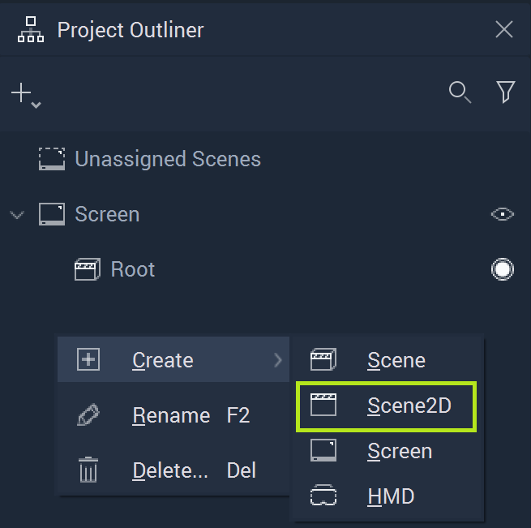
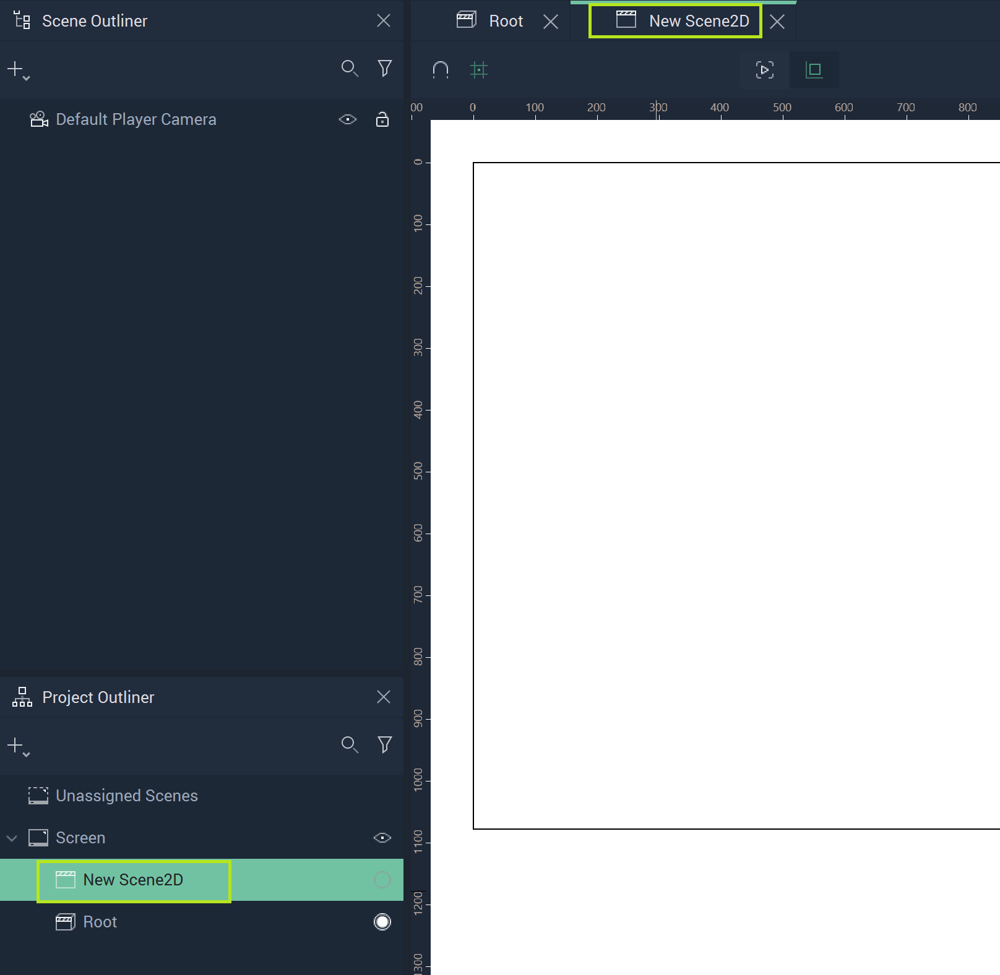
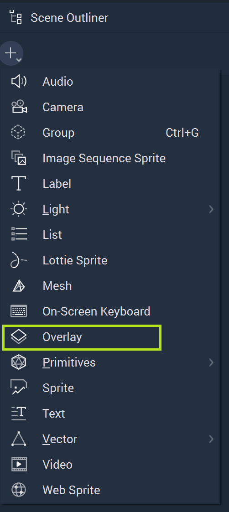
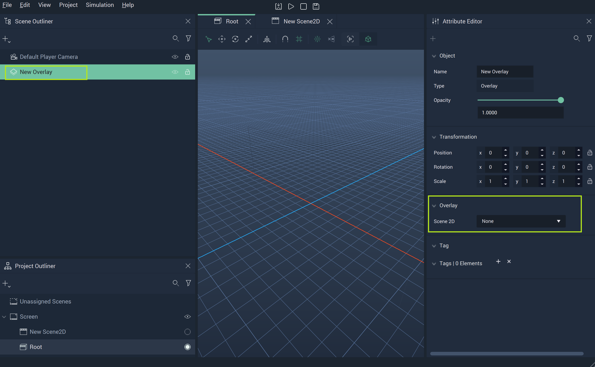
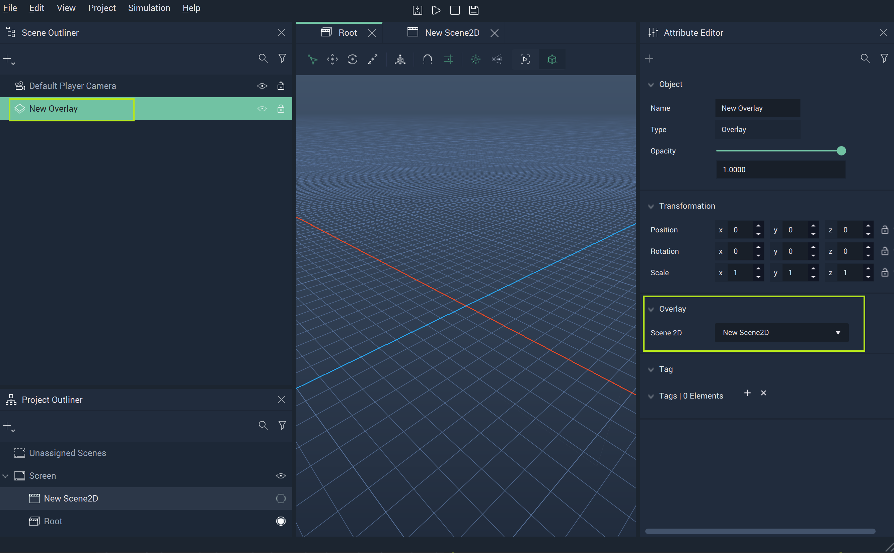
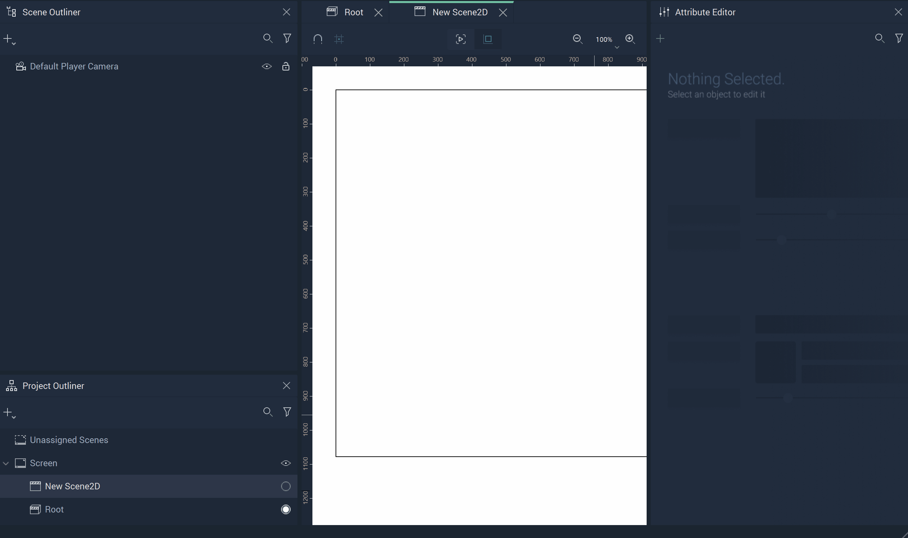

# Overlay

**Overlay Objects** are the driving force of connecting *3D* and *2D* components in **Incari**. Since these items are separated into their respective dimensionalities in either [**Scenes**](../project-objects/scene.md) or [**Scene2Ds**](../project-objects/scene2d.md), it is necessary to use **Overlay Objects** to combine them if a *User Interface* calls for a mix of the two. 

## Setting up for an Overlay Object

To start, the user must create a **Scene2D** and populate it with the desired *2D* components. This can be done in the **Project Outliner**. After it is created and dragged to the correct **Screen**, the user just needs to locate the appropriate tab at the top of the window, below the Menu bar of **Incari Studio**. 

Once finished with any *2D* aspects for that particular **Scene2D**, the user then needs to go to the desired *3D* **Scene** in which they wish to overlay *2D* elements. 

## Creating an Overlay Object

To create an **Overlay Object**, either click the plus icon in the **Scene Outliner** or right-click in the **Scene Outliner**, hover over `Create`, and locate **Overlay**.

In the **Attribute Editor**, the desired **Scene2D** simply needs to be selected from the drop-down Menu of `2D Scene` under the `Overlay` **Attribute**. 

Once this is done, the **Scene2D** will render over the *3D* **Scene**. An example of this process is shown below, culminating in a **Player View** that displays the contents of the **Overlay Object**.

