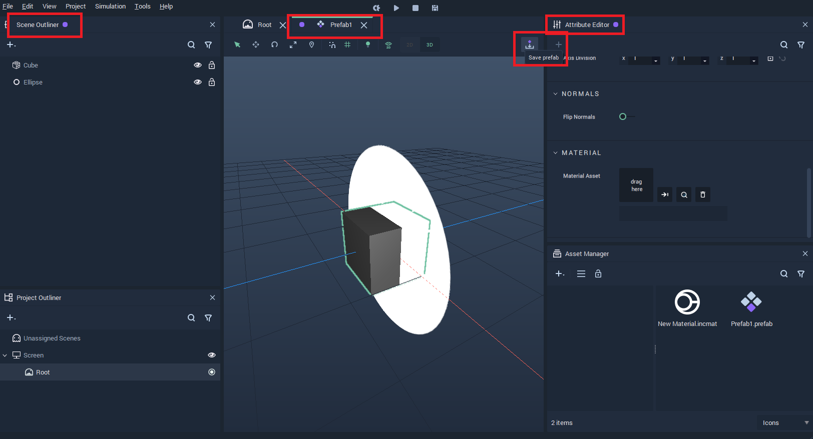

# Prefabs

## Overview

**Prefabs** are are composed of a combination of **Objects**. They allow the user to create multiple individual instances of this combination and then make changes that are enacted across all of them. Each instance can also retain unique properties via overrides, thus allowing to create several **Objects** with the same functionality but different characteristics. Moreover, **Prefabs** have their own **Logic**.

The first section shows how to create and use **Prefabs** and the second section gives more details about the **Logic** of **Prefabs**.

## Creating and Using Prefabs

To create a **Prefab**, go to the **Scene Outliner** and select the **Objects** that will compose the **Prefab**, then right-click and click on `Make Prefab`. This will create a **Prefab** consisting of the selected **Objects** and a new **Prefab** **Asset** will be generated in the **Asset Manager**.

New instances of the **Prefab** can be created by either duplicating the existing **Prefab** in the **Scene Outliner** or by dragging the **Prefab Asset** from the **Asset Manager** to the **Scene Outliner** or the **Scene**.

To edit the **Prefab** **Asset**, double-click the **Prefab** in the **Asset Manager**. This will open the **Prefab View** in both the **Scene Outliner** and **Attribute Editor**. The **Prefab** view is indicated by a purple circle. Changes made here affect all instances of the **Prefab**. 

For the changes made in the **Prefab Asset** to take effect, it is necessary to save them by pressing the `Save prefab` button on the top right corner of the viewport.

Each instance of a **Prefab** can be modified on its own and this overrides the **Attributes** from the **Prefab Asset**. To do this, simply edit the **Object** in the **Prefab** instance.

 

## Logic

**Prefabs** have their own **Logic** and it applies to all instances of the **Prefab**. The **Prefab** **Logic** can be incorporated into the **Scene Logic** via a **Prefab Node**.

To open the **Prefab Logic** graph in the **Logic Editor** either double click the **Prefab Node** in the **Logic Editor** or the **Prefab Asset** in the **Asset Manager**.

The **Prefab Logic** has two **Nodes** by default: **Prefab Input** and **Prefab Output**. These represent the **Input** and **Output** of the **Prefab Node**.

These two **Nodes** can have their **Attributes** customized: **Input Sockets** can be added to the **Prefab Input** **Node** and **Output Sockets** to the **Prefab Output** **Node**. These changes will then be reflected in the **Prefab Node**.

