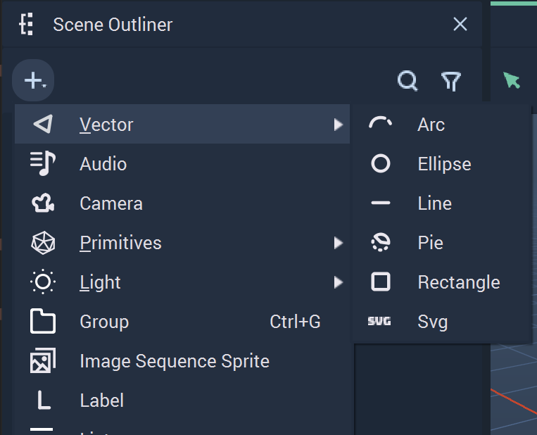
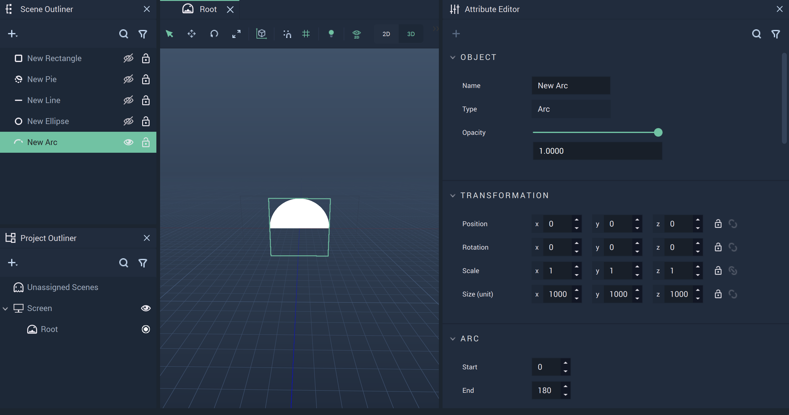
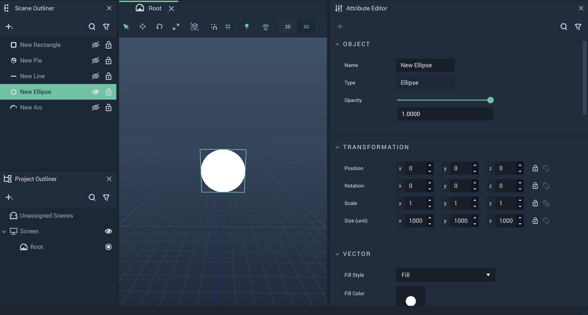
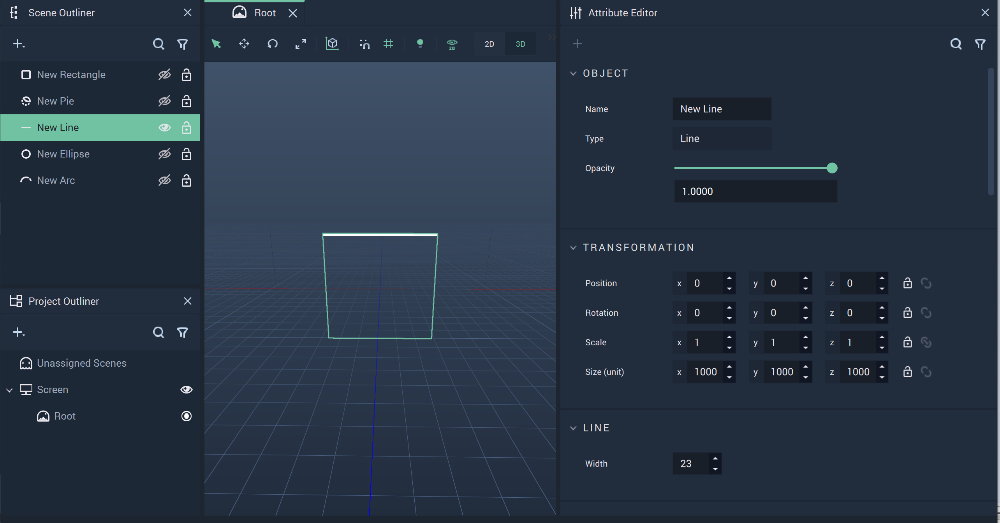
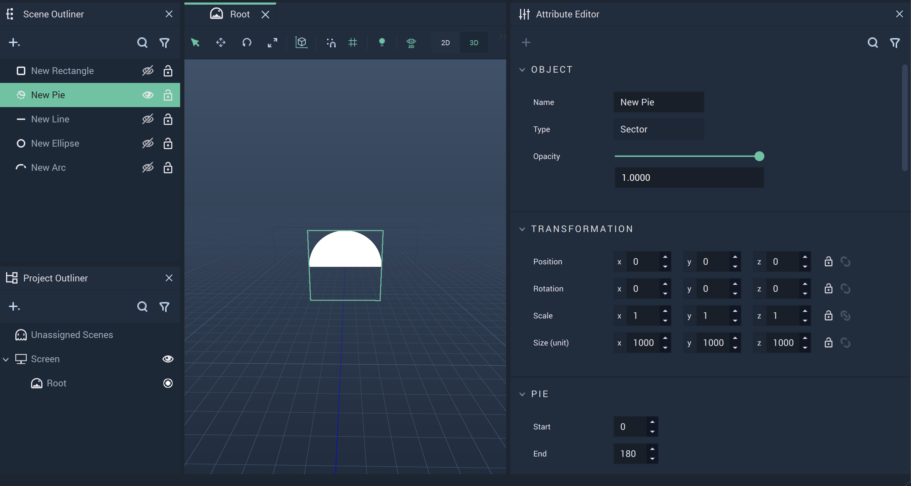
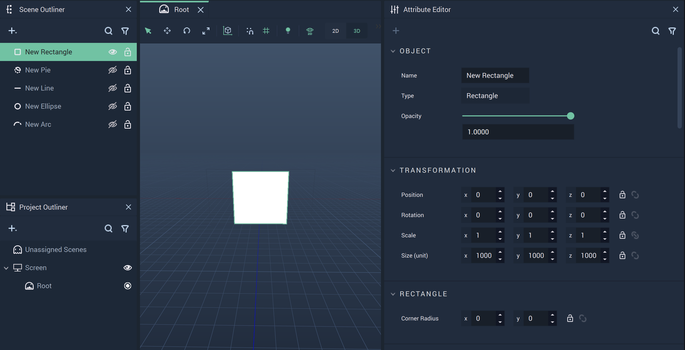

# Vector

The **Vector Objects** encompass several three-dimensional shapes that help build up the visual aspects of a _User Interface_. 

There are several **Vector Objects** that are described below:

* [**Arc**](vector.md#arc)
* [**Ellipse**](vector.md#ellipse)
* [**Line**](vector.md#line)
* [**Pie**](vector.md#pie)
* [**Rectangle**](vector.md#rectangle)
* [**Svg**](vector.md#svg)

## Arc

A **3D Object** that is a piece of a circle defined by a starting and ending degree disregarding the center and running straight through between the two selected degree points. It can be *transformed* along the X, Y, or Z axes. There are several **Nodes** attributed to **Arc Objects**, which can be found [_here_](../../toolbox/incari/vector/arc/README.md).

## Ellipse

A circular **3D** **Object** that can be *transformed* along the X, Y, and Z axes. 

## Line

A linear **3D** **Object** that can be *transformed* along the X, Y, and Z axes. There are several **Nodes** attributed to **Line Objects**, which can found [_here_](../../toolbox/incari/vector/line/README.md).

## Pie

A **3D** **Object** that is a piece of a circle defined by a starting and ending degree and a connected point at the center of the circle. It can be *transformed* along the X, Y, and Z axes. There are several **Nodes** attributed to **Line Objects**, which can be found [_here_](../../toolbox/incari/vector/pie/README.md).

## Rectangle

A rectangular **3D** **Object** that can be *transformed* along the X, Y, and Z axes. There are several **Nodes** attributed to **Rectangle Objects**, which can be found [_here_](../../toolbox/incari/vector/rectangle/README.md).

## Svg

The **Svg Object** allows the user to display *.svg* files in the **Scene Outliner**. 

The most important **Attribute** is `File` under `SVG`. Here, the user can locate the desired *.svg* file. 

Above, the `File` **Attribute** has been highlighted for the **Svg Object**. This is where the user can select the appropriate file after activating the pop-up Menu. 

When the *.svg* file is selected, it is displayed in the viewport of the **Scene Outliner**. 

## External Links

* Example Svg file from [Wikipedia.](https://mathstat.slu.edu/escher/index.php/File:P4m-sample.svg)