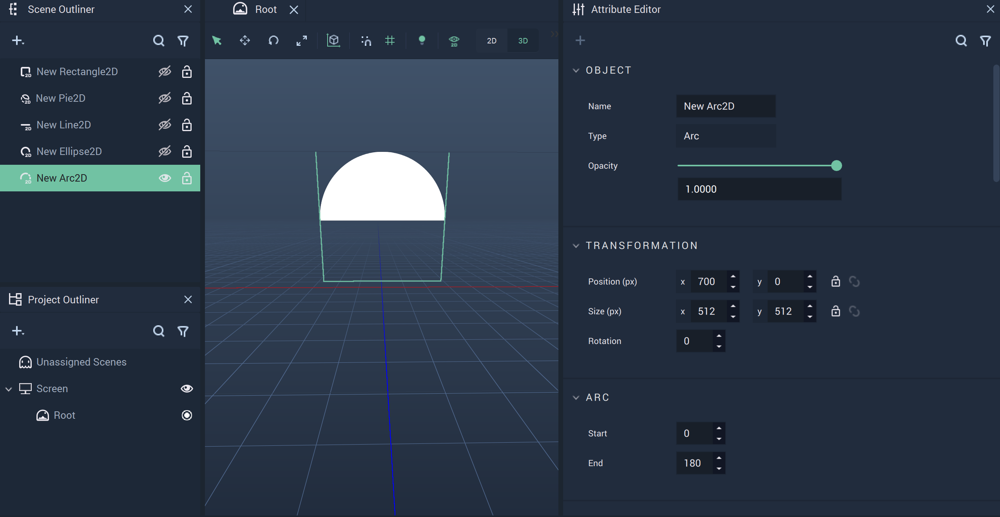
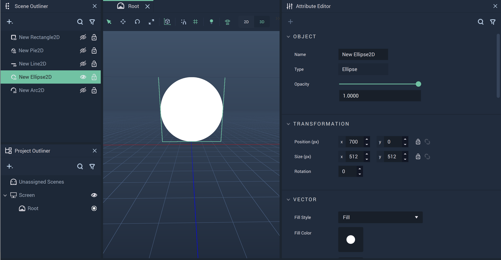
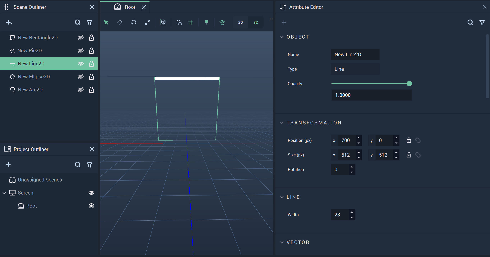
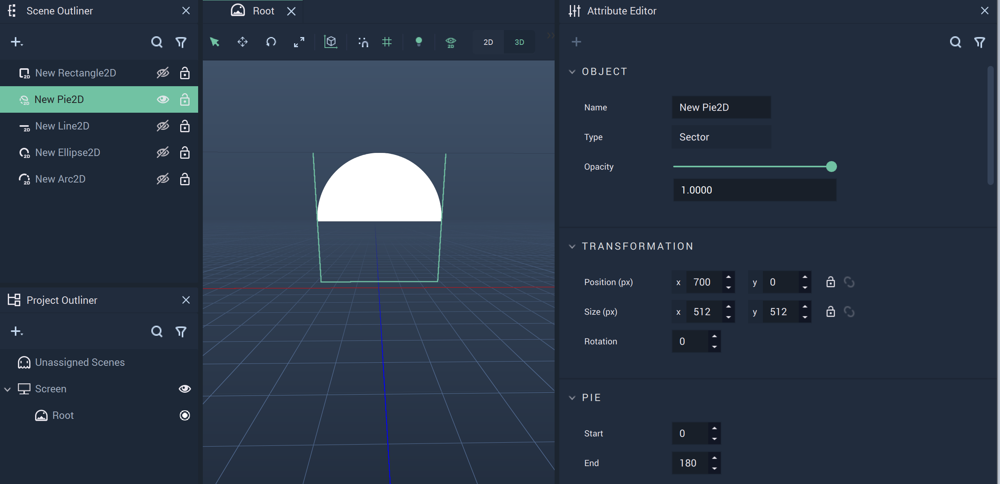
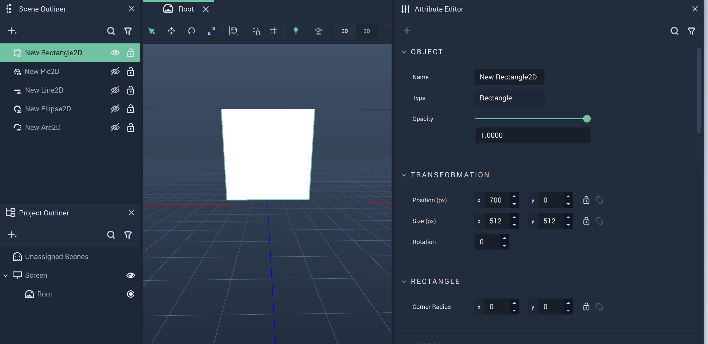

# Vector2D

The **Vector2D Objects** provide alternatives to their **Vector** counterparts and encompass several two-dimensional shapes that help build up the visual aspects of a _User Interface_. Unlike **Vector2D**, **Vector Objects** don't contain Z axis components.

There are several **Vector2D Objects** that are described below:

* [Arc2D](vector2d.md#arc2d)
* [Ellipse2D](vector2d.md#ellipse2d)
* [Line2D](vector2d.md#line2d)
* [Pie2D](vector2d.md#pie2d)
* [Rectangle2D](vector2d.md#rectangle2d)

## Arc2D

A **2D Object** that is a piece of a circle defined by a starting and ending degree disregarding the center and running straight through between the two selected degree points. It is restricted to the X and Y axes. There are several **Nodes** attributed to **Arc2D Objects**, which can be found [_here_](../../toolbox/incari/vector/arc/README.md).

## Ellipse2D

A circular **2D** **Object** that is restricted to the X and Y axes.

## Line2D

A linear **2D** **Object** that is restricted to the X and Y axes. There are several **Nodes** attributed to **Line2D Objects**, which can be found [_here_](../../toolbox/incari/vector/line/README.md).

## Pie2D

A **2D** **Object** that is a piece of a circle defined by a starting and ending degree and a connected point at the center of the circle. It is restricted to the X and Y axes. There are several **Nodes** attributed to **Pie2D Objects**, which can be found [_here_](../../toolbox/incari/vector/pie/README.md).

## Rectangle2D

A rectangular **2D** **Object** that is restricted to the X and Y axes. There are several **Nodes** attributed to **Rectangle2D Objects**, which can be found [_here_](../../toolbox/incari/vector/rectangle/README.md).

