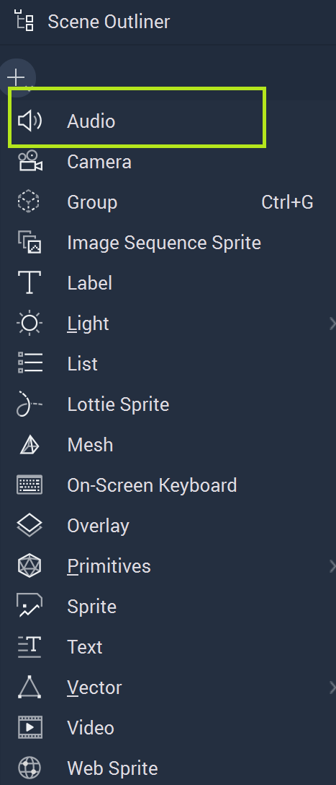
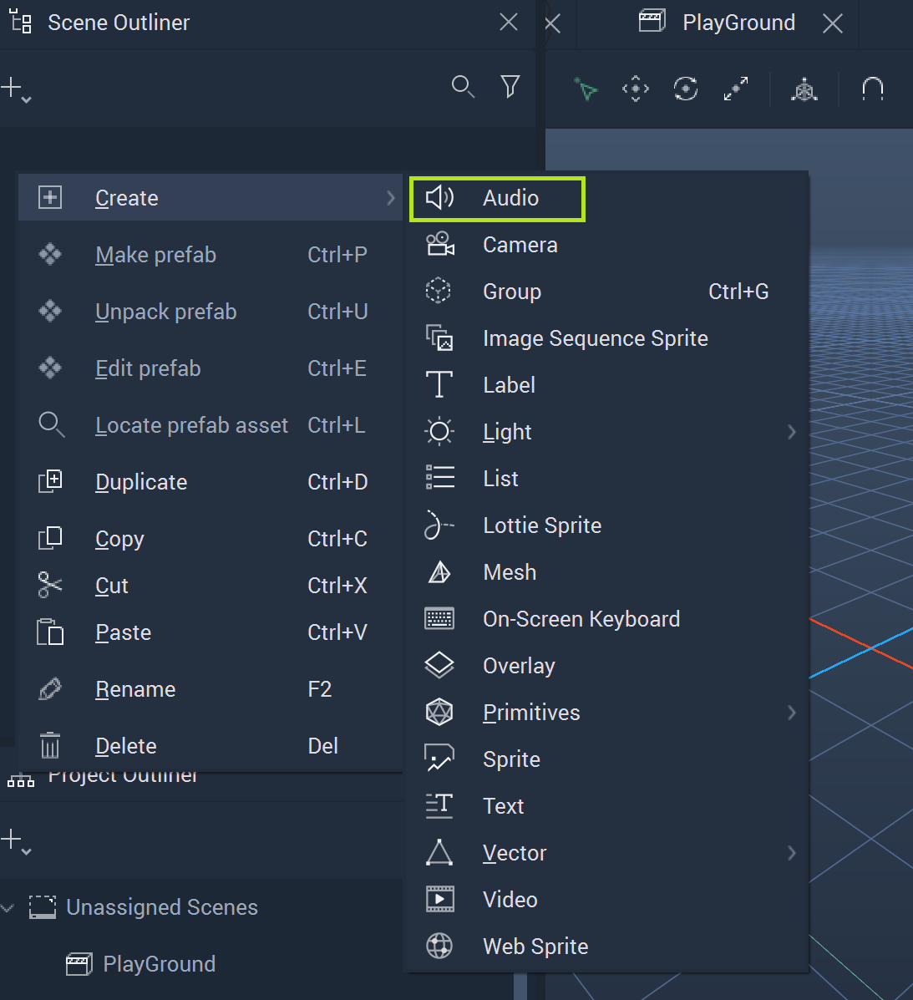
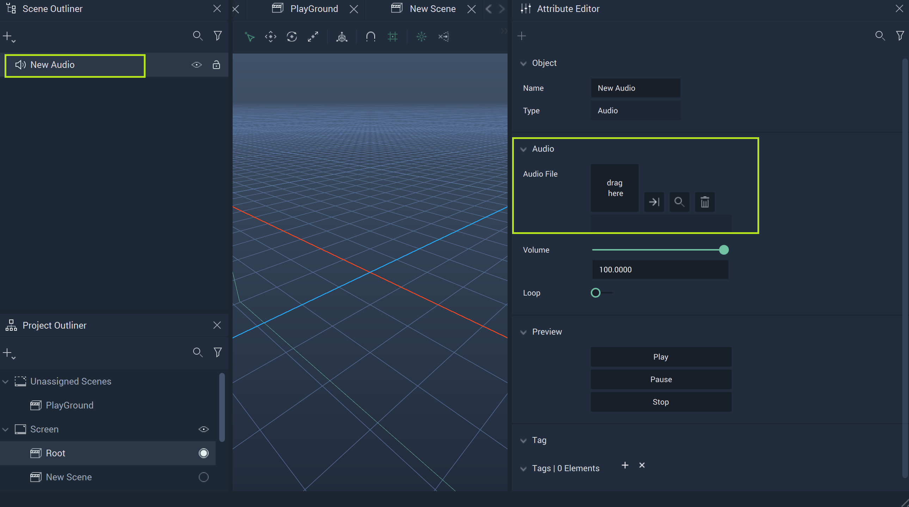
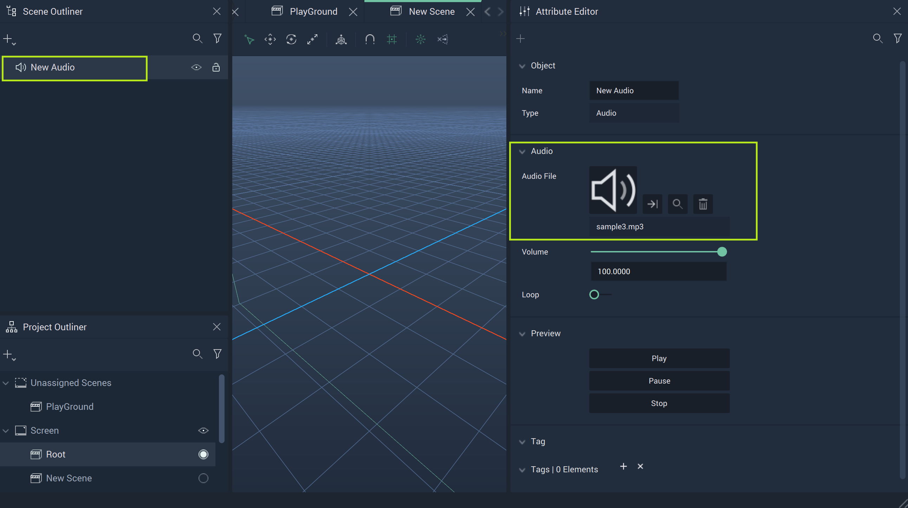
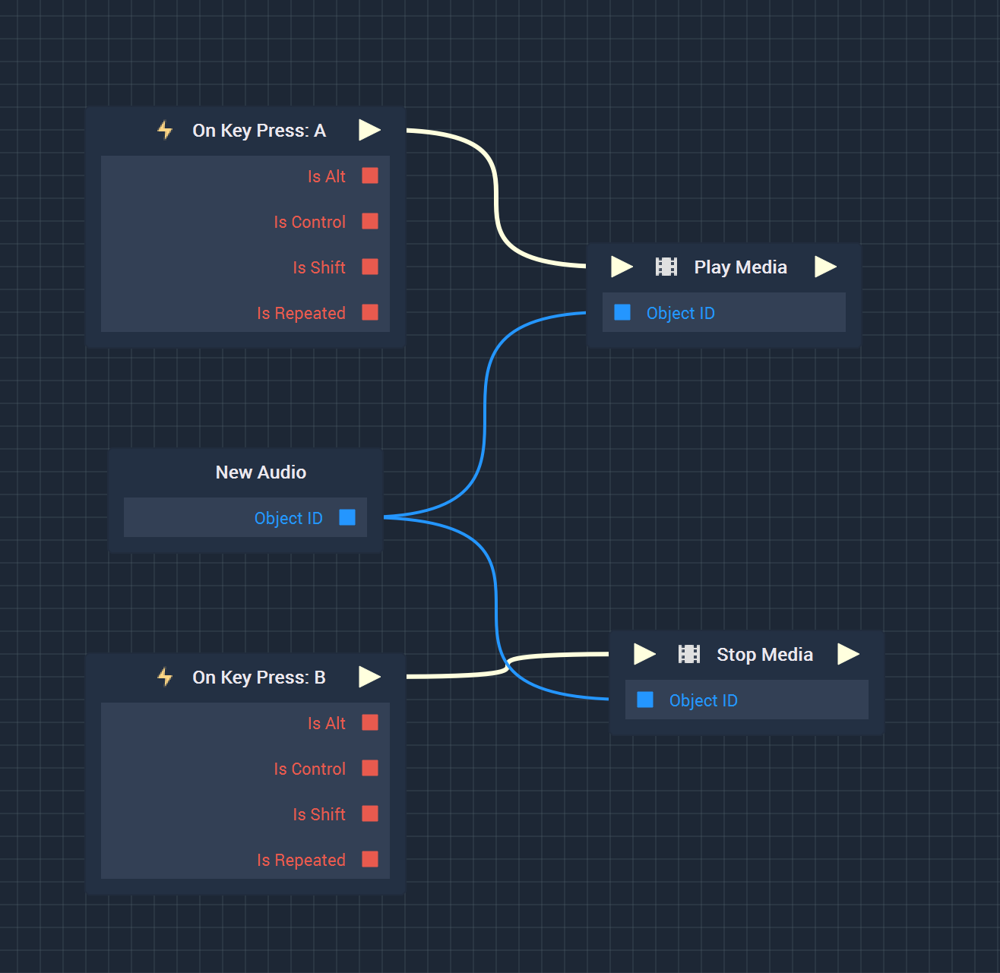

# Audio 2D

**Audio 2D Objects** provide a means for the user to incorporate aural aspects to a *User Interface*, whether that be music, a chime alert, or a speech file. 

In this version of **Incari Studio** only `.mp3` files are supported. 

To create an **Audio Object**, either click the plus icon in the **Scene Outliner** or right-click in the **Scene Outliner**, hover over `Create`, and locate **Audio**.

When an **Audio Object** is created, it is initially empty. Also, there is no visual component displayed in the **Scene**, even when a file is selected.

While the **Audio Object** has several **Attributes**, the most important  of which is `Audio File` under `Audio`. Here the user can either drag a file from the **Asset Manager** or click the empty file icon and select the desired file from the pop-up Menu. 

<figure><figcaption>
Audio Object before File is Selected.
</figcaption></figure>
<figure><figcaption>
Create Audio Object after File is Selected.
</figcaption></figure>

A preview of the **Audio** can be played, paused, or stopped within its **Scene** of **Incari Studio** by clicking the respective buttons in the **Attribute Editor**.

In order to use **Audios** in a **Project** and have them play in the **Player**, the user needs to use the **Media Nodes** in the **Logic Editor**. More information on using **Media Nodes** can be found [here](../../toolbox/incari/media/README.md) and [here.](../../toolbox/events/media/README.md) For understanding how to use **Object Nodes** in the **Logic Editor**, please refer to this [section](../../objects-and-types/scene-objects/README.md#objects-in-logic).

An example **Logic** configuration can be seen below. This would allow one to play the **Audio** with `A` on their keyboard and stop it with `B`. 

