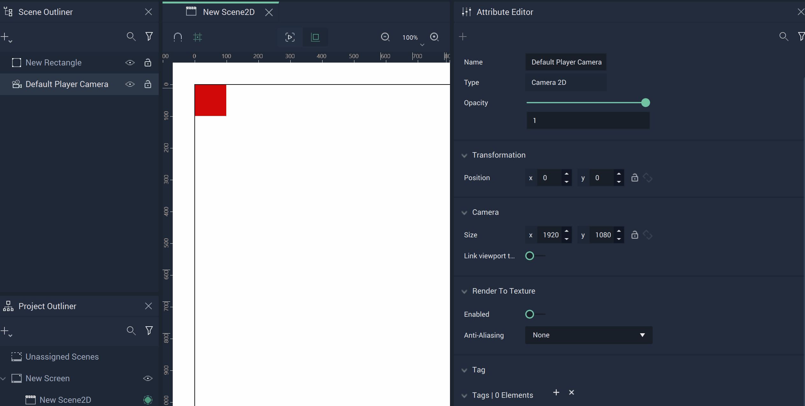
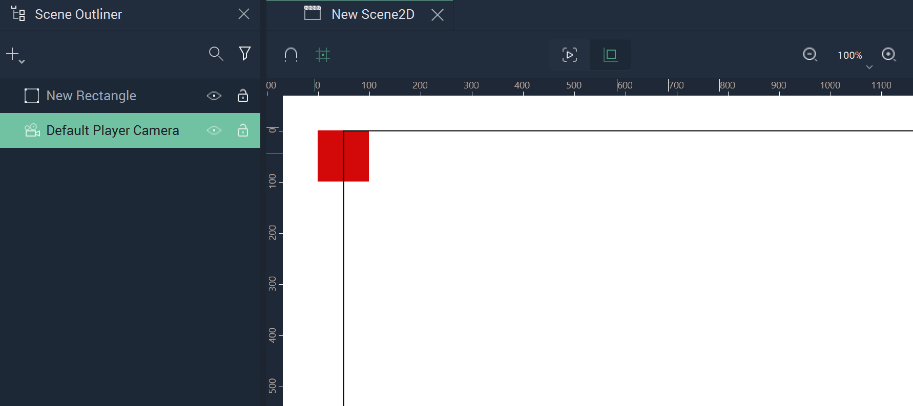
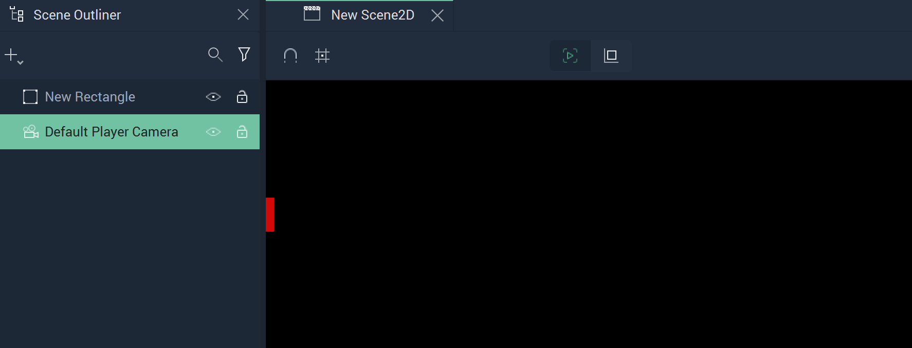
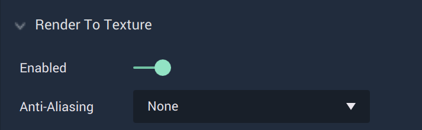

# Camera 2D

The **Camera Object** effectively decides what is visible of a **Scene2D** when switched to `Player View` or when the **Project** is run. The user can control this with its **Attributes**. 

## Attributes

Altering a **Camera's** `Position` and `Rotation` may change how **Objects** are displayed in `Player View`, cutting off parts of an **Object** if they fall outside the **Camera's** bounds. As default, all of these values are set to 0. These can be used to shift the bounds of a **Camera**. 

The `Size` configures the dimensions of the **Camera's** bounds and can be used to reduce or extend the confines of a **Camera**. The default is `1920x1080` in the above example, but this can change as it ultimately depends on the size of the **Screen** that a **Scene2D** resides in. 

`Link viewport to screen size` can be toggled when a **Camera** is in a **Scene** that belongs to a **Screen**. When it is switched off, the user can edit the `Size`.

## Editor View vs. Player View

Before `Player View` is enabled, the bounds of the **Camera** as well as the entire **Object** are visible in `Editor View`. `Player View` is highlighted at the top of the image. 

Once `Player View` is activated, only half of the **Ellipse** is visible and the boundary lines of the **Camera** disappear. 

`Player View` gives a preview of what will be shown when the **Scene2D** is playing. 

## Render to Texture

Enabling `Render to Texture` renders the **Scene2D** from the viewpoint of the **Camera** into a texture. When enabled, the resulting texture is added to the **Asset Database** and can be used for all **Objects** which allow for textures (such as **Images**). It is removed again when the **Attribute** is disabled. 

This **Attribute** can also be used to draw multiple **Scene2Ds**, combine them, or bring them into another **Scene2D**.

`Anti-Aliasing` lets the user choose an anti-aliasing technique which can help improve the appearance of the texture. More information on anti-aliasing can be found [here](https://www.digitaltrends.com/computing/what-is-anti-aliasing/).

## Tag

This **Attribute** manages the *tags* for the **Button**. See more on *tags* [here.](../attributes/common-attributes/tag.md)
