#  Boolean Operation 

The **Boolean Operation** in **Incari** provides similar functionality as its equivalent in *Figma*. It acts as *parent* to its *child* **Objects**. Any visual aspects are controlled completely by the **Boolean Operation**; the visual properties of the *children* do not have any precendent, such as a *child's* `Fill`. 

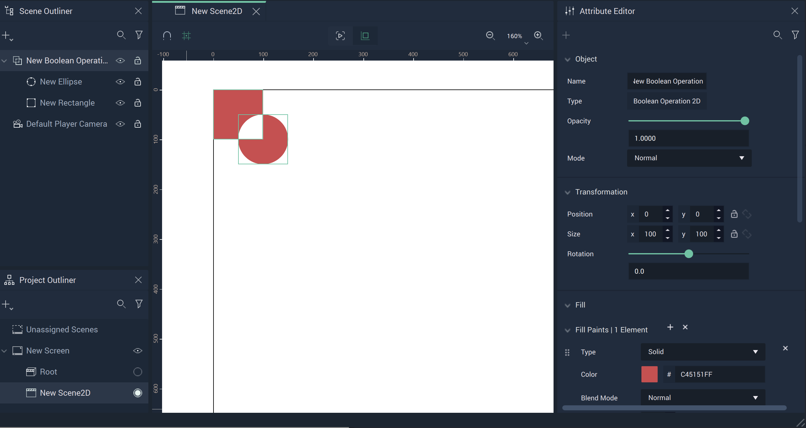

There are several **Attributes** which allow the user heightened customizability and control. 

* [**Transformation**](figmabooleanoperation.md#transformation)
* [**Blending**](figmabooleanoperation.md#blending)
* [**Fill**](figmabooleanoperation.md#fill)
* [**Stroke**](figmabooleanoperation.md#stroke)
* [**Mask**](figmabooleanoperation.md#mask)
* [**Operation**](figmabooleanoperation.md#operation)
* [**Tag**](figmabooleanoperation.md#tag)

# Attributes

## Transformation

The `Transformation` **Attributes** deal with placement, rotation, and size in *XY* space. More information can be found [here](../../attributes/common-attributes/transformation/README.md).

## Blending

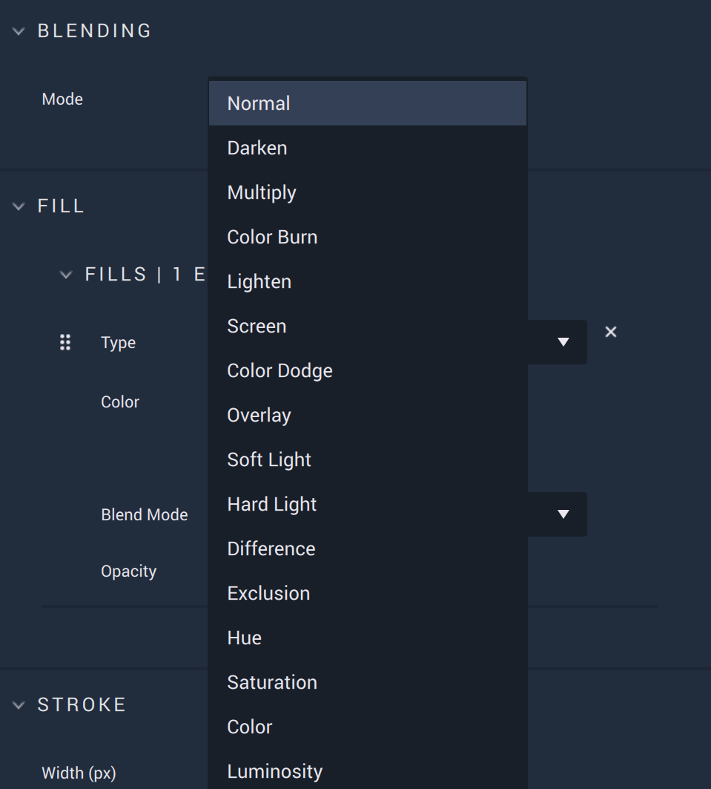

This **Attribute** lets the user set a `Blend Mode` as a base property of the **Ellipse**. These are established on common formulas, examples of each can be accessed [here](http://www.simplefilter.de/en/basics/mixmods.html). An **Object's** `Blend Mode` can also be set with the [**Set Blend Mode Node**](../../../toolbox/incari/object2d/setblendmode.md).

## Fill

The `Fill` **Attributes** consist of different items called `Elements`. Each `Element` contains a `Type`. This can be either `Solid` or `Image` and changes some of the available **Attributes** under this category.

If there is more than one `Fill Element`, the most recent one will take precedent over the others (unless some `Blend Mode` is applied).

### Solid

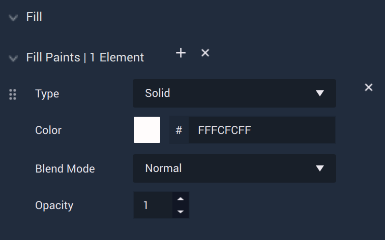

When `Solid` is selected, `Color` is visible. 

* `Color` is a color selector that lets the user pick the `Fill's` color. 

* Similar to the base property described previously, `Blend Mode` here affects the `Fill Elements` only. These are established on common formulas, examples of each can be accessed [here](http://www.simplefilter.de/en/basics/mixmods.html). It can also be set with the [**Set Blend Mode Node**](../../../toolbox/incari/object2d/setblendmode.md).

* `Opacity` refers to how opaque or transparent the `Fill` appears. This is represented by an integer between 0 and 1.

Please note that when a new `Fill` is added, it is added to the top of the *fill* list and the **Object** will be updated to display this `Fill`.  

### Image

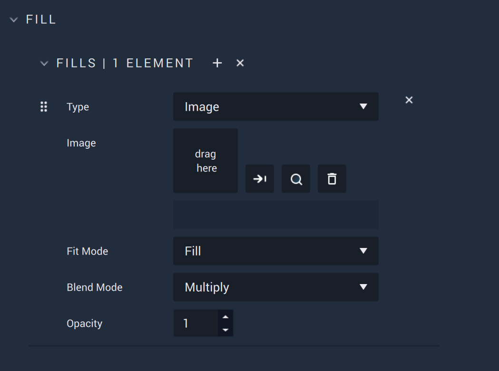 

When `Image` is selected, `Image` and `Fit Mode` are visible. 

* `Image` is the desired **Texture** file.
  
* `Fit Mode` determines how the **Texture** is displayed. These can be `Fill`, `Fit`, `Crop`, and `Tile`. `Tile` has the additional **Attribute** of `Scale Factor`, which augments the tesselation. 

* Similar to the base property described previously, `Blend Mode` here affects the `Fill Elements` only. These are established on common formulas, examples of each can be accessed [here](http://www.simplefilter.de/en/basics/mixmods.html). It can also be set with the [**Set Blend Mode Node**](../../../toolbox/incari/object2d/setblendmode.md).

* `Opacity` refers to how opaque or transparent the `Fill` appears. This is represented by an integer between 0 and 1.

## Stroke

The `Stroke` **Attributes** consist of different items called `Elements`. Each `Element` contains a `Type`. This can be either `Solid` or `Image` and changes some of the available **Attributes** under this category. There are also two fixed **Attributes** outside of the `Elements`. These are:

* `Width`, which is how wide (in pixels) each `Stroke` will appear. This applies to each `Stroke Element`. 
* `Position`, which determines what part of the outline identifies the outside of the **Object**. For example, if `Inner` is selected, then the outside of the `Stroke` is the outside of the **Object**. If `Center` is selected, then the `Stroke's` center is the outside of the **Object**. If `Outer` is selected, then the inside of the `Stroke` is the outside of the **Object**.

### Solid 

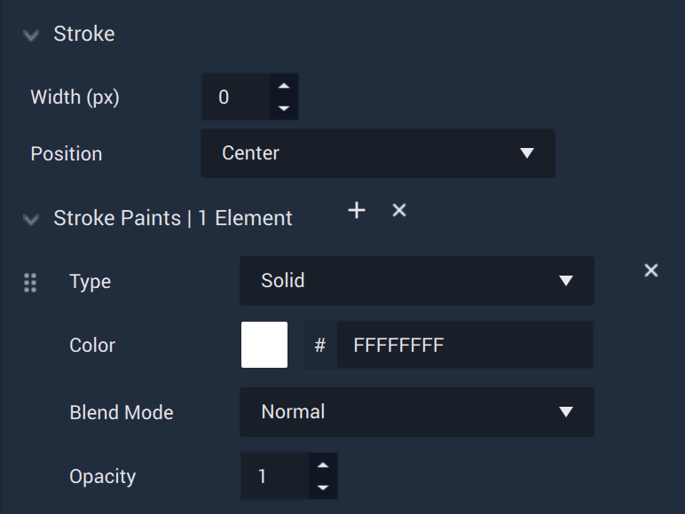

When `Solid` is selected, `Color` is visible. 

* `Color` is a color selector that lets the user pick the `Stroke's` color. 

* Similar to the base property described previously, `Blend Mode` here affects the `Stroke Elements` only. These are established on common formulas, examples of each can be accessed [here](http://www.simplefilter.de/en/basics/mixmods.html). It can also be set with the [**Set Blend Mode Node**](../../../toolbox/incari/object2d/setblendmode.md).

* `Opacity` refers to how opaque or transparent the `Stroke` appears. This is represented by an integer between 0 and 1.

### Image 

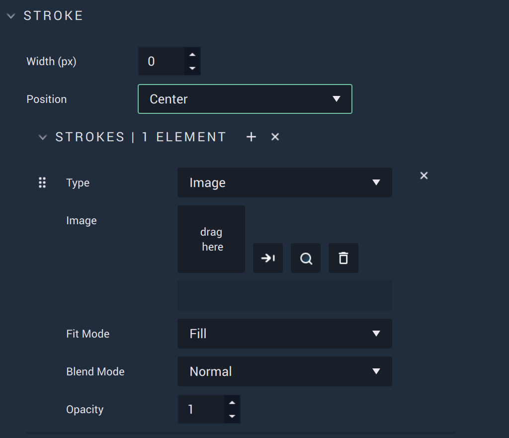

When `Image` is selected, `Image` and `Fit Mode` are visible. 

* `Image` is the desired **Texture** file.
  
* `Fit Mode` determines how the **Texture** is displayed. These can be `Fill`, `Fit`, `Crop`, and `Tile`. `Tile` has the additional **Attribute** of `Scale Factor`, which augments the tesselation. 

* Similar to the base property described previously, `Blend Mode` here affects the `Stroke Elements` only. These are established on common formulas, examples of each can be accessed [here](http://www.simplefilter.de/en/basics/mixmods.html). It can also be set with the [**Set Blend Mode Node**](../../../toolbox/incari/object2d/setblendmode.md).

* `Opacity` refers to how opaque or transparent the `Fill` appears. This is represented by an integer between 0 and 1.

## Mask 

A **Mask** is an **Object** that shows a certain area of another **Object** while concealing the rest. Any **Object** (e.g., an **Ellipse**, **Rectangle**, **Frame**, **Group**, or **Text**) can be used as a **Mask**. 

For easier visualization, think of the **Mask** as a cookie cutter while the masked **Object** is the dough: the cookie cutter shows only a part and discards the rest.

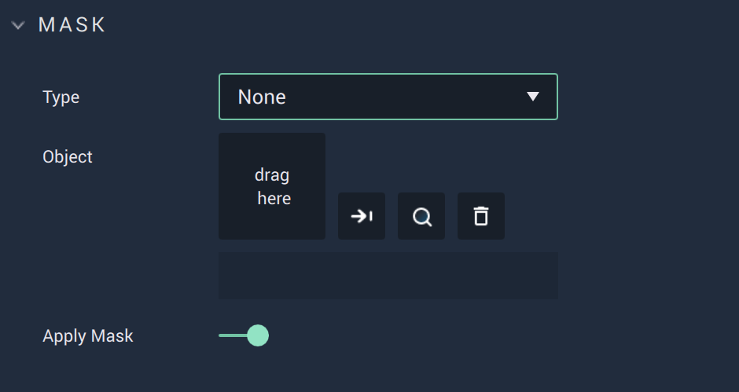

The `Type` **Attribute** has three options:

* `None` - nothing is applied. 
* `Alpha` - the **Mask** has an opacity level (alpha channel) determining with which level of opacity (or transparency) the masked **Object** is revealed: 0% opacity reveals nothing, 100% opacity is equivalent to a **Mask** with `Vector` type.
* `Vector` - only modifies the shape outline of the masked **Object**
* `Luminance` - allows the user to utilize brightness to determine the effect of the **Mask**; the brighter the area of a **Mask**, the more that is revealed and the darker the area, the less that is revealed.

`Object` allows the user to select what should be the masked **Object**.

`Apply Mask` is a toggle that applies the **Mask** when set to on, and disables the **Mask** when set to off. 

## Operation

The `Operation` **Attribute** implements the four functions:

* [Exclude](figmabooleanoperation.md#exclude)
* [Intersect](figmabooleanoperation.md#intersect)
* [Subtract](figmabooleanoperation.md#subtract)
* [Union](figmabooleanoperation.md#union)

Thie *child* **Objects** form the shape that will be the core of what is displayed throught the different operations. The *base* **Object** is always the last *child* **Object** in the **Scene Outliner**. In the image below, the *base* **Object** is the **Rectangle**.

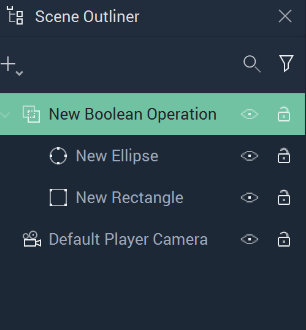

### Exclude

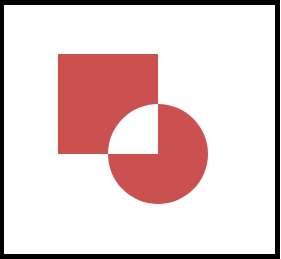

`Exclude` displays all *child* **Objects** but removes any overlapping parts of other *children* from the *base* **Object**. Since the **Rectangle** is the base **Object** in the example above, the overlapping section of the **Ellipse** (the other *child* **Object**) is removed.  

### Intersect

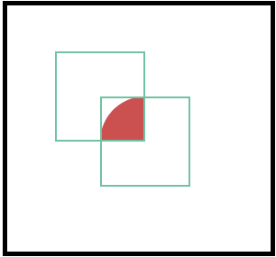

`Intersect` displays *only* the parts of the other *children* **Objects** which overlap with the *base* **Object**. Here, the top-left quadrant of the **Ellipse** (which is represented by the right bounding box) overlaps with the **Rectangle** (which is represented by the left bounding box). Their intersection remains visible.

### Subtract

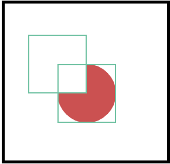

`Subtract` removes the *base* **Object** completely, even the parts which overlap with the other *children*. Since the **Rectangle** is the *base* **Object** in the example above and it's bottom-right quarter overlaps the **Ellipse**, this is removed as well. 

### Union 

`Union` combines all *children* as a single **Object**. In this example, there are only two **Objects**: an **Ellipse** and a **Rectangle**. There are no separating lines anymore and both take the color given to the **Boolean Operation** (in this case, red).

## Tag

This **Attribute** manages the *tags* for the **Button**. See more on *tags* [here.](../../attributes/common-attributes/tag.md)

