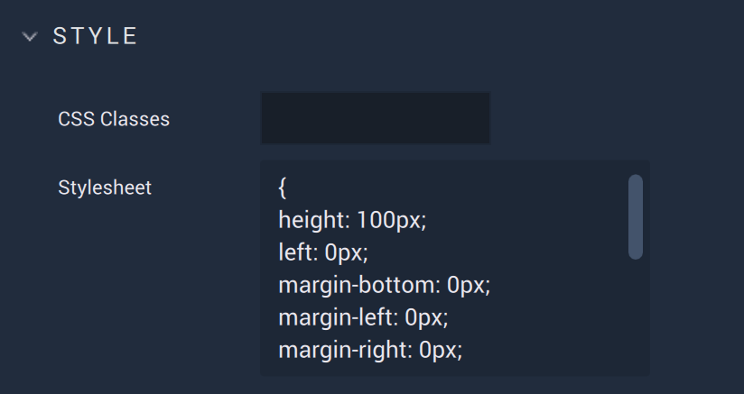

# Figma Line 

figma

# Attributes

## Object

## Transformation

## Blending

## Fill

## Stroke

## Mask 

## Style 

The `Style` **Attributes** allow for more customizability. This can override any stylesheet provided in the [**Project Settings**](../../../modules/project-settings/style.md) or a [**Scene2D**](../../project-objects/scene2d.md). 

To address these in the **Logic**, please refer to the [**Object 2D Nodes**](../../../toolbox/incari/object2d/README.md).

* `CSS Classes` contain the *CSS* class names of the **Object**. 

* `Stylesheet` contains the *CSS* stylesheet of the **Object**.

## Tag

This **Attribute** manages the *tags* for the **Button**. See more on *tags* [here.](../../attributes/common-attributes/tag.md)