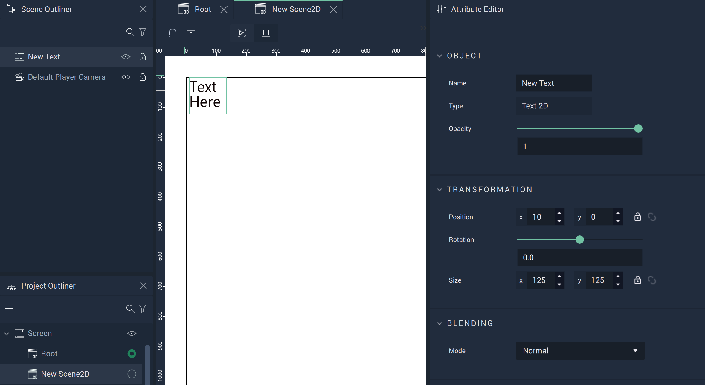

# Figma Text 

The **Text** in **Incari** provides similar functionality as its equivalent in *Figma*. 

There are several **Attributes** which allow the user heightened customizability and control. 

* [**Transformation**](figmarectangle.md#transformation)
* [**Blending**](figmarectangle.md#blending)
* [**Fill**](figmarectangle.md#fill)
* [**Font**](figmatext.md#font)
* [**Stroke**](figmarectangle.md#stroke)
* [**Mask**](figmarectangle.md#mask)
* [**Style**](figmarectangle.md#style)
* [**Tag**](figmarectangle.md#tag)

# Attributes

## Transformation

The `Transformation` **Attributes** deal with placement, rotation, and size in *XY* space. More information can be found [here](../../attributes/common-attributes/transformation/README.md).

## Blending

This **Attribute** lets the user set a `Blend Mode` as a base property of the **Text**. These are established on common formulas, examples of each can be accessed [here](http://www.simplefilter.de/en/basics/mixmods.html). An **Object's** `Blend Mode` can also be set with the [**Set Blend Mode Node**](../../../toolbox/incari/object2d/setblendmode.md).

## Fill

## Font

The `Font` **Attributes** offers three different font types: `monospace`, `sans-serif`, and `serif`. More fonts can be added by the user in [**Project Settings**](../../../modules/project-settings/fonts.md).

## Stroke

The `Fill` **Attributes** consist of different items called `Elements`. Each `Element` contains a `Type`. This can be either `Solid` or `Image` and changes some of the available **Attributes** under this category.

## Mask 

## Style 

The `Style` **Attributes** allow for more customizability. This can override any stylesheet provided in the [**Project Settings**](../../../modules/project-settings/style.md) or a [**Scene2D**](../../project-objects/scene2d.md). 

To address these in the **Logic**, please refer to the [**Object 2D Nodes**](../../../toolbox/incari/object2d/README.md).

* `CSS Classes` contain the *CSS* class names of the **Object**. 

* `Stylesheet` contains the *CSS* stylesheet of the **Object**.

## Text

## Tag

This **Attribute** manages the *tags* for the **Button**. See more on *tags* [here.](../../attributes/common-attributes/tag.md)