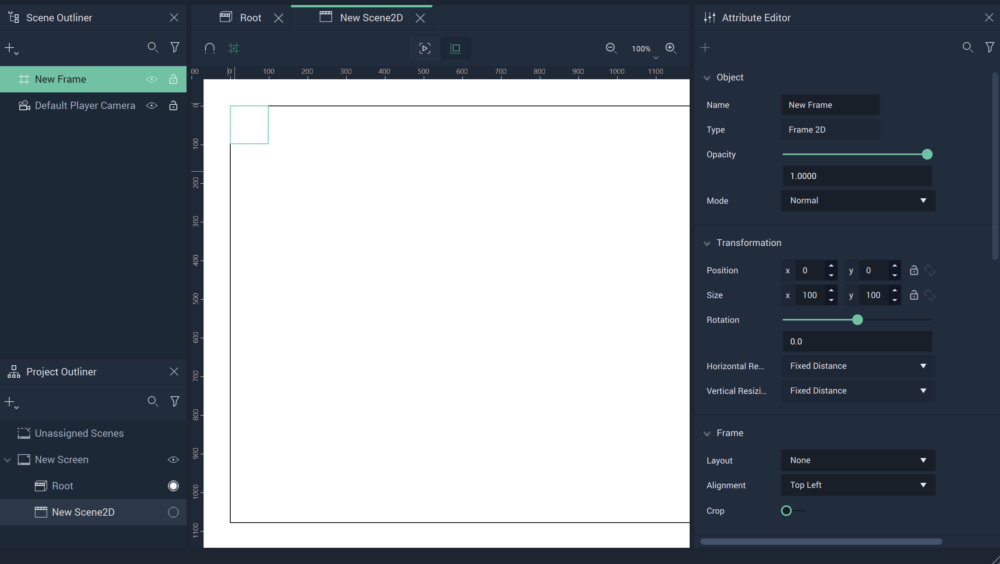
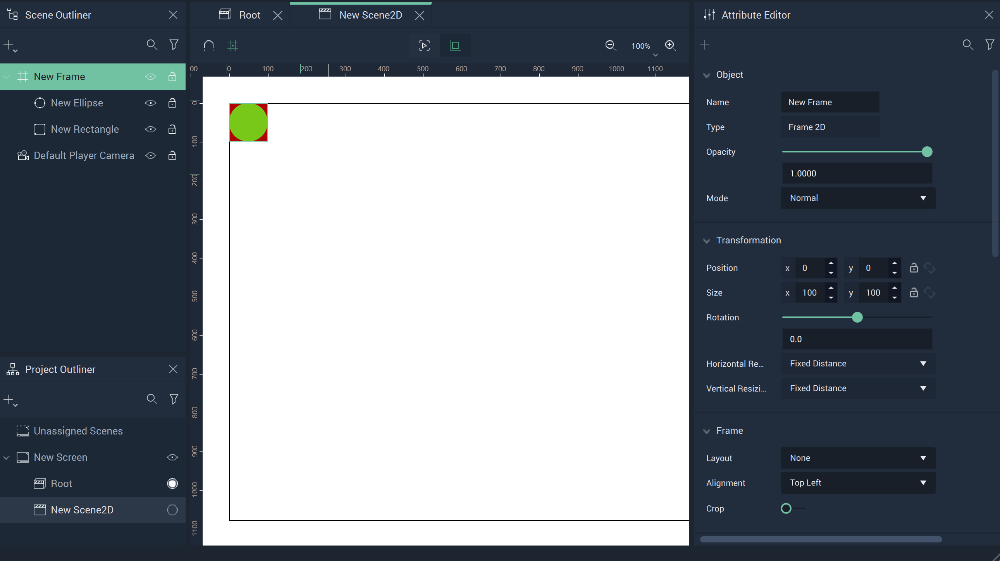
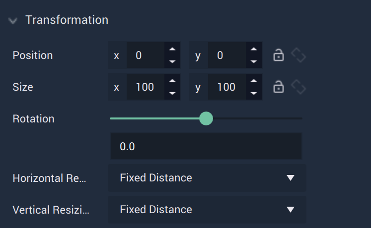
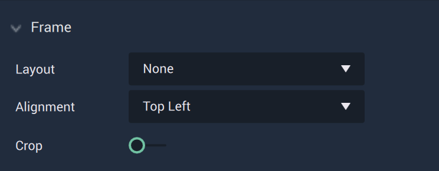
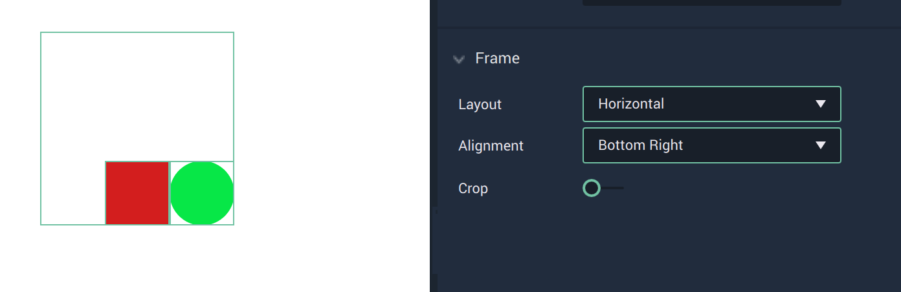
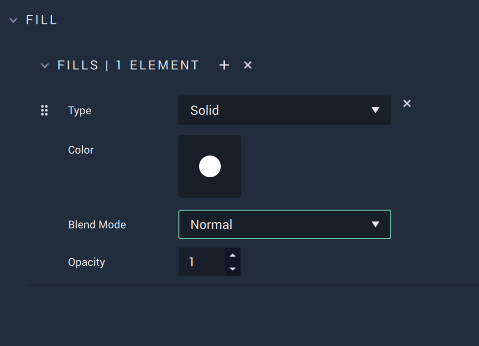

# Frame

A **Frame** is a **Scene2D Object** in **Incari** that acts as a 'container' to its *children* and has rigid boundaries. It is one of the only **Objects** in **Scene2Ds** which can be a *parent*, besides [**Groups**](group2d.md) and [**Boolean Operations**](figma/figmabooleanoperation.md). 

## Create  

When a **Frame** is created, its boundaries are displayed in green, an example of which can be seen in the image below. It can then be populated with other **Objects**.

The dimensions of the **Frame** are provided in its **Attributes**.

Without any **Objects** as *children*, a **Frame** doesn't look like much:

An **Ellipse** and **Rectangle** are now added as *children*<!--, but it's still difficult to tell the boundaries of the **Frame** visually-->. Notice the `Position` and `Size` describe these boundaries numerically. The top-left corner starts at `0,0` and it extends 100 units in both the X and Y-axes. **Objects**, however, will still appear in full outside the boundaries of the **Frame** if they happen to not be entirely encapsulated. 

<!--## Frame Boundaries

For educational purposes, the next image shows the boundaries of a **Frame** by purposefully cutting off portions of three **Rectangles**. Please be careful in your own **Projects** to avoid this if it is not the desired effect for a **User Interface**.

Since the **Frame** is set to size 1000 by 1000, it only reveals a quarter of the **Rectangle** at the bottom-right as the **Rectangle** is placed at `950,950` and its size is 100 by 100. 

The same goes for the other two **Rectangles**. One is positioned at `0,950` and has its bottom half cut off. The other is positioned at `950,0` and has its right half cut off. 

The **Ellipse** remains whole as it does not cross the boundaries of the **Frame**. 

If the size of a **Frame** is altered, its children are automatically affected, cutting off anything that is outside of the new boundaries. 
-->

## Attributes

### Transformation

The `Transformation` **Attributes** deal with placement, rotation, and size in *XY* space. More information can be found [here](../attributes/common-attributes/transformation/README.md).

`Horizontal Resizing` and `Vertical Resizing` are only made functional when the `Layout` has been changed. They both can either be `Hug Content` or `Fixed Distance`. 

When `Hug Content` is selected, the size of the **Frame** is always automatically recalculated to perfectly fit all its elements. If a `Layout` is used on the **Frame** and then an **Object** is added while `Hug Content` is on, the size of the **Frame** will increase. The same happens when a `Gap` or `Padding` is added. `Fixed Distance` means that the **Frame's** boundaries are exactly as they are set with `Size`.  

### Frame

These **Attributes** are essential to formatting a **Frame**.

The `Layout` of the **Frame** can be adjusted to display its *children* horizontally or vertically. Please note that changing the `Layout` causes **Objects** to be placed at their default positions in the **Frame**. 

<!--Here the gap between the **Ellipse** and **Rectangle** disappears when it is first changed to vertical.--> 

`Alignment` determines where the **Frame's** *children* appear within its boundaries. For example, the `Alignment` for the two **Objects** shown below is set to `Bottom Right`.

`Crop` cuts off all content which is outside of the **Frame**. However, this only applies to its *children* and not any unrelated **Objects** in the **Scene2D**.  

If a *child* **Object** (or part of a *child* **Object**) is moved outside the boundary of the **Frame** and `Crop` is toggled on, the **Object** (or part of it) will no longer be visible.

### Events

This **Attribute** determines whether the **Frame** receives **Events** or not in the **Logic**. This is *true* when it is toggled on and *false* if not. 

### Blending 

This **Attribute** lets the user set a `Blend Mode` as a base property of the **Ellipse**. These are established on common formulas, examples of each can be accessed [here](http://www.simplefilter.de/en/basics/mixmods.html). An **Object's** `Blend Mode` can also be set with the [**Set Blend Mode Node**](../../toolbox/incari/object2d/setblendmode.md).

### Fill

The `Fill` **Attributes** consist of different items called `Elements`. Each `Element` contains a `Type`. This can be either `Solid` or `Image` and changes some of the available **Attributes** under this category.

If there is more than one `Fill Element`, the most recent one will take precedent over the others (unless some `Blend Mode` is applied).

### Solid

When `Solid` is selected, `Color` is visible. 

* `Color` is a color selector that lets the user pick the `Fill's` color. 

* Similar to the base property described previously, `Blend Mode` here affects the `Fill Elements` only. These are established on common formulas, examples of each can be accessed [here](http://www.simplefilter.de/en/basics/mixmods.html). It can also be set with the [**Set Blend Mode Node**](../../toolbox/incari/object2d/setblendmode.md).

* `Opacity` refers to how opaque or transparent the `Fill` appears. This is represented by an integer between 0 and 1.

### Image

 

When `Image` is selected, `Image` and `Fit Mode` are visible. 

* `Image` is the desired **Texture** file.
  
* `Fit Mode` determines how the **Texture** is displayed. These can be `Fill`, `Fit`, `Crop`, and `Tile`. `Tile` has the additional **Attribute** of `Scale Factor`, which augments the tesselation. 

* Similar to the base property described previously, `Blend Mode` here affects the `Fill Elements` only. These are established on common formulas, examples of each can be accessed [here](http://www.simplefilter.de/en/basics/mixmods.html). It can also be set with the [**Set Blend Mode Node**](../../toolbox/incari/object2d/setblendmode.md).

* `Opacity` refers to how opaque or transparent the `Fill` appears. This is represented by an integer between 0 and 1.

### Stroke

The `Stroke` **Attributes** consist of different items called `Elements`. Each `Element` contains a `Type`. This can be either `Solid` or `Image` and changes some of the available **Attributes** under this category. There are also two fixed **Attributes** outside of the `Elements`. These are:

* `Width`, which is how wide (in pixels) each `Stroke` will appear. This applies to each `Stroke Element`. 
* `Position`, which determines what part of the outline identifies the outside of the **Object**. For example, if `Inner` is selected, then the outside of the `Stroke` is the outside of the **Object**. If `Center` is selected, then the `Stroke's` center is the outside of the **Object**. If `Outer` is selected, then the inside of the `Stroke` is the outside of the **Object**.

When `Solid` is selected, `Color` is visible. 

* `Color` is a color selector that lets the user pick the `Stroke's` color. 

* Similar to the base property described previously, `Blend Mode` here affects the `Stroke Elements` only. These are established on common formulas, examples of each can be accessed [here](http://www.simplefilter.de/en/basics/mixmods.html). It can also be set with the [**Set Blend Mode Node**](../../toolbox/incari/object2d/setblendmode.md).

* `Opacity` refers to how opaque or transparent the `Stroke` appears. This is represented by an integer between 0 and 1.

When `Image` is selected, `Image` and `Fit Mode` are visible. 

* `Image` is the desired **Texture** file.
  
* `Fit Mode` determines how the **Texture** is displayed. These can be `Fill`, `Fit`, `Crop`, and `Tile`. `Tile` has the additional **Attribute** of `Scale Factor`, which augments the tesselation. 

* Similar to the base property described previously, `Blend Mode` here affects the `Stroke Elements` only. These are established on common formulas, examples of each can be accessed [here](http://www.simplefilter.de/en/basics/mixmods.html). It can also be set with the [**Set Blend Mode Node**](../../toolbox/incari/object2d/setblendmode.md).

* `Opacity` refers to how opaque or transparent the `Fill` appears. This is represented by an integer between 0 and 1.

### Mask 

A **Mask** is an **Object** that shows a certain area of another **Object** while concealing the rest. Any **Object** (e.g., an **Ellipse**, **Rectangle**, **Frame**, **Group**, or **Text**) can be used as a **Mask**. 

For easier visualization, think of the **Mask** as a cookie cutter while the masked **Object** is the dough: the cookie cutter shows only a part and discards the rest.

The `Type` **Attribute** has three options:

* `None` - nothing is applied. 
* `Alpha` - the **Mask** has an opacity level (alpha channel) determining with which level of opacity (or transparency) the masked **Object** is revealed: 0% opacity reveals nothing, 100% opacity is equivalent to a **Mask** with `Vector` type.
* `Vector` - only modifies the shape outline of the masked **Object**
* `Luminance` - allows the user to utilize brightness to determine the effect of the **Mask**; the brighter the area of a **Mask**, the more that is revealed and the darker the area, the less that is revealed.

`Object` allows the user to select what should be the masked **Object**.

`Apply Mask` is a toggle that applies the **Mask** when set to on, and disables the **Mask** when set to off. 

### Style

The `Style` **Attributes** allow for more customizability. This can override any stylesheet provided in the [**Project Settings**](../../modules/project-settings/style.md) or a [**Scene2D**](../project-objects/scene2d.md). 

To address these in the **Logic**, please refer to the [**Object 2D Nodes**](../../toolbox/incari/object2d/README.md).

* `Gap` adds a gap between each of the **Objects** placed in the frame, with the specified distance given by the user. 

* `Padding`adds *padding* to a **Frame** depending on what sizes are specified and for which sides. The options are `t` for top, `r` for right, `b` for bottom, and `l` for left. [Padding](https://www.w3schools.com/cssref/pr_padding.php) is often seen in the context of *CSS*. Similarly, in **Incari**, it is the extra space around elements within the confines of the **Frame**. 

* `CSS Classes` contain the *CSS* class names of the **Object**. 

* `Stylesheet` contains the *CSS* stylesheet of the **Object**.

### Tag 

This **Attribute** manages the *tags* for the **Button**. See more on *tags* [here.](../attributes/common-attributes/tag.md)

<!--

Find a description of a **Frame's** crucial **Attributes** in the sections below.

### Hug Content

### Layout

### Gap

### Padding

### Crop
-->

