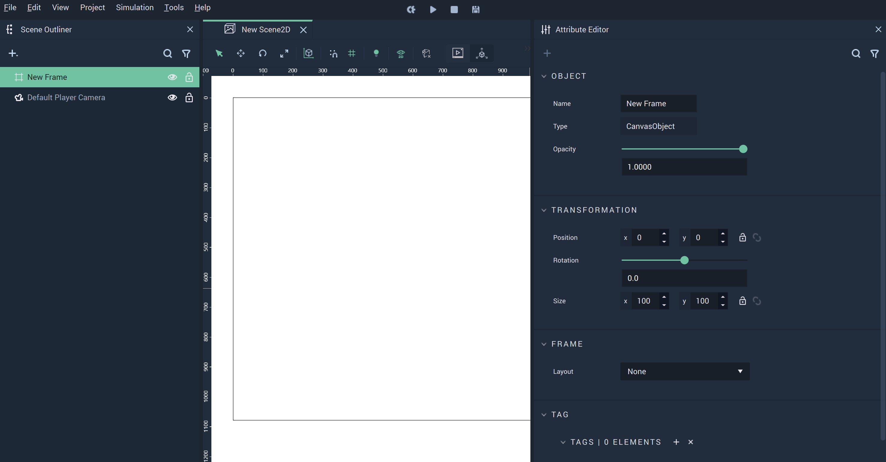
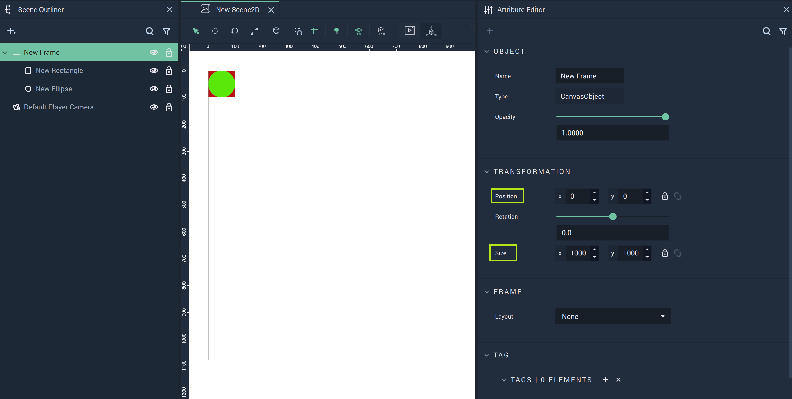
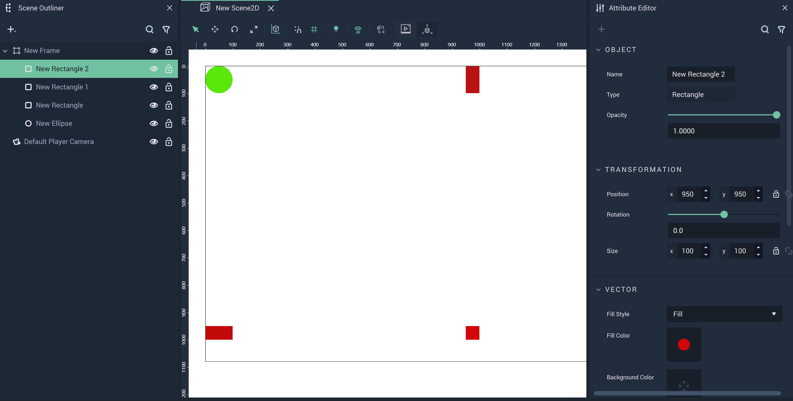
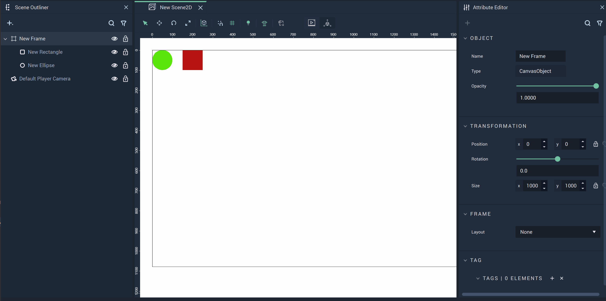

# Frame

A **Frame** is an **Object** in **Incari** that acts as a 'container' to its children and has rigid boundaries which exist within a **Scene2D**. It is one of the two **Objects** in **Scene2Ds** which can be parents. 

## Create 

When a **Frame** is created, it is not expressed as an explicitly visual component to be displayed in the **Scene2D**. It must first be populated with other **Objects**. The dimensions of the **Frame** are provided in its **Attributes**.

Without any **Objects** as children, a **Frame** doesn't look like much:

An **Ellipse** and **Rectangle** are now added as children, but it's still difficult to tell the boundaries of the **Frame** visually. Notice the `Postion` and `Size` describe these boundaries numerically. The top-left corner starts at `0,0` and it extends 1000 units in both the X and Y-axes. 

## Frame Boundaries

For educational purposes, the next image shows the boundaries of a **Frame** by purposefully cutting off portions of three **Rectangles**. Please be careful in your own **Projects** to avoid this if it is not the desired effect for a **User Interface**.

Since the **Frame** is set to size 1000 by 1000, it only reveals a quarter of the **Rectangle** at the bottom-right as the **Rectangle** is placed at `950,950` and its size is 100 by 100. 

The same goes for the other two **Rectangles**. One is positioned at `0,950` and has its bottom half cut off. The other is positioned at `950,0` and has its right half cut off. 

The **Ellipse** remains whole as it does not cross the boundaries of the **Frame**. 

If the size of a **Frame** is altered, its children are automatically affected, cutting off anything that is outside of the new boundaries. 

## Layout

The `Layout` of the **Frame** can be adjusted to display its children horizontally or vertically. Please note that changing the `Layout` causes **Objects** to be placed at their default positions in the **Frame**. Here the gap between the **Ellipse** and **Rectangle** disappears when it is first changed to vertical. 

