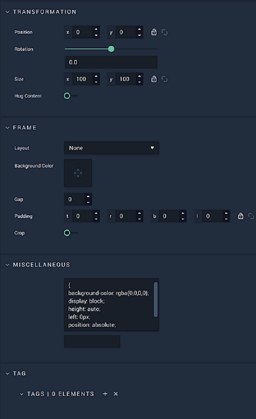
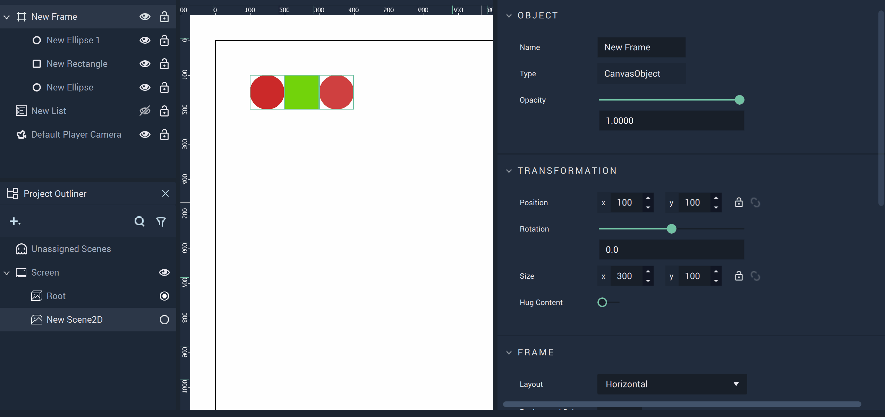
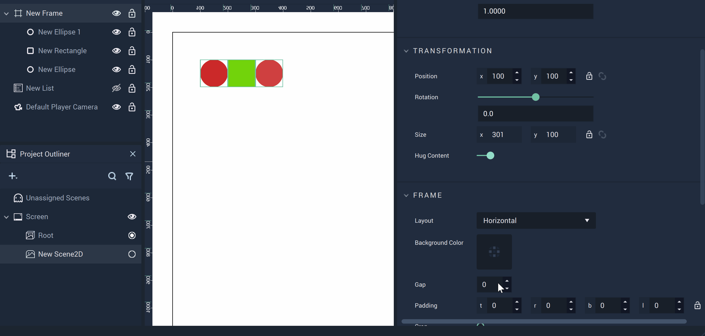
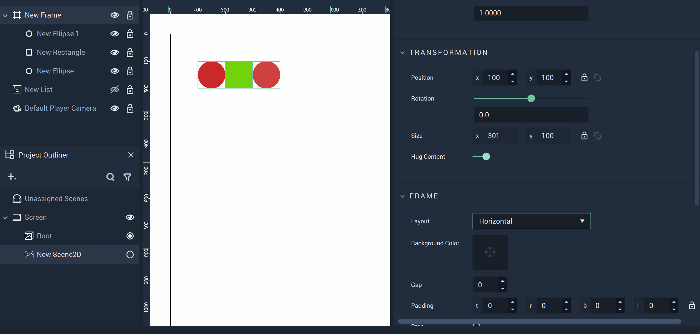

# Frame

A **Frame** is a **Scene2D Object** in **Incari** that acts as a 'container' to its *children* and has rigid boundaries. It is the only **Object** in **Scene2Ds** which can be a *parent*. 

## Create 

<!--When a **Frame** is created, it is not expressed as an explicitly visual component to be displayed in the **Scene2D**. It must first be populated with other **Objects**. -->The dimensions of the **Frame** are provided in its **Attributes**.

Without any **Objects** as *children*, a **Frame** doesn't look like much:

An **Ellipse** and **Rectangle** are now added as *children*, but it's still difficult to tell the boundaries of the **Frame** visually. Notice the `Position` and `Size` describe these boundaries numerically. The top-left corner starts at `0,0` and it extends 100 units in both the X and Y-axes. **Objects**, however, will still appear in full outside the boundaries of the **Frame** if they happen to not be entirely encapsulated. 

<!--## Frame Boundaries

For educational purposes, the next image shows the boundaries of a **Frame** by purposefully cutting off portions of three **Rectangles**. Please be careful in your own **Projects** to avoid this if it is not the desired effect for a **User Interface**.

Since the **Frame** is set to size 1000 by 1000, it only reveals a quarter of the **Rectangle** at the bottom-right as the **Rectangle** is placed at `950,950` and its size is 100 by 100. 

The same goes for the other two **Rectangles**. One is positioned at `0,950` and has its bottom half cut off. The other is positioned at `950,0` and has its right half cut off. 

The **Ellipse** remains whole as it does not cross the boundaries of the **Frame**. 

If the size of a **Frame** is altered, its children are automatically affected, cutting off anything that is outside of the new boundaries. 
-->

## Attributes

Find a description of a **Frame's** crucial **Attributes** in the sections below.

### Hug Content

When `Hug Content` is toggled on, the size of the **Frame** is always automatically recalculated to perfectly fit all its elements. If a `Layout` is used on the **Frame** and then an **Object** is added while `Hug Content` is on, the size of the **Frame** will increase. The same happens when a `Gap` or `Padding` is added.

### Gap

This **Attribute** adds a gap between each of the **Objects** placed in the frame, with the specified distance given by the user. 

### Padding

This **Attribute** adds *padding* to a **Frame** depending on what sizes are specified and for which sides. The options are `t` for top, `r` for right, `b` for bottom, and `l` for left. [Padding](https://www.w3schools.com/cssref/pr_padding.php) is often seen in the context of *CSS*. Similarly, in **Incari**, it is the extra space around elements within the confines of the **Frame**. 

### Crop

`Crop` cuts off all content which is outside of the **Frame** that is a *child* **Object** of said **Frame**. 

If a *child* **Object** (or part of a *child* **Object**) is moved outside the boundary of the **Frame** and `Crop` is toggled on, the **Object** (or part of it) will no longer be visible.

### Layout

The `Layout` of the **Frame** can be adjusted to display its *children* horizontally or vertically. Please note that changing the `Layout` causes **Objects** to be placed at their default positions in the **Frame**. Here the gap between the **Ellipse** and **Rectangle** disappears when it is first changed to vertical. 

