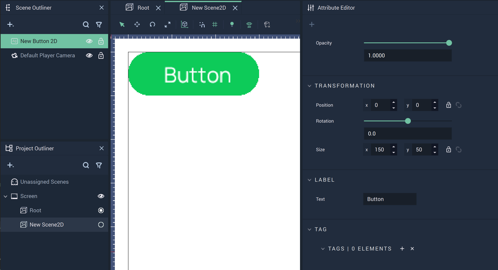
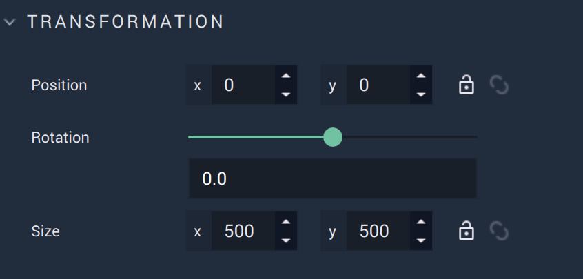
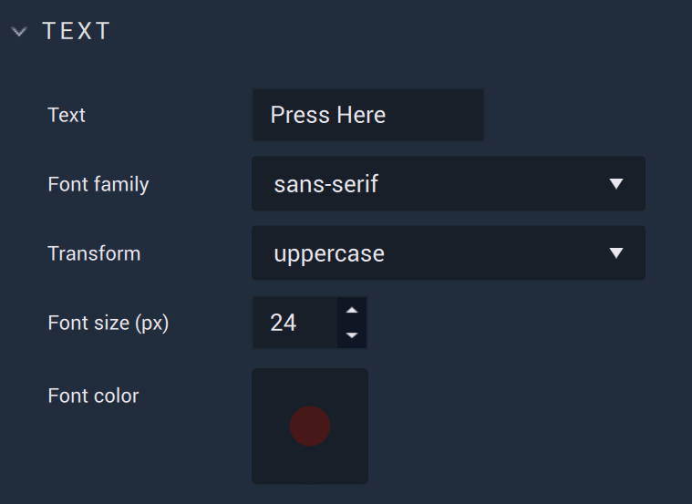
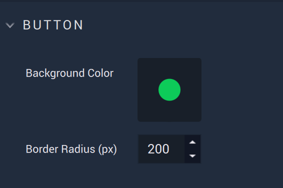
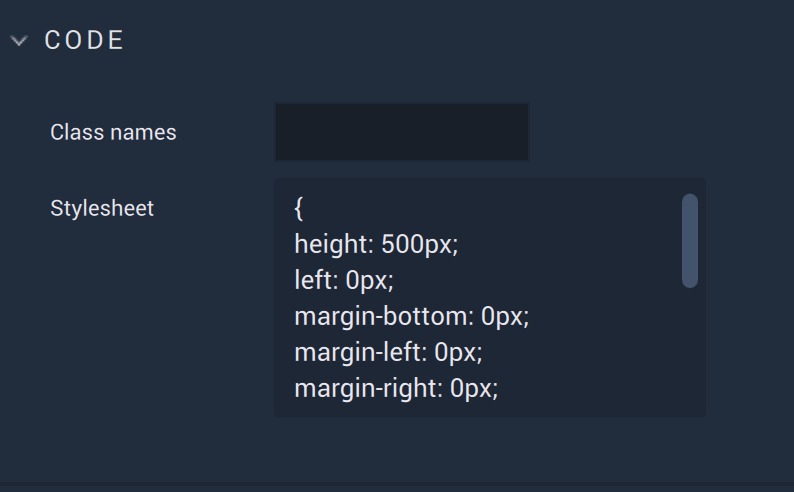
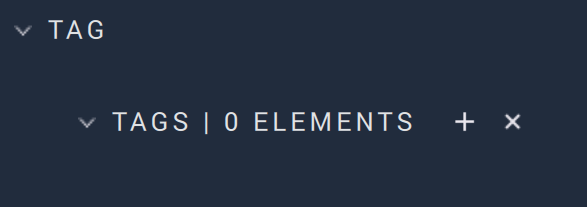

# Button

The **Button** **GUI** **Object** is a simple icon to attach **Logic** to. Its text, placement, and size can be altered in the **Attribute Editor**. 

## Attributes
### Transformation

The `Transformation` **Attributes** deal with placement, rotation, and size in *XY* space. More information can be found [here](../../attributes/common-attributes/transformation.md).

### Text

There are several **Attributes** here which help customize the textual elements of a **Button**.

`Text` is the text itself which will displayed on the **Button**. Please not that only text which fits within the confines of the **Button** will be displayed. Size the **Button** accordingly. 

`Font family` offers three different font types: `monospace`, `sans-serif`, and `serif`.

`Transform` can easily change certain text aesthetics without requiring the user to change the `Text` **Attribute** itself. `Capitalize` makes the first letter capital, `uppercase` makes all letters capital, and `lowercase` makes all letters lowercase. 

`Font size (px)` determines the size of the font in pixels.

`Font color` decides the color of the **Button's** text.

### Button

`Background Color` determines the color of the **Button** itself. In the example image above, it is green. 

`Border radius (px)` decides to what extent the corners and edges of the **Button** are rounded. 

### Code

`Class names` contain the *CSS* class names of the **Object**. 

`Stylesheet` contains the *CSS* stylesheet of the **Object**.

### Tag

This **Attribute** manages the *tags* for the **Button**. See more on *tags* [here.](../../attributes/common-attributes/tag.md)