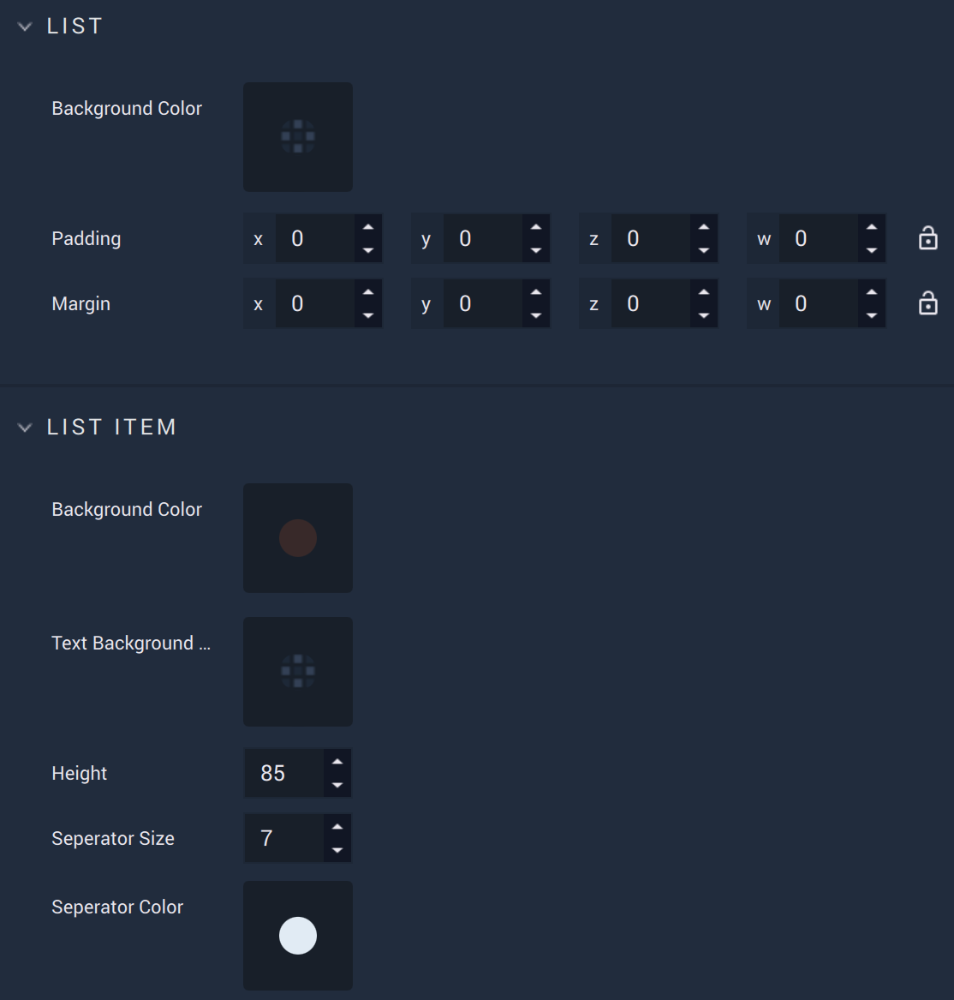
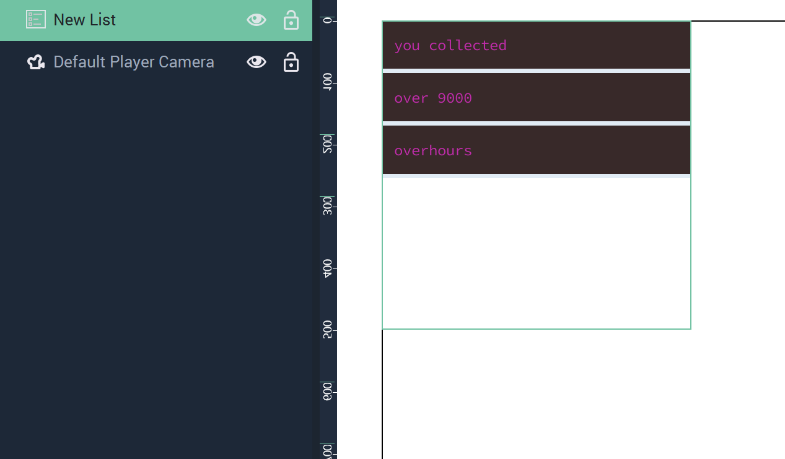
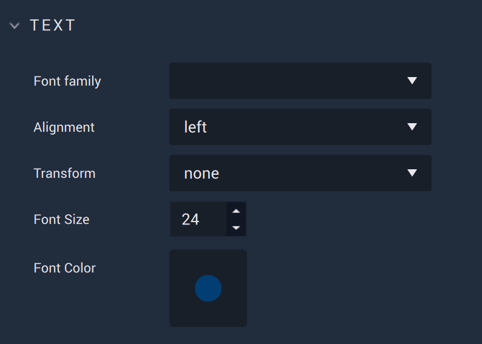
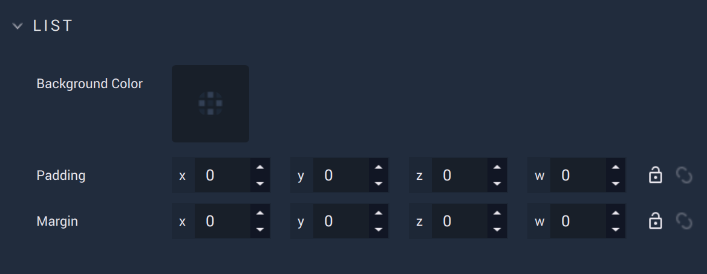
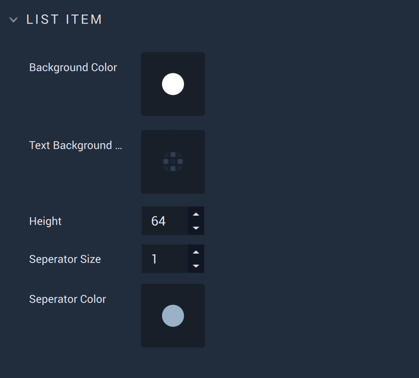

# List

A **List** is a **GUI 2D Object** that allows the user to create a *list*. The contents of the list, and any visual components, can be customized in the **Attributes**.  





The `List`, `List Item`, `Text`, and `List Item Icon` categories cover visual aspects of the **List Object** and any distancing and spacing specifications of its components.

The `JSON File` contains the actual data of the **List** and is a required **Attribute** that must be provided by the user. For example, a *JSON* file could contain something like this:


```
    {
        "icon": "",
        "text": "you collected"
    },
    {
        "icon": "",
        "text": "over 9000"
    },
    {
        "icon": "",
        "text": "overhours"
    }
```
This results in a **List** that appears like this (with some other visual **Attributes** changed):



## Attributes

The **Object's** **Attributes** can be used to fully customize the **Object**. Explained below, they are:

* [**Transformation**](list.md#transformation)
* [**Text**](list.md#text)
* [**Miscellaneous**](list.md#miscellaneous)
* [**List**](list.md#list)
* [**List Item**](list.md#list-item)
* [**Text**](list.md#list-1)
* [**List Item Icon**](list.md#list-item-icon)
* [**Data**](list.md#data)
* [**Code**](list.md#code)
* [**Tag**](list.md#tag)

### Transformation


The `Transformation` **Attributes** deal with placement, rotation, and size in *XY* space. More information can be found [here](../../attributes/common-attributes/transformation/README.md).

### Text



The `Text` **Attributes** customize the textual elements of a **List**. 

* `Font family` offers three different font types: `monospace`, `sans-serif`, and `serif`. More fonts can be added by the user in [**Project Settings**](../../../modules/project-settings/fonts.md).

* `Alignment` sets the alignment of the text. This is either left, right, or center.

* `Transform` can easily change certain text aesthetics without requiring the user to change the `Options` **Attributes** themselves. `Capitalize` makes the first letter capital, `uppercase` makes all letters capital, and `lowercase` makes all letters lowercase.  

* `Font size (px)` determines the size of the font in pixels.

* `Font color` decides the color of the **List's** text.

### Miscellaneous

tbd

### List



### List Item



### Text


### List Item Icon


### Data


### Code


The `Code` **Attributes** allow for more customizability. This can override any stylesheet provided in the [**Project Settings**](../../../modules/project-settings/style.md) or a [**Scene2D**](../../project-objects/scene2d.md). 

To address these in the **Logic**, please refer to the [**Object 2D Nodes**](../../../toolbox/incari/object2d/README.md).

* `Class names` contain the *CSS* class names of the **Object**. 

* `Stylesheet` contains the *CSS* stylesheet of the **Object**.

### Tag


This **Attribute** manages the *tags* for the **List**. See more on *tags* [here.](../../attributes/common-attributes/tag.md)