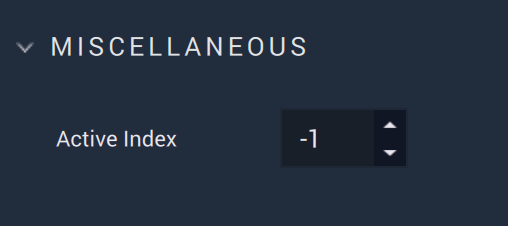

# List

A **List** is a **GUI 2D Object** that allows the user to create a *list*. The contents of the list, and any visual components, can be customized in the [**Attributes**](list.md#attributes).  

## Attributes

The **Object's** **Attributes** can be used to fully customize the **Object**. Explained below, they are:

* [**Transformation**](list.md#transformation)
* [**Text**](list.md#text)
* [**Miscellaneous**](list.md#miscellaneous)
* [**List**](list.md#list)
* [**List Item**](list.md#list-item)
* [**Text**](list.md#list-1)
* [**List Item Icon**](list.md#list-item-icon)
* [**Data**](list.md#data)
* [**Code**](list.md#code)
* [**Tag**](list.md#tag)

### Transformation


The `Transformation` **Attributes** deal with placement, rotation, and size in *XY* space. More information can be found [here](../../attributes/common-attributes/transformation/README.md).

### Text


The `Text` **Attributes** customize the textual elements of a **List**. 

* `Font family` offers three different font types: `monospace`, `sans-serif`, and `serif`. More fonts can be added by the user in [**Project Settings**](../../../modules/project-settings/fonts.md).

* `Alignment` sets the alignment of the text. This is either left, right, or center.

* `Transform` can easily change certain text aesthetics without requiring the user to change the `Options` **Attributes** themselves. `Capitalize` makes the first letter capital, `uppercase` makes all letters capital, and `lowercase` makes all letters lowercase.  

* `Font size (px)` determines the size of the font in pixels.

* `Font color` decides the color of the **List's** text.

### Miscellaneous



The `Active Index` **Attribute** decides which item is currently active in the **List**. 

### List


The `List` **Attributes** provide crucial data for a **List Object**.

* `Background Color` decides the background color of the **List**.
* `Padding` adds adds *padding* to a **List** depending on what sizes are specified and for which sides. The options are `x` for the top, `y` for the right, `z` for the bottom, and `w` for the left. [Padding](https://www.w3schools.com/cssref/pr_padding.php) is often seen in the context of *CSS*. Similarly, in **Incari**, it is the extra space inside the **List Object** itself. The separators of the **List** do not extend into this space. 
* `Margin` adds *margins* to a **List** depending on what sizes are specified and for which sides. The options are `x` for the top, `y` for the right, `z` for the bottom, and `w` for the left. [Margins](https://www.w3schools.com/Css/css_margin.asp) are often seen in the context of *CSS*. Similarly, here, it is the extra space around the **List** in relation to other **Objects**. 

### List Item


The `List Item` **Attributes** provide crucial data for a **List Object's** items.

* `Background Color` decides the background color of the **List's** items.
* `Text Background Color` determines the background color of the **List** items' text. 
* `Height` decides the space between each segement of the list (the total vertical space of an item).
* `Separator Size` chooses the thickness of the separators, which are the lines between **List** items. 
* `Separator Color` determines the color of the separators. 

### Text


The `Text Margin` **Attribute** adds *margins* to the text of a **List** depending on what sizes are specified and for which sides. The options are `x` for the top, `y` for the right, `z` for the bottom, and `w` for the left. [Margins](https://www.w3schools.com/Css/css_margin.asp) are often seen in the context of *CSS*. Similarly, here, it is the extra space around the **List** item's text in relation to the space around it.  

### List Item Icon


The `List Item Icon` **Attributes** provide crucial data for a **List Object's** icons.

* `Use Icon` toggles the visibility of any icons in the **JSON** file on or off. 
* `Icon Size` determines the size of the icons. 
* `Icon Margin` adds *margins* to the icons of a **List's** depending on what sizes are specified and for which sides. The options are `x` for the top, `y` for the right, `z` for the bottom, and `w` for the left. [Margins](https://www.w3schools.com/Css/css_margin.asp) are often seen in the context of *CSS*. Similarly, here, it is the extra space around the **List** item's icon in relation to the space around it.
* `Icon Background` decides the background color of the icons.


### Data


The `JSON File` contains the actual data of the **List** and is a required **Attribute** that must be provided by the user. For example, a *JSON* file could contain something like this:


```
   [
    {
        "icon": "Users/user.name/Documents/Project1/Assets/image1.jpg",
        "text": "you collected"
    },
    {
        "icon": "Users/user.name/Documents/Project1/Assets/image2.png",
        "text": "over 9000"
    },
    {
        "icon": "Users/user.name/Documents/Project1/Assets/image3.png",
        "text": "overhours"
    }
]
```
This results in a **List** that appears like this (with some other visual **Attributes** changed):


Please note, for icon images the absolute path on one's local machine must be used. 

### Code


The `Code` **Attributes** allow for more customizability. This can override any stylesheet provided in the [**Project Settings**](../../../modules/project-settings/style.md) or a [**Scene2D**](../../project-objects/scene2d.md). 

To address these in the **Logic**, please refer to the [**Object 2D Nodes**](../../../toolbox/incari/object2d/README.md).

* `Class names` contain the *CSS* class names of the **Object**. 

* `Stylesheet` contains the *CSS* stylesheet of the **Object**.

### Tag


This **Attribute** manages the *tags* for the **List**. See more on *tags* [here.](../../attributes/common-attributes/tag.md)