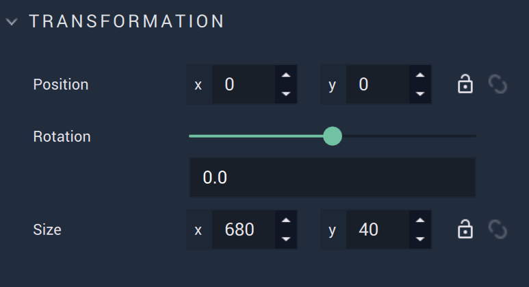

# Slider

The **Slider** is a **GUI** **2D Object** that allows the user to create a customizable slider selector. The customization is done through the **Attributes**. <!-- Its **Attributes** offer the options to customize the **Slider**. -->

## Attributes

### Transformation

The `Transformation` **Attributes** deal with placement, rotation, and size in *XY* space. More information can be found [here](../../attributes/common-attributes/transformation.md).

### Slider

The **Slider Attributes** offer the user options to customize the **Slider**:

`Value` determines where the handle will appear on the track on start. 

`Minimum` is the leftmost value that occurs on the track.

`Maximum` is the rightmost value that occurs on the track. 

`Step` is the amount the values increase to the next.

`Track Color` is the color of the track (the line that appears as part of the **Slider**).

`Track thickness (px)` is how thick the track appears.

`Handle color` is the color of the handle (the sliding object along the track)

`Handle size (px)` is the size of the handle. 

Finally, the **Slider** works like this when the **Project** is run:

### Code

`Class names` contain the *CSS* class names of the **Object**. 

`Stylesheet` contains the *CSS* stylesheet of the **Object**.

### Tag

This **Attribute** manages the *tags* for the **Dropdown**. See more on *tags* [here.](../../attributes/common-attributes/tag.md)

