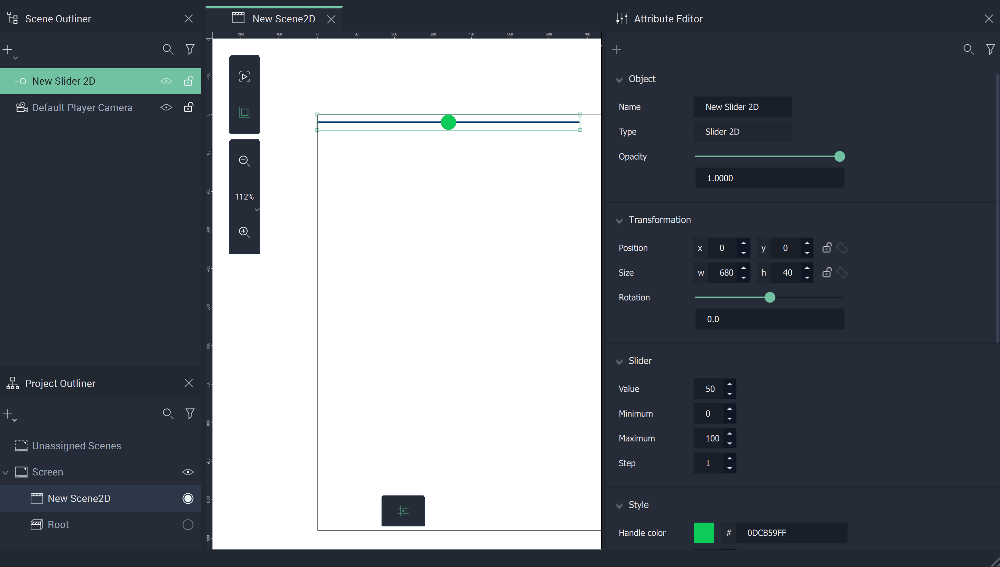
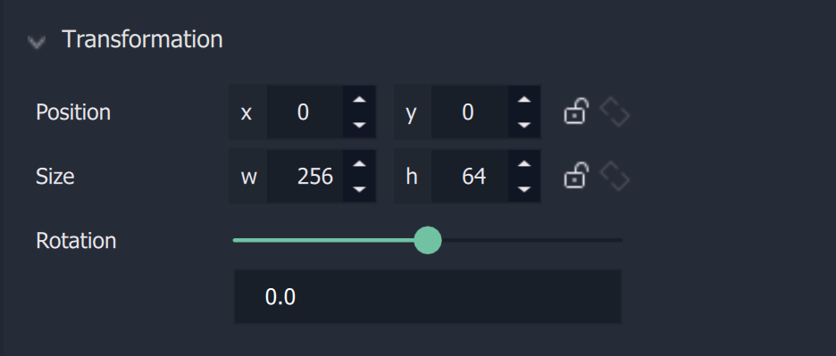

# Slider

The **Slider** is a **GUI** **2D Object** that allows the user to create a customizable slider selector. The customization is done through the [**Attributes**](slider.md#attributes). <!-- Its **Attributes** offer the options to customize the **Slider**. -->

## Attributes

The **Object's** **Attributes** can be used to fully customize the **Object**. Explained below, they are:

* [**Transformation**](slider.md#transformation)
* [**Slider**](slider.md#slider)
* [**Style**](slider.md#style)
* [**Tag**](slider.md#tag)

### Transformation

The `Transformation` **Attributes** deal with placement, rotation, and size in *XY* space. More information can be found [here](../../attributes/common-attributes/transformation/README.md).

### Slider

The **Slider Attributes** offer the user options to customize the **Slider**:

* `Value` determines where the handle will appear on the track on start. 

* `Minimum` is the leftmost value that occurs on the track.

* `Maximum` is the rightmost value that occurs on the track. 

* `Step` is the amount the values increase to the next.

### Style

The **Style Attributes** offer the user options to customize further visual aspects of the **Slider**:

* `Handle color` is the color of the handle (the sliding object along the track)

* `Handle size (px)` is the size of the handle. 

* `Track Color` is the color of the track (the line that appears as part of the **Slider**).

* `Track thickness (px)` is how thick the track appears.

* `CSS Classes` contain the *CSS* class names of the **Object**. 

* `Stylesheet` contains the *CSS* stylesheet of the **Object**. This can override any stylesheet provided in the [**Project Settings**](../../../modules/project-settings/style.md) or a [**Scene2D**](../../project-objects/scene2d.md). To address these in the **Logic**, please refer to the [**Object 2D Nodes**](../../../toolbox/incari/object2d/README.md).

Finally, the **Slider** works like this when the **Project** is run:

### Tag

This **Attribute** manages the *tags* for the **Slider**. See more on *tags* [here.](../../attributes/common-attributes/tag.md)

