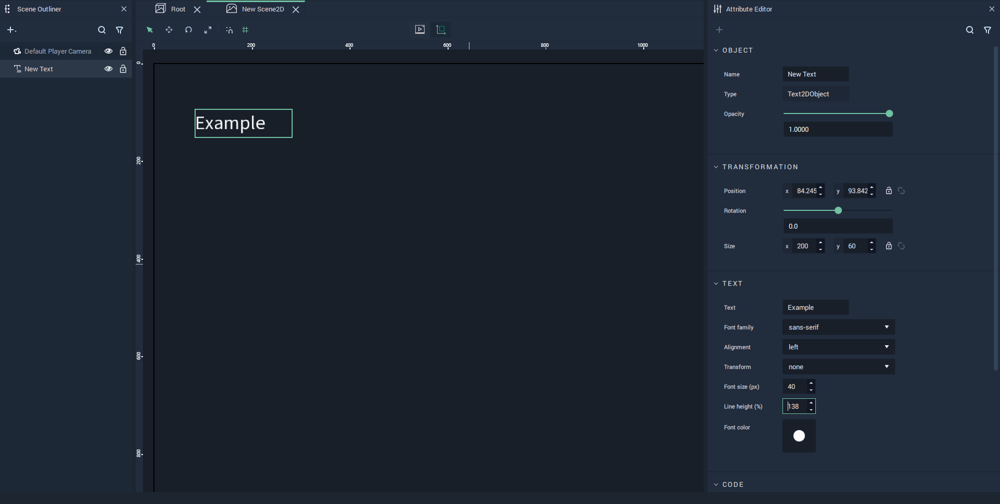
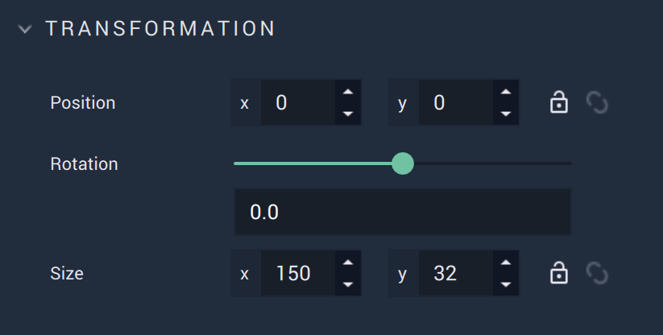
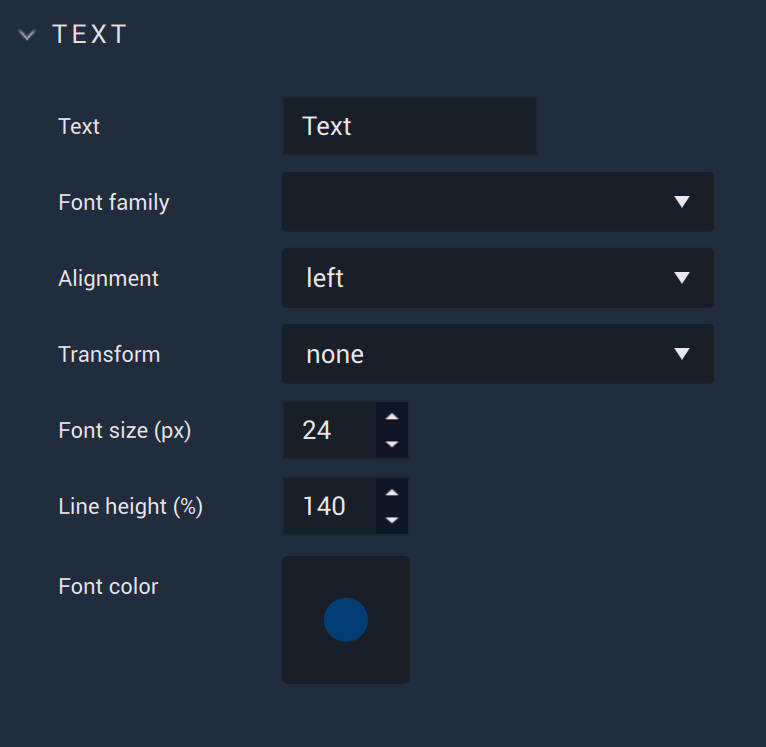

# Text

The **Text** **Object** allows the user to add text to their **Project**. It can be completely customized in the [**Attributes**](slider.md#attributes).

## Attributes

The **Object's** **Attributes** can be used to fully customize the **Object**. Explained below, they are:

* [**Transformation**](text.md#transformation)
* [**Text**](text.md#text)
* [**Code**](text.md#code)
* [**Tag**](text.md#tag)

### Transformation

The `Transformation` **Attributes** deal with placement, rotation, and size in *XY* space. More information can be found [here](../../attributes/common-attributes/transformation/README.md).

### Text

The **Text Attributes** offer the user options to customize the **Text**:

* `Text` is the text itself which will be displayed. 

* `Font family` offers three different font types: `monospace`, `sans-serif`, and `serif`. More fonts can be added by the user in [**Project Settings**](../../../modules/project-settings/fonts.md).

* `Alignment` sets the alignment of the text. This is either left, right, or center. 

* `Transform` can easily change certain text aesthetics without requiring the user to change the `Text` **Attribute** itself. `Capitalize` makes the first letter capital, `uppercase` makes all letters capital, and `lowercase` makes all letters lowercase. 

* `Font size (px)` determines the size of the font in pixels.

* `Line height (%)` determines the placement of the text within the text box. 

* `Font color` decides the color of the text.

### Code

The `Code` **Attributes** allow for more customizability. This can override any stylesheet provided in the [**Project Settings**](../../../modules/project-settings/style.md) or a [**Scene2D**](../../project-objects/scene2d.md). 

To address these in the **Logic**, please refer to the [**Object 2D Nodes**](../../../toolbox/incari/object2d/README.md).

* `Class names` contain the *CSS* class names of the **Object**. 

* `Stylesheet` contains the *CSS* stylesheet of the **Object**.

### Tag 

This **Attribute** manages the *tags* for the **Text**. See more on *tags* [here.](../../attributes/common-attributes/tag.md)