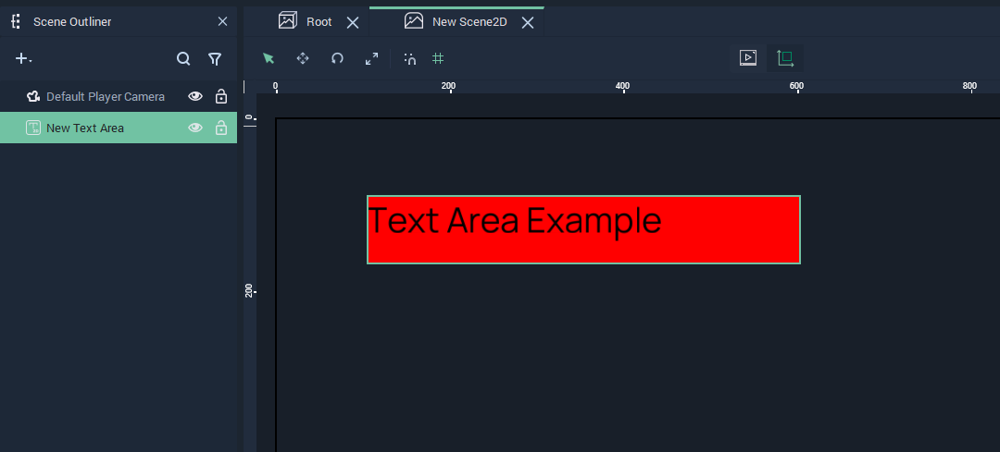
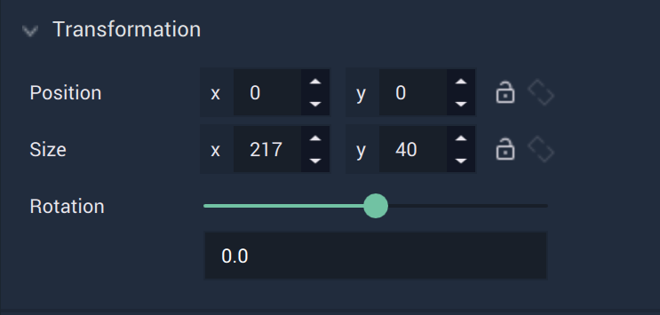
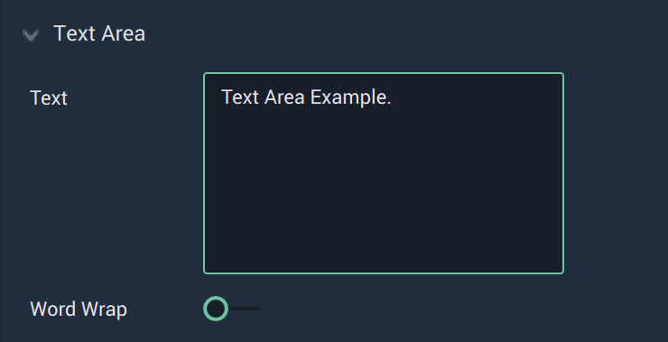
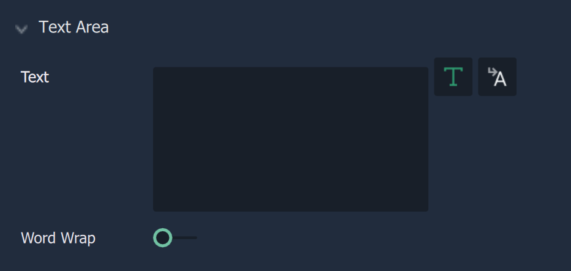
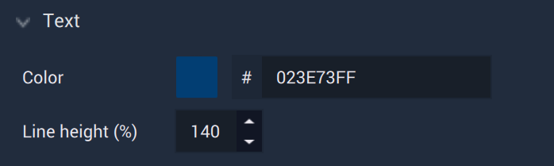
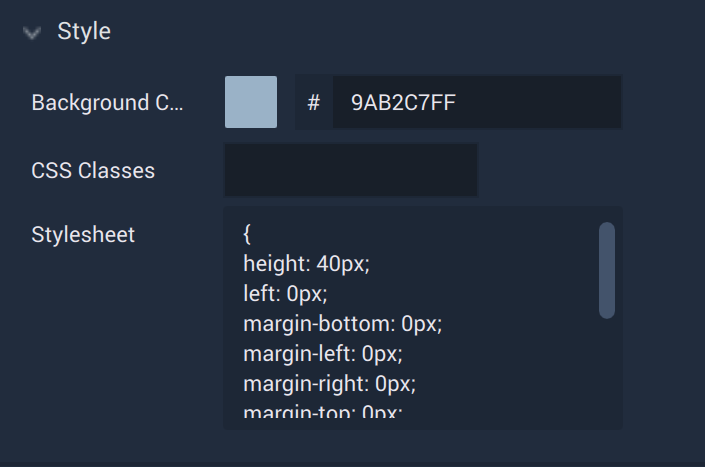

# Text Area

The **Text Area** **Object** allows the user to add multiline text with a background to their **Project**. It can be completely customized in the [**Attributes**](textarea.md#attributes).

## Attributes

The **Object's** **Attributes** can be used to fully customize the **Object**. Explained below, they are:

* [**Transformation**](textarea.md#transformation)
* [**Text Area**](textarea.md#text-area)
* [**Text**](textarea.md#text)
* [**Font**](textarea.md#font)
* [**Style**](textarea.md#style)
* [**Tag**](textarea.md#tag)

### Transformation

The `Transformation` **Attributes** deal with placement, rotation, and size in *XY* space. More information can be found [here](../../attributes/common-attributes/transformation/README.md).

### Text Area

The `Text Area` **Attributes** provide crucial data for a **Text Area Object**.

There are two ways the `Text Area` Attribute can be incorporated in the **Object**. That is either as `Static Text` or `Translation`. This can be switched using the text or translation icons to the right, in that order. 

#### Static Text

When `Static Text` is selected, the **Attributes** are:

* `Text` is the text itself which will be displayed in the **Text Area**. 

* `Word Wrap` can be enabled and disabled. When it is enabled, the text fits within the confines of the **Text Area**. If disabled, the text will be in one line and may run off the **Text Area**, causing some text to not be visible. In this case, please adjust the dimensions of the **Text Area**.

#### Translation

When `Translation` is selected, the **Attributes** are:

* `Translation` lets the user choose the key of the current language (which is established in the [**Project Settings**](../../../modules/project-settings/localization.md)). In the image above, the selected key is `phrase`.
 

* `Word Wrap` can be enabled and disabled. When it is enabled, the text fits within the confines of the **Text Area**. If disabled, the text will be in one line and may run off the **Text Area**, causing some text to not be visible. In this case, please adjust the dimensions of the **Text Area**.

### Text

 
The **Text Attributes** offer the user options to customize the **Text**:

* `Line height (%)` determines the placement of the text within the text box. 

* `Color` decides the color of the text.

### Font

The **Font Attributes** offer the user options to customize the **Text's** font:

* `Family` offers three different font types: `monospace`, `sans-serif`, and `serif`. More fonts can be added by the user in [**Project Settings**](../../../modules/project-settings/fonts.md).

* `Size` determines the size of the font in pixels.

### Style 

The **Style Attributes** offer the user options to customize further visual aspects of the **Text Area**:

* The `Background Color` is the color of the **Text Area** box which appears behind the text. 

* `CSS Classes` contain the *CSS* class names of the **Object**. 

* `Stylesheet` contains the *CSS* stylesheet of the **Object**. This can override any stylesheet provided in the [**Project Settings**](../../../modules/project-settings/style.md) or a [**Scene2D**](../../project-objects/scene2d.md). To address these in the **Logic**, please refer to the [**Object 2D Nodes**](../../../toolbox/incari/object2d/README.md).

### Tag 

This **Attribute** manages the *tags* for the **Text Area**. See more on *tags* [here.](../../attributes/common-attributes/tag.md)
