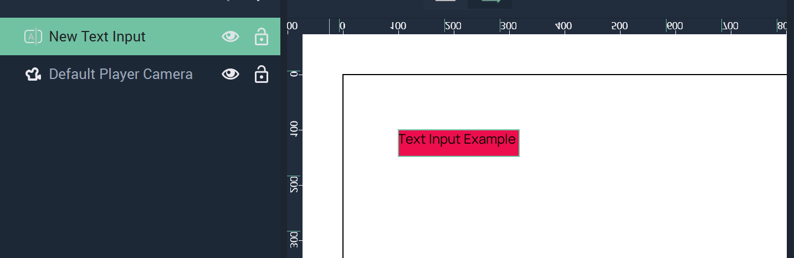
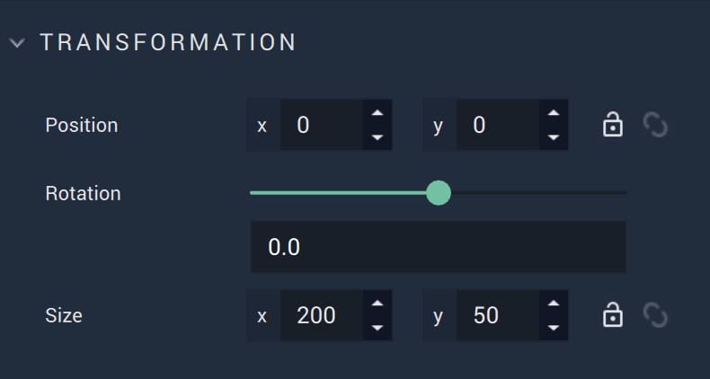
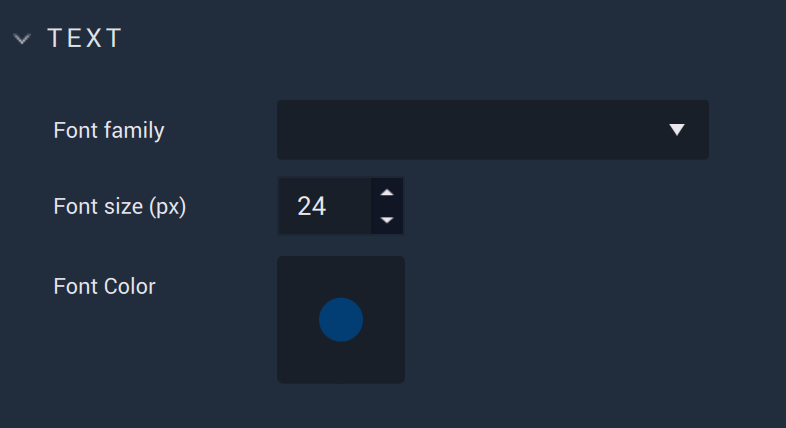
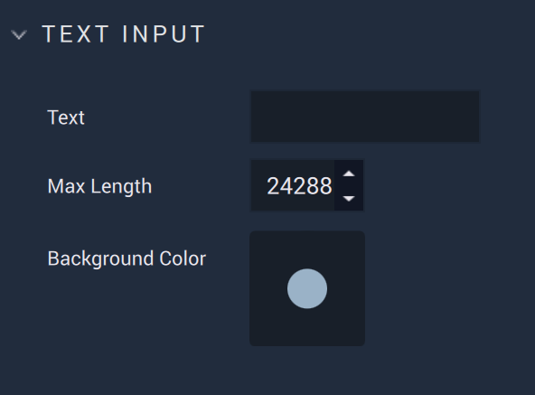

# Text Input

The **Text Input** **Object** allows the user to add singleline text with a background to their **Project**. It can be completely customized in the [**Attributes**](textinput.md#attributes).

## Attributes

The **Object's** **Attributes** can be used to fully customize the **Object**. Explained below, they are:

* [**Transformation**](textinput.md#transformation)
* [**Text**](textinput.md#text)
* [**Text Input**](textinput.md#text-input)
* [**Code**](textinput.md#code)
* [**Tag**](textinput.md#tag)

### Transformation

The `Transformation` **Attributes** deal with placement, rotation, and size in *XY* space. More information can be found [here](../../attributes/common-attributes/transformation/README.md).

### Text 

The **Text Attributes** offer the user options to customize the **Text**:

* `Font family` offers three different font types: `monospace`, `sans-serif`, and `serif`. More fonts can be added by the user in [**Project Settings**](../../../modules/project-settings/fonts.md).

* `Font size (px)` determines the size of the font in pixels.

* `Font color` decides the color of the text.

### Text Input

The `Text Input` **Attributes** provide crucial data for a **Text Input Object**.

* `Text Area` is simply the desired text.

* `Max Length` is the maximum number of characters of the text. When this number is reduced, the characters that fall after that index are deleted. Increasing the number will not bring back these characters once removed. 

* The `Background Color` is the color of the **Text Input** box which appears behind the text.

### Code

The `Code` **Attributes** allow for more customizability. This can override any stylesheet provided in the [**Project Settings**](../../../modules/project-settings/style.md) or a [**Scene2D**](../../project-objects/scene2d.md). 

To address these in the **Logic**, please refer to the [**Object 2D Nodes**](../../../toolbox/incari/object2d/README.md).

* `Class names` contain the *CSS* class names of the **Object**. 

* `Stylesheet` contains the *CSS* stylesheet of the **Object**.

### Tag

This **Attribute** manages the *tags* for the **Text Input**. See more on *tags* [here.](../../attributes/common-attributes/tag.md)
