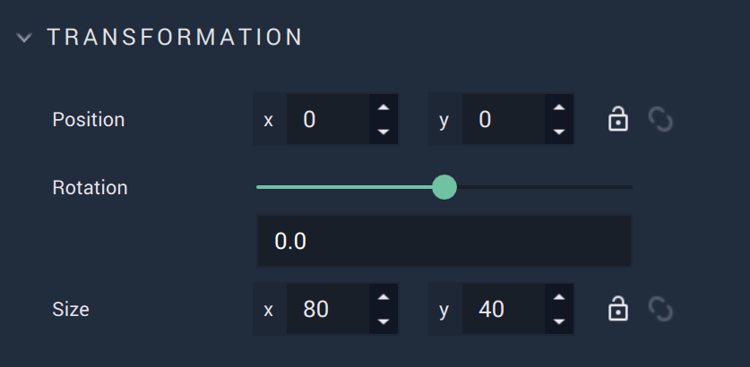
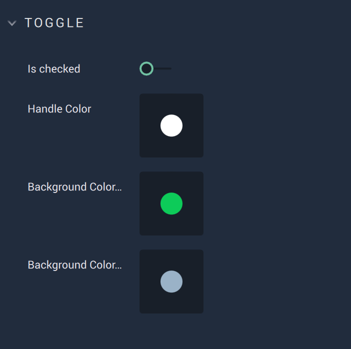

# Toggle

The **Toggle** **Object** is a **2D GUI Object** that has two states: checked or unchecked. Its initial state and colors can be customized in the **Attributes**.

 

## Attributes

### Transformation

The `Transformation` **Attributes** deal with placement, rotation, and size in *XY* space. More information can be found [here](../../attributes/common-attributes/transformation.md).

### Toggle

`Is checked` can be enabled or disabled. Enabled toggles it on and disabled toggles it off. 

`Handle Color` is the color of the **Toggle's** handle. It is the small circle which appears on the background of the **Toggle**. 

`Background Color Checked` is the color of the background when `Is checked` is enabled. 

`Background Color Unchecked` is the color of the background when `Is checked` is disabled. 

### Code

`Class names` contain the *CSS* class names of the **Object**. 

`Stylesheet` contains the *CSS* stylesheet of the **Object**.

### Tag

This **Attribute** manages the *tags* for the **Dropdown**. See more on *tags* [here.](../../attributes/common-attributes/tag.md)