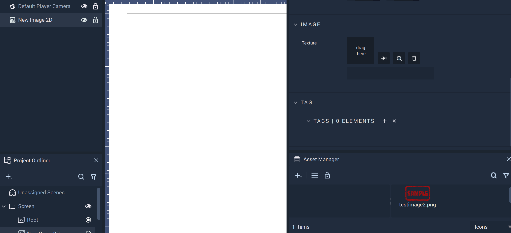
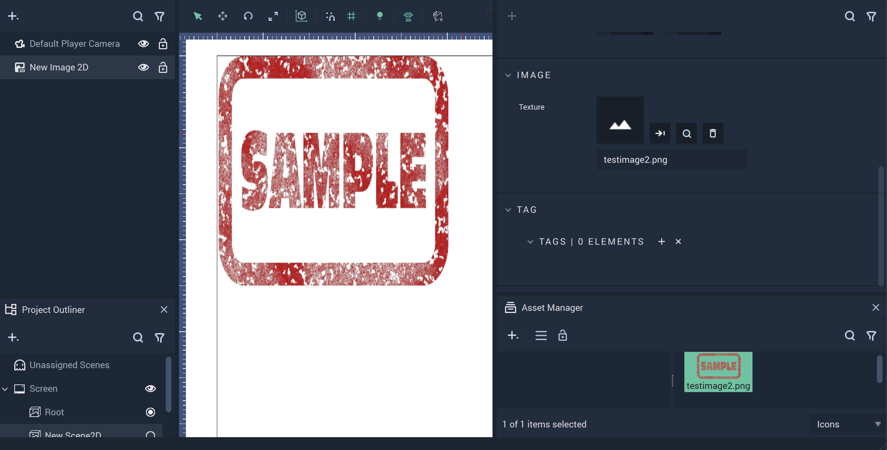

# Image 

**Images** in **Scene2Ds**  allow the user to add files like `.pngs` and `.jpegs` to *2D* space. This diversifies the visual aspects of a **Project**.

Simply click on the `Texture` **Attribute** and select the desired image, or drag the image from the [**Asset Manager**](../../modules/asset-manager.md) to the file icon. **Images** also have [`Transformation`](../attributes/common-attributes/transformation/README.md) and [`Tag`](../attributes/common-attributes/tag.md) **Attributes**.

The **Image** will then be displayed in the **Viewport**.

