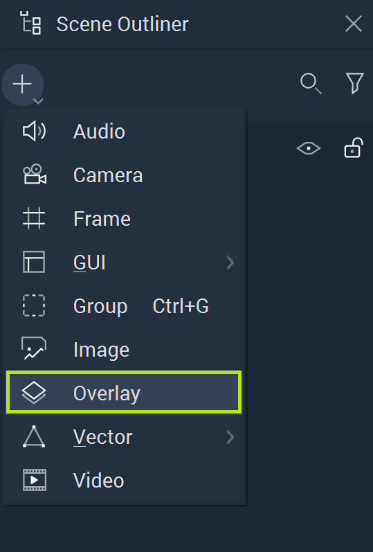
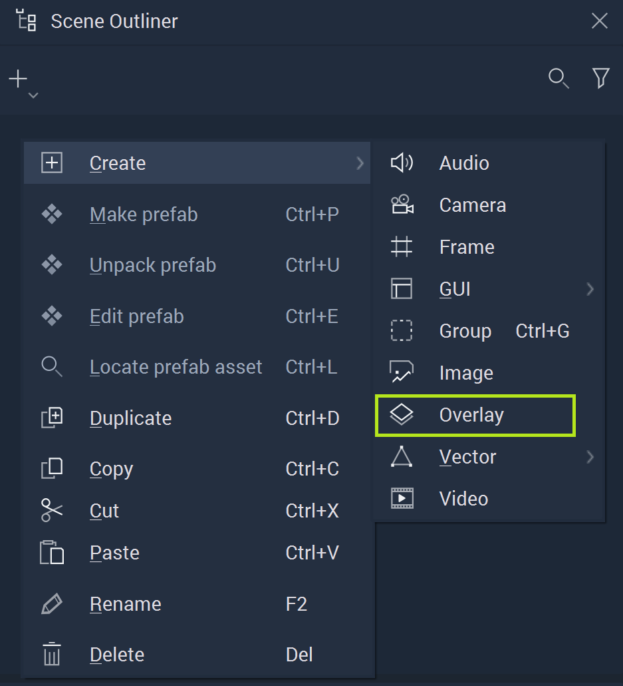
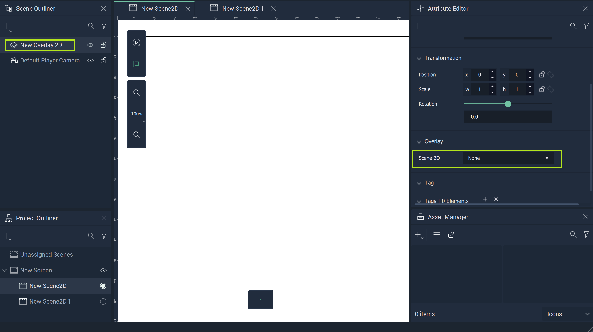
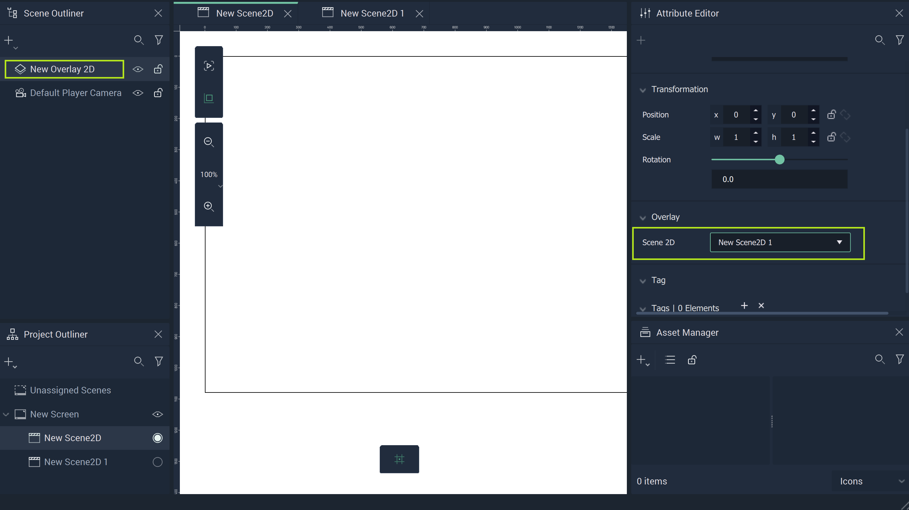
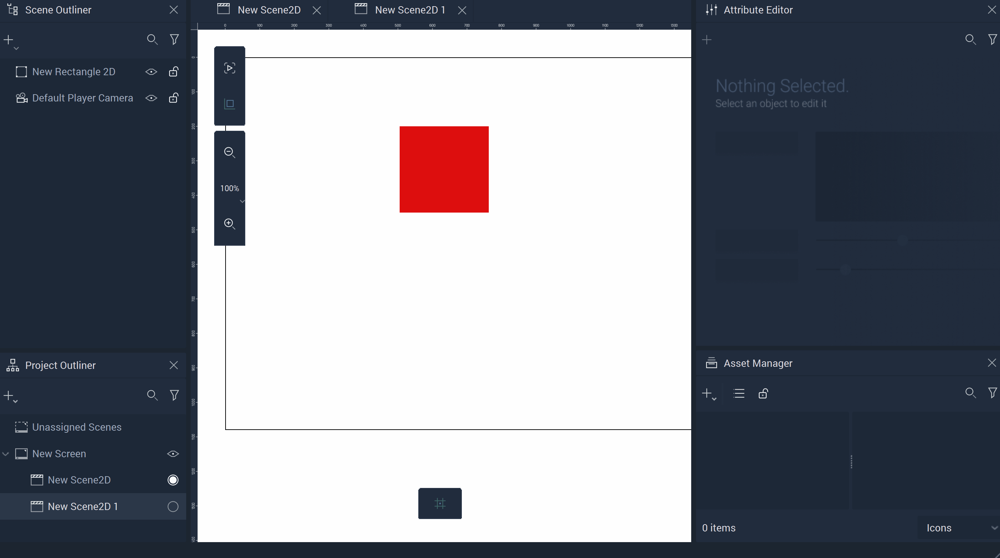

# Overlay

**Overlay Objects** allow the user to reference other **Scene2Ds** within a **Scene2D**. 

## Setting up for an Overlay Object

To start, the user must create a **Scene2D** and populate it with the desired *2D* components. This can be done in the **Project Outliner**. After it is created and dragged to the correct **Screen**, the user just needs to locate the appropriate tab at the top of the window, below the Menu bar of **Incari Studio**. 

Once finished with any *2D* aspects for that particular **Scene2D**, the user then needs to go to the desired **Scene2D** in which they wish to overlay the other *2D* elements. 

## Creating an Overlay Object

To create an **Overlay Object**, either click the plus icon in the **Scene Outliner** or right-click in the **Scene Outliner**, hover over `Create`, and locate **Overlay**.

In the **Attribute Editor**, the desired **Scene2D** simply needs to be selected from the drop-down Menu of `2D Scene` under the `Overlay` **Attribute**. 

Once this is done, the **Scene2D** will render over the target **Scene2D**. An example of this process is shown below, culminating in a **Player View** that displays the contents of the **Overlay Object**.

## Overlay Order

It is possible to have multiple **Overlays** in a **Scene2D**. If they are overlapping, there is an order in which they appear. This is determined by the order in the **Scene Outliner**. The top-most **Overlay** will appear at the front and the bottom-most will be appear behind any and all **Overlays** before it. 

Please note that when switching the order in the **Scene Outliner**, this will not be reflected in **Incari Studio** in either `Player view` or `Editor view`. The user must open the **Player** to see any changes. 

