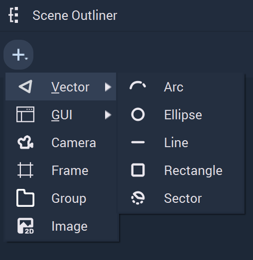
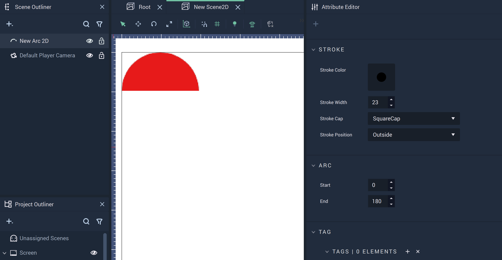
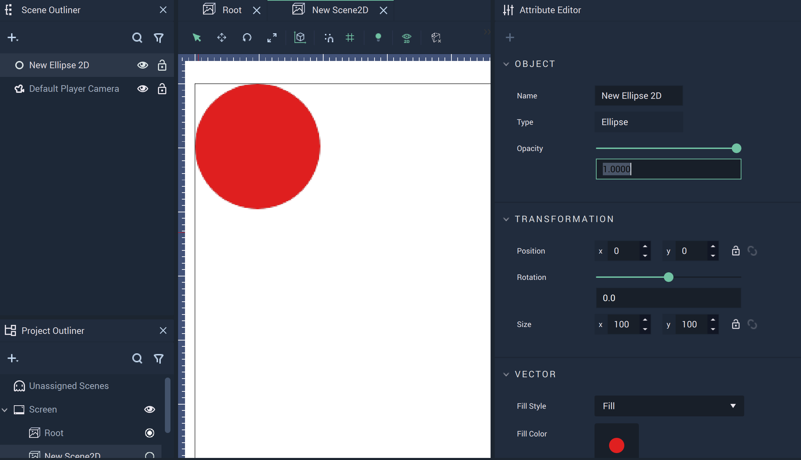
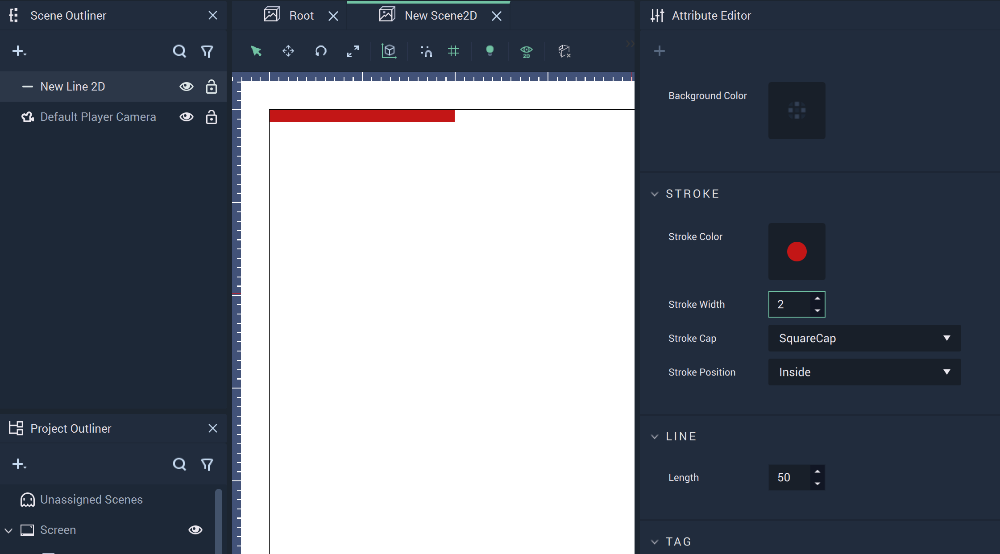
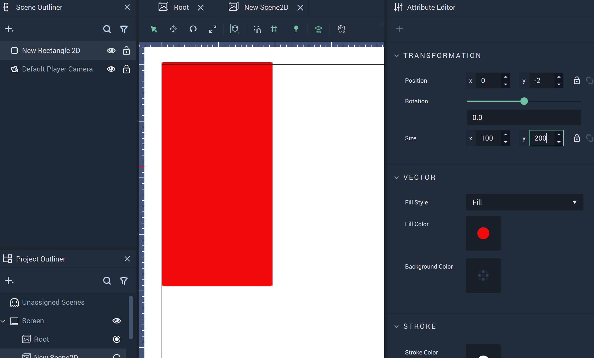
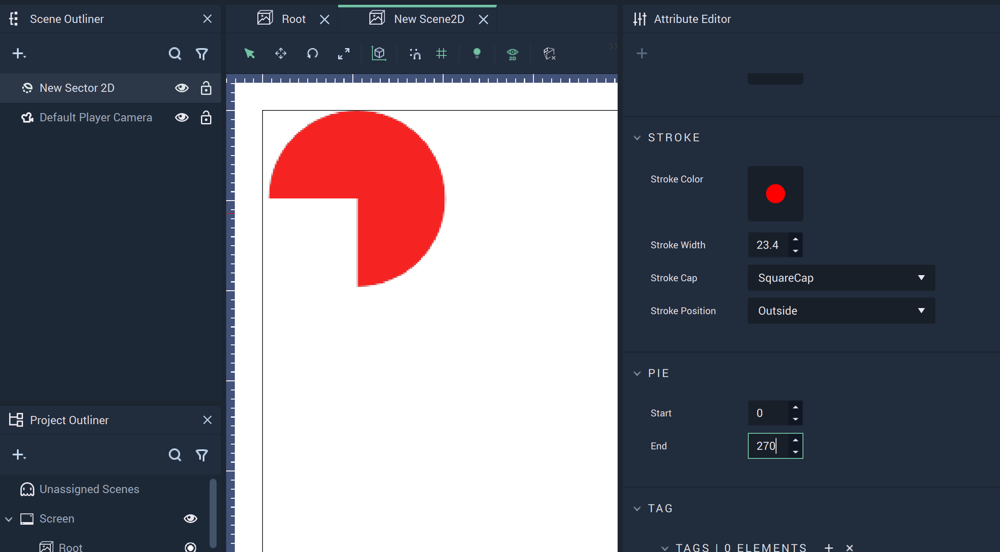

# Vector

The **Vector Objects** in **Scene2Ds** provide alternatives to their **Vector** counterparts in 3D **Scenes** and encompass several two-dimensional shapes that help build up the visual aspects of a _User Interface_. Unlike **Vector Objects** in 3D **Scenes**, **Vector Objects** in **Scene2Ds** don't contain Z axis components.

There are several **Vector Objects** that are described below:

* [Arc](vector2d.md#arc)
* [Ellipse](vector2d.md#ellipse)
* [Line](vector2d.md#line)
* [Rectangle](vector2d.md#rectangle)
* [Sector](vector2d.md#sector)

## Arc

A **2D Object** that is a piece of a circle defined by a starting and ending degree disregarding the center and running straight through between the two selected degree points. It is restricted to the X and Y axes. There are several **Nodes** attributed to **Arc Objects**, which can be found [_here_](../../toolbox/incari/vector/arc/README.md).

## Ellipse

A circular **2D** **Object** that is restricted to the X and Y axes.

## Line

A linear **2D** **Object** that is restricted to the X and Y axes. There are several **Nodes** attributed to **Line Objects**, which can be found [_here_](../../toolbox/incari/vector/line/README.md).

## Rectangle

A rectangular **2D** **Object** that is restricted to the X and Y axes. There are several **Nodes** attributed to **Rectangle Objects**, which can be found [_here_](../../toolbox/incari/vector/rectangle/README.md).

## Sector

A **2D** **Object** that is a piece of a circle defined by a starting and ending degree and a connected point at the center of the circle. It is restricted to the X and Y axes. There are several **Nodes** attributed to **Sector Objects**, which can be found [_here_](../../toolbox/incari/vector/pie/README.md).

