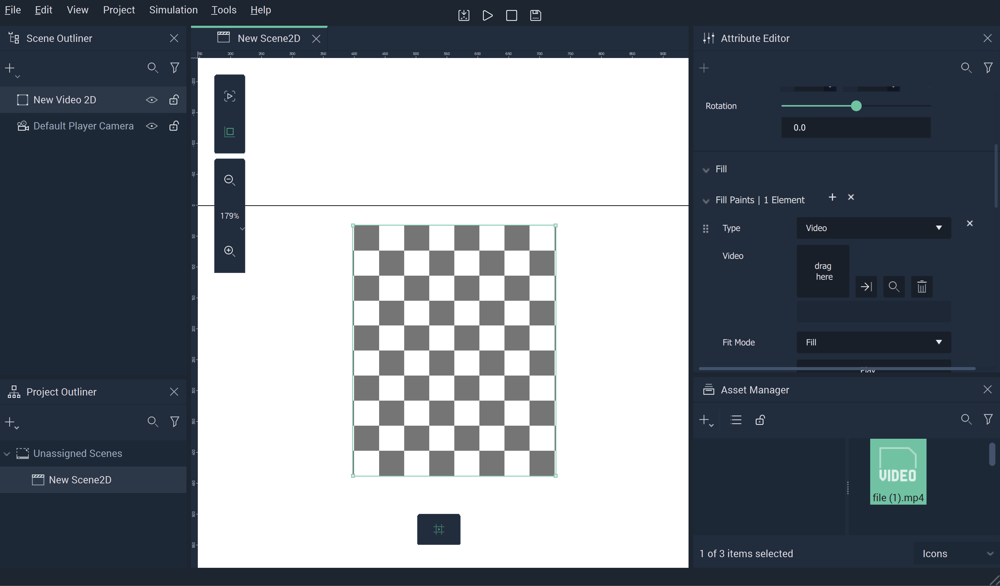
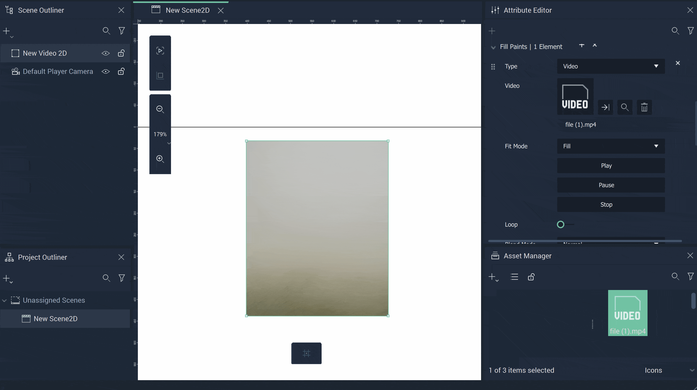

# Video

**Videos** in **Scene2Ds**  allow the user to add files like `.mp4` and `.wmv` to *2D* space. This diversifies the visual aspects of a **Project**.

When created, the `Fill` **Attribute** is already set to `Video`. Here, the user just needs to click the `Video` **Attribute** and select the desired video, or drag the video from the [**Asset Manager**](../../modules/asset-manager.md) to the file icon. **VIdeos** also have [`Transformation`](../attributes/common-attributes/transformation/README.md) and [`Tag`](../attributes/common-attributes/tag.md) **Attributes**.

The **Video** will then be displayed in the **Viewport**.

