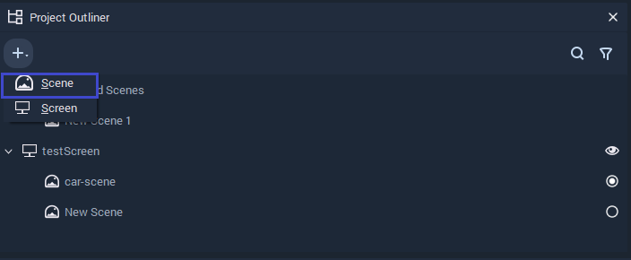

# Scene

A **Scene** is a collection of Incari **Objects** such as **Mesh**, **Text**, **Sprite**, **Point Light**, **Spot Light**, etc. Each **Scene** can be rendered in 2D and 3D space allowing for 2D and 3D views respectively.

The 3D space is known as the **Editor View** in Incari and it allows a user to fully see how an **Object** functions in a **Scene**. Contrarily, the 2D space mimics the view of Incari's **Player** and as such it is named the **Player View**.

A **Scene** is accessed in Incari through the **Project Outliner**. It can be added to a **Project** either by adding it to a **Screen** or as one of the **Unassigned** **Scenes**. The created **Scene**, doesn't have any **Attributes** of its own, unlike every _other_ **Object** in Incari. However, its **Size** and **Resolution** are determined by the **Attributes** of the **Screen** that it is assigned to.

In order to create an **Unassigned Scene**, click on the plus  icon located at the top of the **Project Outliner** and click on the **Scene** button.

Also by _right-clicking_ on a **Scene** or **Screen** in the **Project Outliner** you can create an **Unassigned Scene** or a _child_ **Scene** for that particular **Screen**.

