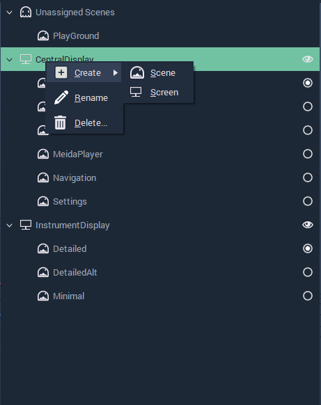
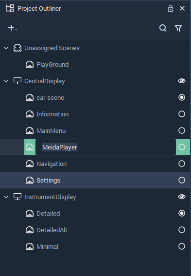
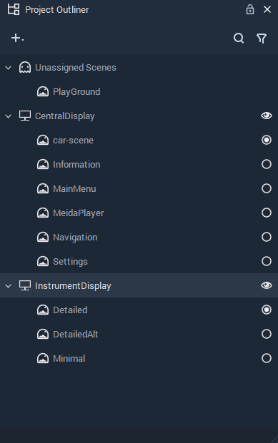

# Project Outliner

## Project Outliner

### Overview

The **Project Outliner** contains a structured list of every **Scene** and **Screen** in a **Project**, and can be used to organize, manage, create, delete and edit them.

### Creating

New **Screens** and **Scenes** can be created in the following ways:

* Click on the plus  icon located at the top left corner of the **Project Outliner**, after that click the `Scene` button.
* Right-click inside the **Project Outliner** and select `Create` &gt; `Scene` from the pop-up.
* Select `File` &gt; `New Screen` or `New Scene` from the drop-down **Menu**.
* Pressing `Ctrl`+`N` whilst the **Project Outliner** is active.

### Deleting

**Screens** and **Scenes** can be deleted in the following ways:

* Right-click on an item and select the `Delete` button from the pop-up.
* Select an item and press `del`.

### Renaming

**Screens** and **Scenes** can be renamed by right-clicking an item and selecting `Rename`. You can then type a new name and press **`⏎`**/`Return` to confirm the change.

### Disabling Screens

When you **Start** the **Simulation** of a **Project** in Incari, all **Screens** will initialize in separate windows. By disabling a **Scene** in the **Project Outliner**, you can prevent a **Screen** from being included in the **Simulation**.

To disable a **Screen**, simply click the eye \(👁\) icon.

### Unassigned Scenes

Unless a **Scene** is assigned to a **Screen**, it will appear under `Unassigned Scenes`, and therefore it will be excluded from the **Simulation**. When you create a **Scene**, it is unassigned by default. Unless a **Screen** was selected when it was created, in which case, it will be assigned to that **Screen**.

### Rearranging Scenes

**Scenes** can be rearranged easily by dragging and dropping them to a new place in the **Project Outliner**. Not only does this make it easier to organize **Scenes**, but you can also move them to an entirely different **Screen** or disable them entirely, by moving them into `Unassigned Scenes`.

## See Also

* [**Scene**](project-objects/scene.md)
* [**Screen**](project-objects/screen.md)

