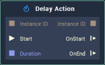
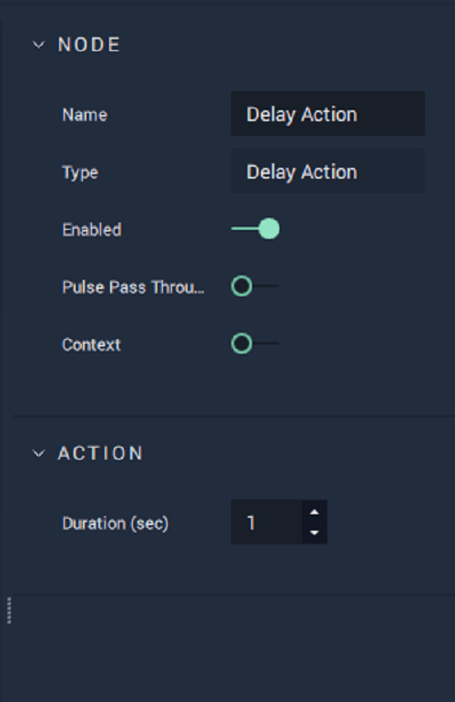

# Delay Action

## Overview

The **Delay Action Node** delays the **Pulse Flow** for the specified duration \(in seconds\). 

*Scope*: **Scene**, **Function**, **Prefab**

## Attributes

| Attribute | Type | Description |
| :--- | :--- | :--- |
| `Duration (sec)` | **Float** | The time of the delay, if none is given in the `Duration` **Input Socket**. |

## Inputs

| Input | Type | Description |
| :--- | :--- | :--- |
| `Instance ID` | **InstanceID** | The assigned [**Instance ID**](README.md#instance-id) of the **Action**. If nothing is received, it automatically assigns 0 as the **Instance ID**.  |
| \(►\) `Start` | **Pulse** | A standard **Input Pulse**, to trigger the execution of the **Node**. |
| `Duration` | **Float** | The time of the delay \(in seconds\). |

## Outputs

| Output | Type | Description |
| :--- | :--- | :--- |
| `Instance ID` | **InstanceID** | The assigned [**Instance ID**](README.md#instance-id) of the **Action**. |
| `OnStart` \(►\) | **Pulse** | Flows to the next **Node** following **Delay Action** when the **Action** starts. |
| `OnEnd` \(►\) | **Pulse** | Flows to the next **Node** following **Delay Action** when the **Action** stops. |

