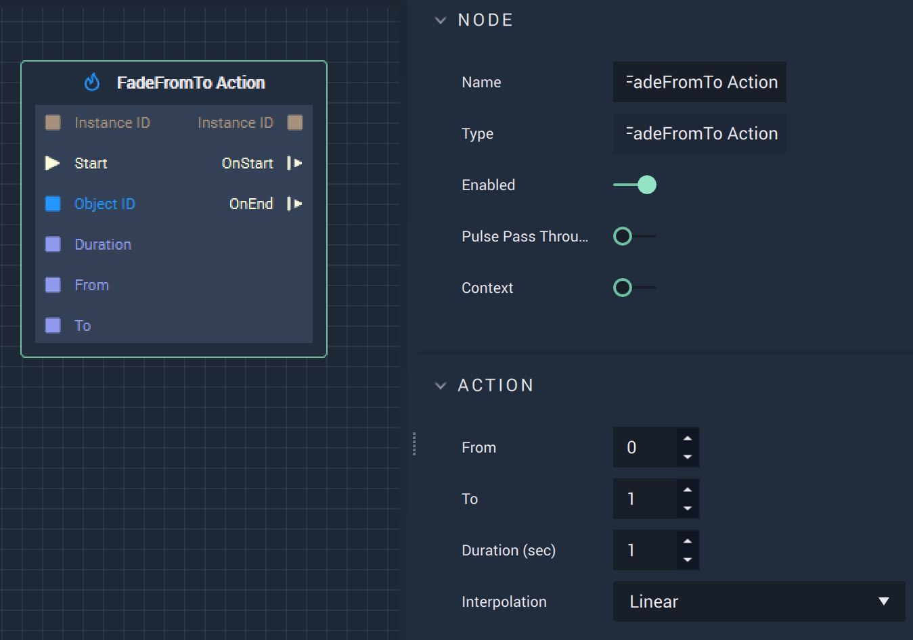

# Overview

The **FadeFromTo Action Node** reduces the opacity of an **Animation** from an initial value to a final one over a specified period of time, in either **Attributes** or **Inputs**..

# Attributes

|Attribute|Type|Description|
|---|---|---|
|`From`|**Float**|The initial value of the desired *opacity*|
|`To`|**Float**|The final value of the desired *opacity*.|
|`Duration (sec)`|**Float**|The total time of the **Action**.|
|`Interpolation`|**Dropdown**|The `Interpolation` type. Can be Linear, Sine Ease In, Sine Ease Out, or Sine Ease In Out.|

# Inputs

|Input|Type|Description|
|---|---|---|
|`Instance ID`| **InstanceID** | The assigned **Instance** of an **Object**.|
|(►) `Start`|**Pulse**|A standard **Input Pulse**, to trigger the execution of the **Node**.|
|`Object ID`|**ObjectID**|The ID of the target **Object**.|
|`Duration`|**Float**|The total time (in seconds).|
|`From`|**Float**|The initial value of the desired *opacity*.|
|`To`|**Float**| The final value of the desired *opacity*.|

# Outputs

|Output|Type|Description|
|---|---|---|
|*Pulse Output* (►)|**Pulse**|A standard **Output Pulse**, to move onto the next **Node** along the **Logic Branch**, once this **Node** has finished its execution.|
|`Instance ID`|**InstanceID**|The assigned **Instance** of an **Object**.|
|`OnStart` (►)|**Pulse**|Flows to additional actions following **FadeFromTo Action** when the **Action** starts.|
|`OnEnd` (►)|**Pulse**|Flows to additional actions following **FadeFromTo Action** when the **Action** stops.|

# See Also

* [**FadeTo Action**](fadetoaction.md)

# External Links

* [_Transparency \(graphic\)_](https://en.wikipedia.org/wiki/Transparency_%28graphic%29) on Wikipedia.

