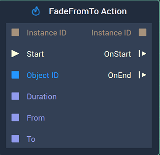
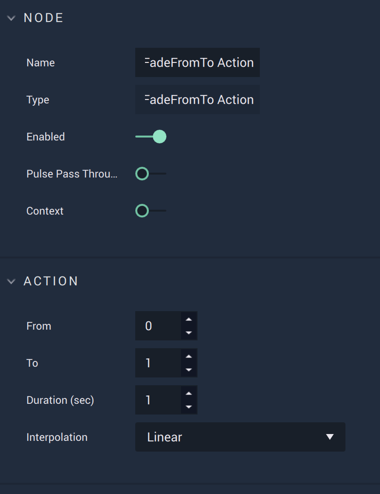

# FadeFromTo Action

## Overview

The **FadeFromTo Action Node** continuously modifies the `Opacity` of an **Object** over a specified period of time, thus creating an **Animation**. Both the initial and final values of the `Opacity` are chosen by the user.

## Attributes

| Attribute | Type | Description |
| :--- | :--- | :--- |
| `From` | **Float** | The desired initial value of the `Opacity`, if none is received in the `From` **Input Socket**. |
| `To` | **Float** | The desired final value of the `Opacity`, if none is received in the `To` **Input Socket**. |
| `Duration (sec)` | **Float** | The total time of the **Action**, if none is received in the `Duration` **Input Socket**. |
| `Interpolation` | **Drop-down** | The `Interpolation` method to use for calculating the intermediate values of the `Opacity`. It can be [*Linear*](https://en.wikipedia.org/wiki/Linear_interpolation), [*Sine Ease In*](https://easings.net/#easeInSine), [*Sine Ease In Out*](https://easings.net/#easeInOutSine), or [*Sine Ease Out*](https://easings.net/#easeOutSine). |

## Inputs

| Input | Type | Description |
| :--- | :--- | :--- |
| `Instance ID` | **InstanceID** | The assigned [**Instance ID**](README.md#instance-id) of the **Action**. If nothing is received, it automatically assigns 0 as the **Instance ID**. |
| \(►\) `Start` | **Pulse** | A standard **Input Pulse**, to trigger the execution of the **Node**. |
| `Object ID` | **ObjectID** | The ID of the target **Object**. |
| `Duration` | **Float** | The total time \(in seconds\). |
| `From` | **Float** | The initial value of the desired `Opacity`. |
| `To` | **Float** | The final value of the desired `Opacity`. |

## Outputs

| Output | Type | Description |
| :--- | :--- | :--- |
| _Pulse Output_ \(►\) | **Pulse** | A standard **Output Pulse**, to move onto the next **Node** along the **Logic Branch**, once this **Node** has finished its execution. |
| `Instance ID` | **InstanceID** | The assigned [**Instance ID**](README.md#instance-id) of the **Action**. |
| `OnStart` \(►\) | **Pulse** | Flows to the next **Node** following **FadeFromTo Action** when the **Action** starts. |
| `OnEnd` \(►\) | **Pulse** | Flows to the next **Node** following **FadeFromTo Action** when the **Action** stops. |

## See Also

* [**FadeTo Action**](fadetoaction.md)

## External Links

* [_Transparency \(graphic\)_](https://en.wikipedia.org/wiki/Transparency_%28graphic%29) on Wikipedia.

