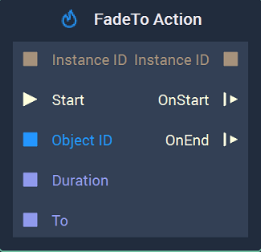
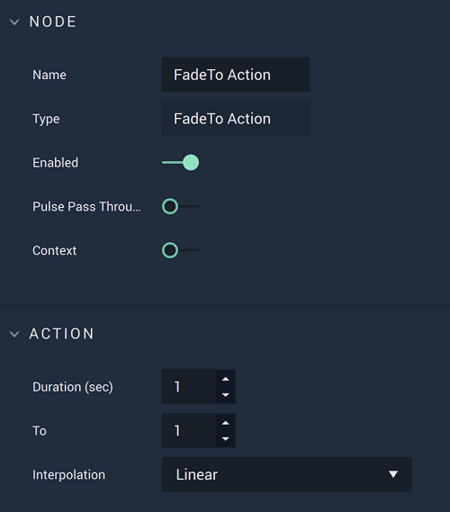

# FadeTo Action

## Overview

The **FadeTo Action Node** reduces the opacity of an **Animation** to the desired value over a specified time period, in either **Attributes** or **Inputs**.

## Attributes

| Attribute | Type | Description |
| :--- | :--- | :--- |
| `Duration (sec)` | **Float** | The total time of the **Action**. |
| `To` | **Float** | The desired opacity value at the end of the **Action**. |
| `Interpolation` | **Drop-down** | The `Interpolation` type. Can be Linear, Sine Ease In, Sine Ease Out, or Sine Ease In Out. |

## Inputs

| Input | Type | Description |
| :--- | :--- | :--- |
| `Instance ID` | **InstanceID** | The assigned **Instance** of an **Object**. |
| \(►\) `Start` | **Pulse** | A standard **Input Pulse**, to trigger the execution of the **Node**. |
| `Object ID` | **ObjectID** | The ID of the target **Object**. |
| `Duration` | **Float** | The total time \(in seconds\). |
| `To` | **Float** | The desired opacity at the end of the **Action**. |

## Outputs

| Output | Type | Description |
| :--- | :--- | :--- |
| `Instance ID` | **InstanceID** | The assigned **Instance** of an **Object**. |
| `OnStart` \(►\) | **Pulse** | Flows to additional actions following **FadeTo Action** when the **Action** starts. |
| `OnEnd` \(►\) | **Pulse** | Flows to additional actions following **FadeTo Action** when the **Action** stops. |

## See Also

* [**FadeFromTo Action**](fadefromtoaction.md)

## External Links

* [_Transparency \(graphic\)_](https://en.wikipedia.org/wiki/Transparency_%28graphic%29) on Wikipedia.

