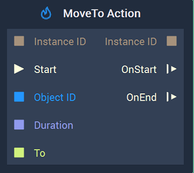
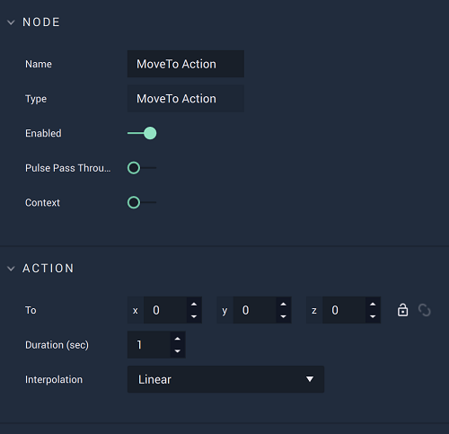

# MoveTo Action

## Overview

The **MoveTo Action Node** continuously modifies the `Position` of an **Object** to the values specified in `To` for a given period of time, thus creating an **Animation**.

## Attributes

| Attribute | Type | Description |
| :--- | :--- | :--- |
| `To` | **Vector3** | The desired `Position` along the X, Y, Z axes, if none is received in the `To` **Input Socket**. |
| `Duration (sec)` | **Float** | The total time of the **Action**, if none is received in the `Duration` **Input Socket**. |
| `Interpolation` | **Drop-down** | The `Interpolation` method to use for calculating the intermediate values of the `opacity`. IT can be [*Linear*](https://en.wikipedia.org/wiki/Linear_interpolation), [*Sine Ease In*](https://easings.net/#easeInSine), [*Sine Ease In Out*](https://easings.net/#easeInOutSine), or [*Sine Ease Out*](https://easings.net/#easeOutSine). |

## Inputs

| Input | Type | Description |
| :--- | :--- | :--- |
| `Instance ID` | **InstanceID** | The assigned [**Instance ID**](README.md#instance-id) of the **Action**. If nothing is received, it automatically assigns 0 as the **Instance ID**. |
| \(►\) `Start` | **Pulse** | A standard **Input Pulse**, to trigger the execution of the **Node**. |
| `Object ID` | **ObjectID** | The ID of the target **Object**. |
| `Duration` | **Float** | The total time \(in seconds\). |
| `To` | **Vector3** | The desired final `Position` along the X, Y, Z axes. |

## Outputs

| Output | Type | Description |
| :--- | :--- | :--- |
| `Instance ID` | **InstanceID** | The assigned [**Instance ID**](README.md#instance-id) of the **Action**. |
| `OnStart` \(►\) | **Pulse** | Flows to the next **Node** following **MoveTo Action** when the **Action** starts. |
| `OnEnd` \(►\) | **Pulse** | Flows to the next **Node** following **MoveTo Action** when the **Action** stops. |

## See Also

* [**MoveBy Action**](movebyaction.md)

## External Links

* [_Position \(geometry\)_](https://en.wikipedia.org/wiki/Position_%28geometry%29) on Wikipedia.

