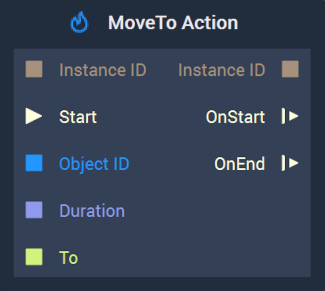
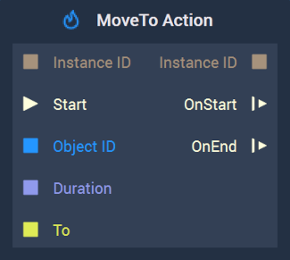

# MoveTo Action

This **Node** has different versions for [**Scenes**](../../../objects-and-types/project-objects/scene.md) and [**Scene2Ds**](../../../objects-and-types/project-objects/scene2d.md). Find in the tabs below the documentation for both versions.




## Overview

The **MoveTo Action Node** continuously modifies the `Position` of a [**Scene Object**](../../objects-and-types/scene-objects/) to the values specified in `To` for a given period of time, thus creating an **Animation**. <!--Find an [example](movetoaction.md#example) of how to use this **Node** and its effect over an **Object** at the end of this page.-->

Furthermore, visit the [**Actions Nodes**](./) page for a general introduction to these **Nodes**, and [**Position**](../../objects-and-types/attributes/common-attributes/transformation/#position) for more detail about the `Position` **Attribute**.

[**Scope**](../overview.md#scopes): **Scene**, **Function**, **Prefab**.

## Attributes

| Attribute        | Type          | Description                                                                                                                                                                                                                                                                                                                                  |
| ---------------- | ------------- | -------------------------------------------------------------------------------------------------------------------------------------------------------------------------------------------------------------------------------------------------------------------------------------------------------------------------------------------- |
| `To`             | **Vector3**   | The desired `Position` along the X, Y, Z axes, if none is received in the `To` **Input Socket**.                                                                                                                                                                                                                                             |
| `Duration (sec)` | **Float**     | The total time of the **Action**, if none is received in the `Duration` **Input Socket**.                                                                                                                                                                                                                                                    |
| `Interpolation`  | **Drop-down** | The `Interpolation` method to use for calculating the intermediate values of the `Position`. It can be [_Linear_](https://en.wikipedia.org/wiki/Linear\_interpolation), [_Sine Ease In_](https://easings.net/#easeInSine), [_Sine Ease In Out_](https://easings.net/#easeInOutSine), or [_Sine Ease Out_](https://easings.net/#easeOutSine). |

## Inputs

| Input         | Type           | Description                                                                                                                                  |
| ------------- | -------------- | -------------------------------------------------------------------------------------------------------------------------------------------- |
| `Instance ID` | **InstanceID** | The assigned [**Instance ID**](./#instance-id) of the **Action**. If nothing is received, it automatically assigns 0 as the **Instance ID**. |
| (►) `Start`   | **Pulse**      | A standard **Input Pulse**, to trigger the execution of the **Node**.                                                                        |
| `Object ID`   | **ObjectID**   | The ID of the target **Object**.                                                                                                             |
| `Duration`    | **Float**      | The total time (in seconds).                                                                                                                 |
| `To`          | **Vector3**    | The desired final `Position` along the X, Y, Z axes.                                                                                         |

## Outputs

| Output        | Type           | Description                                                                        |
| ------------- | -------------- | ---------------------------------------------------------------------------------- |
| `Instance ID` | **InstanceID** | The assigned [**Instance ID**](./#instance-id) of the **Action**.                  |
| `OnStart` (►) | **Pulse**      | Flows to the next **Node** following **MoveTo Action** when the **Action** starts. |
| `OnEnd` (►)   | **Pulse**      | Flows to the next **Node** following **MoveTo Action** when the **Action** stops.  |



The **MoveTo Action Node** continuously modifies the `Position` of an [**Scene2D Object**](../../objects-and-types/scene-objects/) to the values specified in `To` for a given period of time, thus creating an **Animation**. <!--Find an [example](movetoaction.md#example) of how to use this **Node** and its effect over an **Object** at the end of this page.-->

Furthermore, visit the [**Actions Nodes**](./) page for a general introduction to these **Nodes**, and [**Position**](../../objects-and-types/attributes/common-attributes/transformation/#position) for more detail about the `Position` **Attribute**.

[**Scope**](../overview.md#scopes): **Scene**, **Function**, **Prefab**.

## Attributes

| Attribute        | Type          | Description                                                                                                                                                                                                                                                                                                                                  |
| ---------------- | ------------- | -------------------------------------------------------------------------------------------------------------------------------------------------------------------------------------------------------------------------------------------------------------------------------------------------------------------------------------------- |
| `To`             | **Vector2**   | The desired `Position` along the X and Y axes, if none is received in the `To` **Input Socket**.                                                                                                                                                                                                                                             |
| `Duration (sec)` | **Float**     | The total time of the **Action**, if none is received in the `Duration` **Input Socket**.                                                                                                                                                                                                                                                    |
| `Interpolation`  | **Drop-down** | The `Interpolation` method to use for calculating the intermediate values of the `Position`. It can be [_Linear_](https://en.wikipedia.org/wiki/Linear\_interpolation), [_Sine Ease In_](https://easings.net/#easeInSine), [_Sine Ease In Out_](https://easings.net/#easeInOutSine), or [_Sine Ease Out_](https://easings.net/#easeOutSine). |

## Inputs

| Input         | Type           | Description                                                                                                                                  |
| ------------- | -------------- | -------------------------------------------------------------------------------------------------------------------------------------------- |
| `Instance ID` | **InstanceID** | The assigned [**Instance ID**](./#instance-id) of the **Action**. If nothing is received, it automatically assigns 0 as the **Instance ID**. |
| (►) `Start`   | **Pulse**      | A standard **Input Pulse**, to trigger the execution of the **Node**.                                                                        |
| `Object ID`   | **ObjectID**   | The ID of the target **Object**.                                                                                                             |
| `Duration`    | **Float**      | The total time (in seconds).                                                                                                                 |
| `To`          | **Vector2**    | The desired final `Position` along the X and Y axes.                                                                                         |

## Outputs

| Output        | Type           | Description                                                                        |
| ------------- | -------------- | ---------------------------------------------------------------------------------- |
| `Instance ID` | **InstanceID** | The assigned [**Instance ID**](./#instance-id) of the **Action**.                  |
| `OnStart` (►) | **Pulse**      | Flows to the next **Node** following **MoveTo Action** when the **Action** starts. |
| `OnEnd` (►)   | **Pulse**      | Flows to the next **Node** following **MoveTo Action** when the **Action** stops.  |




## Example

This section shows a simple example of how to use the **MoveTo Action** **Node** and the effect it has on an **Scene Object**. This concept can be applied as well to a **Scene2D Object**. 

We start by [configuring the **Scene**](movetoaction.md#scene-configuration), then [build the **Logic**](movetoaction.md#logic), and finally show the [result](movetoaction.md#final-result).

### Scene Configuration

We consider a [**Scene**](../../objects-and-types/project-objects/scene.md) with two [**Objects**](../../objects-and-types/scene-objects/): a red arc over a black background, both of which can be easily created in the [**Scene Outliner**](../../modules/scene-outliner.md). Then, we set the `Size` **Attribute** of the arc to $$(150, 150, 1)$$. See this configuration in the following image:

### Logic

We then need to configure the **Logic**. This is done in the [**Logic Editor**](../../modules/logic-editor.md).

We use the **MoveBy Action** **Node** with the following **Attributes**:

* `To`: $$(150, 150, 0)$$
* `Duration (sec)`: $$3$$
* `Interpolation`: `Linear`

And we connect to it the [**Object Node**](../../objects-and-types/scene-objects/#objects-in-the-logic) of the red arc and a **Pulse** to the `Start` **Input Socket**. Thus, having the following **Logic** configuration:

### Final result

Finally, the effect of the **ScaleTo Action** **Node** when triggered is the following:

## See Also

* [**MoveBy Action**](movebyaction.md)

## External Links

* [_Position (geometry)_](https://en.wikipedia.org/wiki/Position\_\(geometry\)) on Wikipedia.
