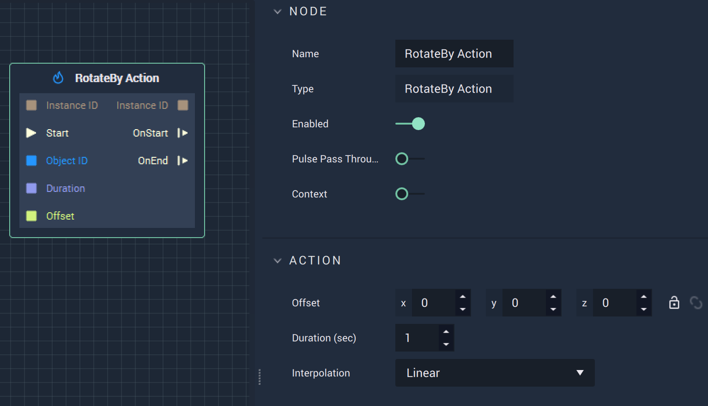

# Overview

The **RotateBy Action Node** rotates an **Animation** by the relative values specified in the `Offset` for the `Duration` (in seconds), in either **Attributes** or **Inputs**.

# Attributes

|Attribute|Type|Description|
|---|---|---|
|`Offset`|**Vector3**|The amount to rotate the **Animation** by measured in Euler angles along the X, Y, and Z axes.|
|`Duration (sec)`|**Float**|The total time of the **Action**.|
|`Interpolation`|**Dropdown**|The `Interpolation` type. Can be Linear, Sine Ease In, Sine Ease Out, or Sine Ease In Out.|

# Inputs

|Input|Type|Description|
|---|---|---|
|`Instance ID`| **InstanceID** | The assigned **Instance** of an **Object**.|
|(►) `Start`|**Pulse**|A standard **Input Pulse**, to trigger the execution of the **Node**.|
|`Object ID`|**ObjectID**|The ID of the target **Object**.|
|`Duration`|**Float**|The total time (in seconds).|
|`Offset`|**Vector3**|The amount to rotate the **Animation** by measured in Euler angles along the X, Y, and Z axes.|

# Outputs

|Output|Type|Description|
|---|---|---|
|`Instance ID`|**InstanceID**|The assigned **Instance** of an **Object**.|
|`OnStart` (►)|**Pulse**|Flows to additional actions following **RotateBy Action** when the **Action** starts.|
|`OnEnd` (►)|**Pulse**|Flows to additional actions following **RotateBy Action** when the **Action** stops.|

# See Also

* [**RotateTo Action**](rotatetoaction.md)
* [**RotateFromTo Action**](rotatefromtoaction.md)

# External Links

* [_Rotation_](https://en.wikipedia.org/wiki/Euler_angles) on Wikipedia

