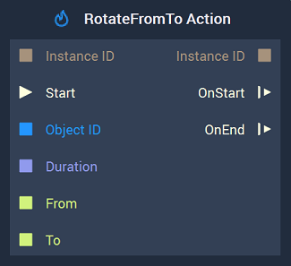
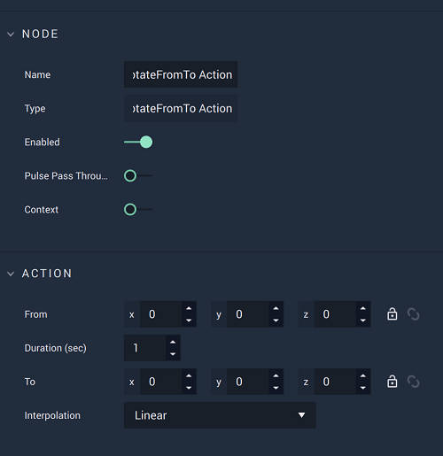

# RotateFromTo Action

## Overview

The **RotateFromTo Action Node** continuously rotates an **Object** from the *Euler angles* specified in `From` to those specified in `To` for a given period of time, thus creating an **Animation**.

[**Scope**](../overview.md#scopes): **Scene**, **Function**, **Prefab**.

## Attributes

| Attribute | Type | Description |
| :--- | :--- | :--- |
| `From` | **Vector3** | The *Euler angles* along the X, Y, and Z axes to rotate from, if none are received in the `From` **Input Socket**. |
| `To` | **Vector3** | The *Euler angles* along the X, Y, and Z axes to rotate to, if none are received in the `To` **Input Socket**. |
| `Duration (sec)` | **Float** | The total time of the **Action**, if none is received in the `Duration` **Input Socket**. |
| `Interpolation` | **Drop-down** | The `Interpolation` method to use for calculating the intermediate values of the *Euler angles*. It can be [*Linear*](https://en.wikipedia.org/wiki/Linear_interpolation), [*Sine Ease In*](https://easings.net/#easeInSine), [*Sine Ease In Out*](https://easings.net/#easeInOutSine), or [*Sine Ease Out*](https://easings.net/#easeOutSine). |

## Inputs

| Input | Type | Description |
| :--- | :--- | :--- |
| `Instance ID` | **InstanceID** | The assigned [**Instance ID**](README.md#instance-id) of the **Action**. If nothing is received, it automatically assigns 0 as the **Instance ID**. |
| \(►\) `Start` | **Pulse** | A standard **Input Pulse**, to trigger the execution of the **Node**. |
| `Object ID` | **ObjectID** | The ID of the target **Object**. |
| `Duration` | **Float** | The total time \(in seconds\). |
| `From` | **Vector3** | The *Euler angles* along the X, Y, and Z axes to rotate from. |
| `To` | **Vector3** | The *Euler angles* along the X, Y, and Z axes to rotate to. |

## Outputs

| Output | Type | Description |
| :--- | :--- | :--- |
| `Instance ID` | **InstanceID** | The assigned [**Instance ID**](README.md#instance-id) of the **Action**.  |
| `OnStart` \(►\) | **Pulse** | Flows to the next **Node** following **RotateFromTo Action** when the **Action** starts. |
| `OnEnd` \(►\) | **Pulse** | Flows to the next **Node** following **RotateFromTo Action** when the **Action** stops. |

## See Also

* [**RotateTo Action**](rotatetoaction.md)
* [**RotateBy Action**](rotatebyaction.md)

## External Links

* [_Rotation_](https://en.wikipedia.org/wiki/Rotation) on Wikipedia
* [_Euler angles_](https://en.wikipedia.org/wiki/Euler_angles) on Wikipedia
