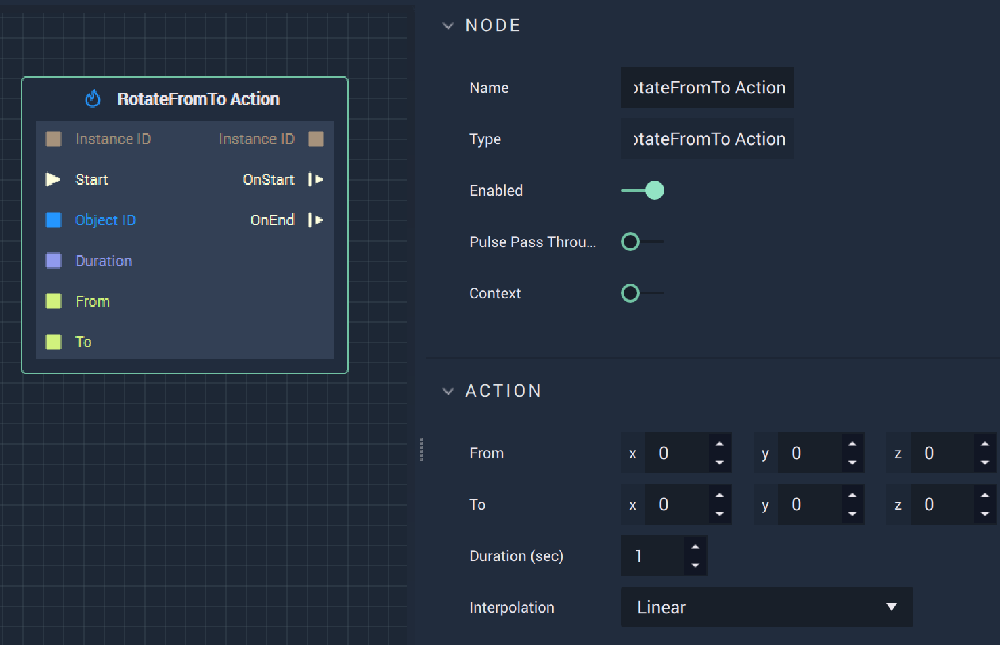

# RotateFromTo Action

## Overview

The **RotateFromTo Action Node** rotates an **Animation** from the absolute Euler angles along the X, Y, and Z axes specified in `From` to those specified in `To` for the `Duration` \(in seconds\), in either **Attributes** or **Inputs**.

## Attributes

| Attribute | Type | Description |
| :--- | :--- | :--- |
| `From` | **Vector3** | The Euler angles along the X, Y, and Z axes to rotate from. |
| `To` | **Vector3** | The Euler angles along the X, Y, and Z axes to rotate to. |
| `Duration (sec)` | **Float** | The total time of the **Action**. |
| `Interpolation` | **Drop-down** | The `Interpolation` type. Can be Linear, Sine Ease In, Sine Ease Out, or Sine Ease In Out. |

## Inputs

| Input | Type | Description |
| :--- | :--- | :--- |
| `Instance ID` | **InstanceID** | The assigned **Instance** of an **Object**. |
| \(►\) `Start` | **Pulse** | A standard **Input Pulse**, to trigger the execution of the **Node**. |
| `Object ID` | **ObjectID** | The ID of the target **Object**. |
| `Duration` | **Float** | The total time \(in seconds\). |
| `From` | **Vector3** | The Euler angles along the X, Y, and Z axes to rotate from. |
| `To` | **Vector3** | The Euler angles along the X, Y, and Z axes to rotate to. |

## Outputs

| Output | Type | Description |
| :--- | :--- | :--- |
| `Instance ID` | **InstanceID** | The assigned **Instance** of an **Object**. |
| `OnStart` \(►\) | **Pulse** | Flows to additional actions following **RotateFromTo Action** when the **Action** starts. |
| `OnEnd` \(►\) | **Pulse** | Flows to additional actions following **RotateFromTo Action** when the **Action** stops. |

## See Also

* [**RotateTo Action**](rotatetoaction.md)
* [**RotateBy Action**](rotatebyaction.md)

## External Links

* [_Rotation_](https://en.wikipedia.org/wiki/Euler_angles) on Wikipedia

