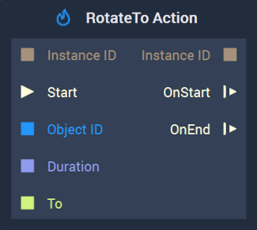
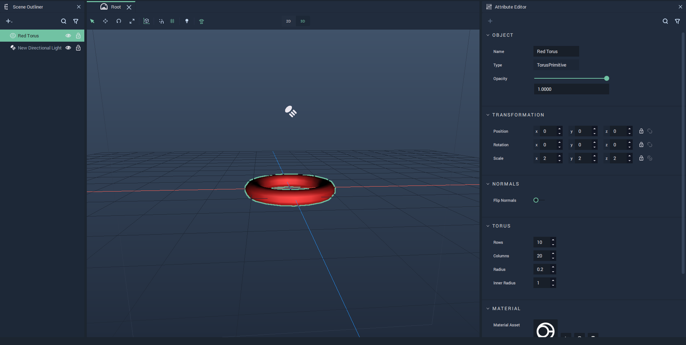
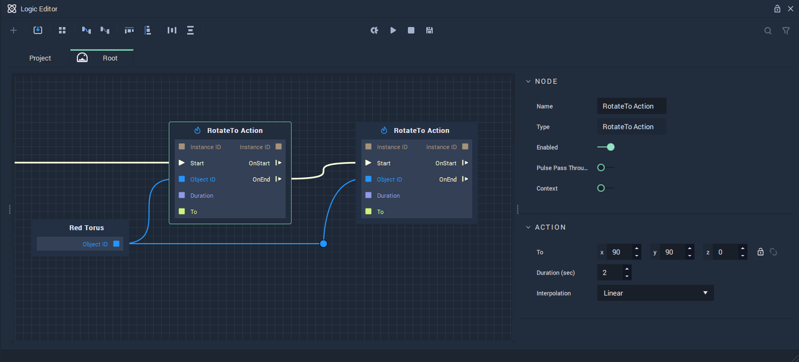
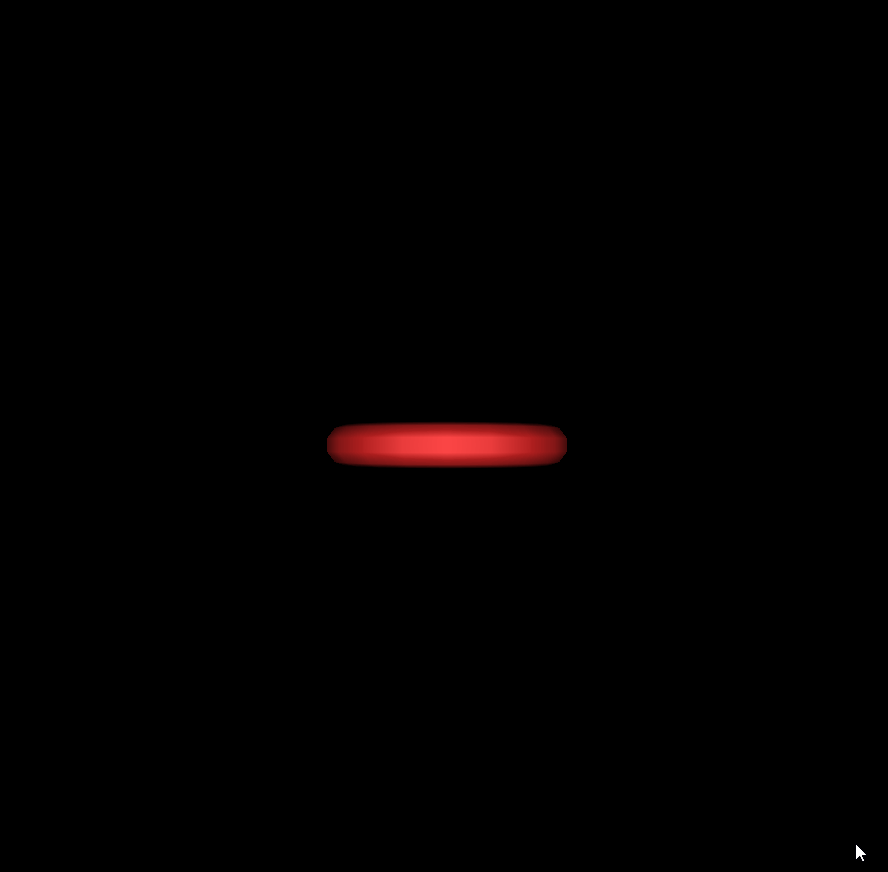

# RotateTo Action

## Overview

The **RotateTo Action Node** continuously rotates an [**Object**](../../objects-and-types/scene-objects/README.md) to the *Euler angles* specified in `To` for a given period of time, thus creating an **Animation**. Find an [example](#example) of how to use this **Node** and its effect over an **Object** at the end of this page.

Furthermore, visit the [**Actions Nodes**](README.md) page for a general introduction to these **Nodes**, and [**Rotation**](../../objects-and-types/attributes/common-attributes/transformation/README.md#rotation) for more detail about the `Rotation` **Attribute**.

[**Scope**](../overview.md#scopes): **Scene**, **Function**, **Prefab**.

## Attributes

| Attribute | Type | Description |
| :--- | :--- | :--- |
| `To` | **Vector3** | The *Euler angles* along the X, Y, and Z axes to rotate to, if none are received in the `To` **Input Socket**. |
| `Duration (sec)` | **Float** | The total time of the **Action**, if none is received in the `Duration` **Input Socket**. |
| `Interpolation` | **Drop-down** | The `Interpolation` method to use for calculating the intermediate values of the *Euler Angles*. It can be [*Linear*](https://en.wikipedia.org/wiki/Linear_interpolation), [*Sine Ease In*](https://easings.net/#easeInSine), [*Sine Ease In Out*](https://easings.net/#easeInOutSine), or [*Sine Ease Out*](https://easings.net/#easeOutSine). |

## Inputs

| Input | Type | Description |
| :--- | :--- | :--- |
| `Instance ID` | **InstanceID** | The assigned [**Instance ID**](README.md#instance-id) of the **Action**. If nothing is received, it automatically assigns 0 as the **Instance ID**. |
| \(►\) `Start` | **Pulse** | A standard **Input Pulse**, to trigger the execution of the **Node**. |
| `Object ID` | **ObjectID** | The ID of the target **Object**. |
| `Duration` | **Float** | The total time \(in seconds\). |
| `To` | **Vector3** | The *Euler angles* along the X, Y, and Z axes to rotate to. |

## Outputs

| Output | Type | Description |
| :--- | :--- | :--- |
| `Instance ID` | **InstanceID** | The assigned [**Instance ID**](README.md#instance-id) of the **Action**.  |
| `OnStart` \(►\) | **Pulse** | Flows to the next **Node** following **RotateTo Action** when the **Action** starts. |
| `OnEnd` \(►\) | **Pulse** | Flows to the next **Node** following **RotateTo Action** when the **Action** stops. |

## Example

This section shows a simple example of how to use the **RotateTo Action** **Node** and the effect it has on an **Object**. We start by [configuring the **Scene**](#scene-configuration), then [build the **Logic**](#logic), and finally show the [result](#final-result).

### Scene Configuration

We consider a [**Scene**](../../objects-and-types/project-objects/scene.md) with two [**Objects**](../../objects-and-types/scene-objects/README.md): a red [**Torus**](../../objects-and-types/scene-objects/primitives.md#torus) and a [**Directional Light**](../../objects-and-types/scene-objects/lights.md), both of which can be easily created in the [**Scene Outliner**](../../modules/scene-outliner.md). Then, we set the `Scale` **Attribute** of the **Torus** to $$(2, 2, 2)$$ and the `Position` of the **Light** to $$(0, 200, 0)$$. See this configuration in the following image:

### Logic

We then need to configure the **Logic**. This is done in the [**Logic Editor**](../../modules/logic-editor.md).

We will use two **RotateTo Action** **Nodes** in order to first perform a *rotation* and then reverse it. For the first one, we set the following **Attributes**:

* `To`: $$(90, 90, 0)$$ 
* `Duration (sec)`: $$2$$ 
* `Interpolation`: `Linear`

And for the second **Node**:

* `To`: $$(0, 0, 0)$$ 
* `Duration (sec)`: $$2$$ 
* `Interpolation`: `Linear`

Then, we connect to both **Nodes** the [**Object Node**](../../objects-and-types/scene-objects/README.md#objects-in-the-logic) of the red **Torus**, a **Pulse** to the `Start` **Input Socket** of the first **RotateTo Action** and the **Output** `OnEnd` to the `Start` **Input** of the second **RotateTo Action** **Node**. Thus, having the following **Logic** configuration:

### Final result

Finally, the effect of the **RotateTo Action** **Node** when triggered is the following:

## See Also

* [**RotateBy Action**](rotatebyaction.md)
* [**RotateFromTo Action**](rotatefromtoaction.md)

## External Links

* [_Rotation_](https://en.wikipedia.org/wiki/Rotation) on Wikipedia
* [_Euler angles_](https://en.wikipedia.org/wiki/Euler_angles) on Wikipedia

