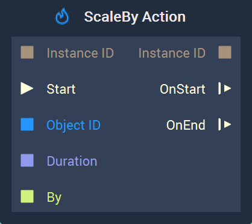
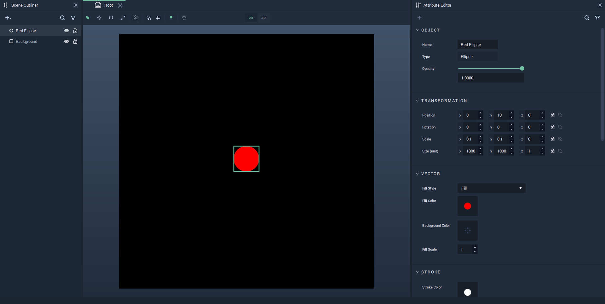
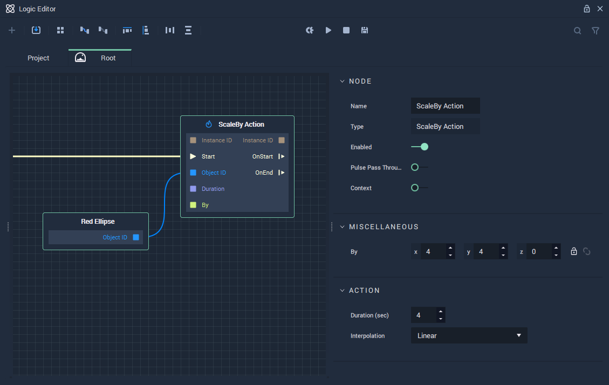
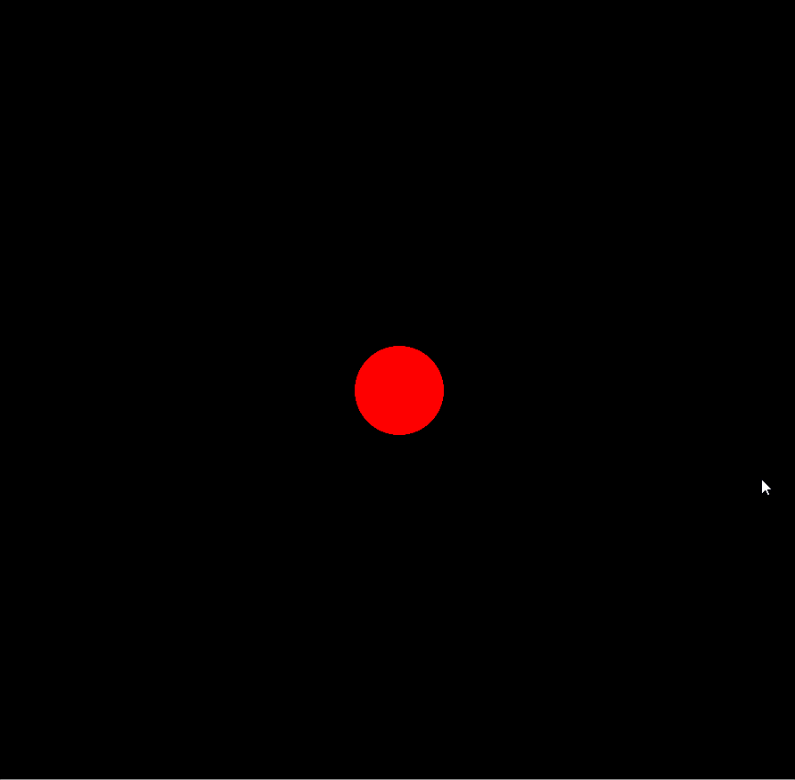

# ScaleBy Action

## Overview

The **ScaleBy Action Node** continuously scales an [**Object**](../../objects-and-types/scene-objects/README.md) up to the values specified in `By` multiplied by the initial values for a given period of time, thus creating an **Animation**. Find an [example](#example) of how to use this **Node** and its effect over an **Object** at the end of this page.

Furthermore, visit the [**Actions Nodes**](README.md) page for a general introduction to these **Nodes**, and [**Scale**](../../objects-and-types/attributes/common-attributes/transformation/README.md#scale) for more detail about the `Scale` **Attribute**.

[**Scope**](../overview.md#scopes): **Scene**, **Function**, **Prefab**.

## Attributes

| Attribute | Type | Description |
| :--- | :--- | :--- |
| `By` | **Vector3** | The number by which the `Scale` **Attribute** values will be multiplied, if none is received in the `By` **Input Socket**. |
| `Duration (sec)` | **Float** | The total time of the **Action**, if none is given in the `Duration` **Input Socket**. |
| `Interpolation` | **Drop-down** | The `Interpolation` method to use for calculating the intermediate values of the `Scale`. It can be [*Linear*](https://en.wikipedia.org/wiki/Linear_interpolation), [*Sine Ease In*](https://easings.net/#easeInSine), [*Sine Ease In Out*](https://easings.net/#easeInOutSine), or [*Sine Ease Out*](https://easings.net/#easeOutSine). |

## Inputs

| Input | Type | Description |
| :--- | :--- | :--- |
| `Instance ID` | **InstanceID** |  The assigned [**Instance ID**](README.md#instance-id) of the **Action**. If nothing is received, it automatically assigns 0 as the **Instance ID**. |
| \(►\) `Start` | **Pulse** | A standard **Input Pulse**, to trigger the execution of the **Node**. |
| `Object ID` | **ObjectID** | The ID of the target **Object**. |
| `Duration` | **Float** | The total time \(in seconds\). |
| `By` | **Vector3** | The number by which the `Scale` **Attribute** values will be multiplied, along the X, Y, Z axes. |

## Outputs

| Output | Type | Description |
| :--- | :--- | :--- |
| `Instance ID` | **InstanceID** | The assigned [**Instance ID**](README.md#instance-id) of the **Action**.  |
| `OnStart` \(►\) | **Pulse** | Flows to the next **Node** following **ScaleBy Action** when the **Action** starts. |
| `OnEnd` \(►\) | **Pulse** | Flows to the next **Node** following **ScaleBy Action** when the **Action** stops. |

## Example

This section shows a simple example of how to use the **ScaleBy Action** **Node** and the effect it has on an **Object**. We start by [configuring the **Scene**](#scene-configuration), then [build the **Logic**](#logic), and finally show the [result](#final-result).

### Scene Configuration

We consider a [**Scene**](../../objects-and-types/project-objects/scene.md) with two [**Objects**](../../objects-and-types/scene-objects/README.md): a red ellipse over a black background, both of which can be easily created in the [**Scene Outliner**](../../modules/scene-outliner.md). Then, we set the `Size` **Attribute** of the ellipse to $$(1000, 1000, 0)$$ and its `Scale` **Attribute** to $$(0.1, 0.1, 0)$$. See this configuration in the following image:

### Logic

We then need to configure the **Logic**. This is done in the [**Logic Editor**](../../modules/logic-editor.md).

We use the **ScaleBy Action** **Node** with the following **Attributes**: 

* `By`: $$(4, 4, 0)$$ 
* `Duration (sec)`: $$4$$ 
* `Interpolation`: `Linear`

And we connect to it the **Object Node** of the red ellipse and a **Pulse** to the `Start` **Input Socket**. Thus, having the following **Logic** configuration:

### Final result

Finally, the effect of the **ScaleBy Action** **Node** when triggered is the following:

## See Also

* [**ScaleTo Action**](scaletoaction.md)

## External Links

* [_Scaling \(geometry\)_](https://en.wikipedia.org/wiki/Scaling_%28geometry%29) on Wikipedia.

