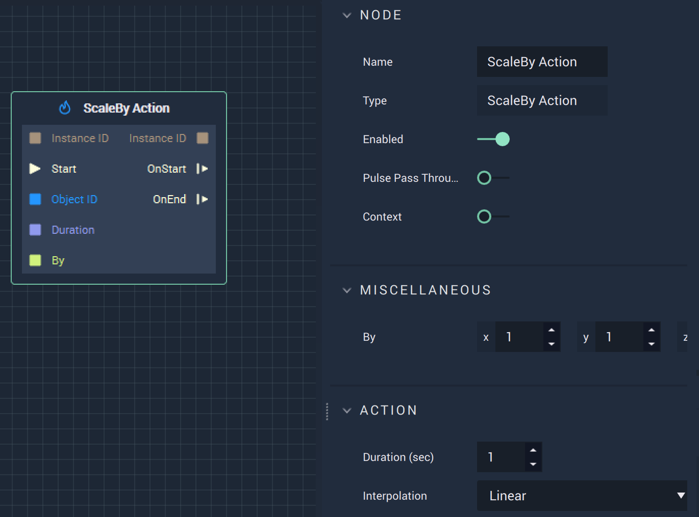

# ScaleBy Action

## Overview

The **ScaleBy Action Node** scales an **Animation** by the relative values specified in `By` for the `Duration` \(in seconds\), in either **Attributes** or **Inputs**.

## Attributes

| Attribute | Type | Description |
| :--- | :--- | :--- |
| `By` | **Vector3** | The amount to scale an **Animation** by along the X, Y, Z axes. |
| `Duration (sec)` | **Float** | The total time of the **Action**. |
| `Interpolation` | **Dropdown** | The `Interpolation` type. Can be Linear, Sine Ease In, Sine Ease Out, or Sine Ease In Out. |

## Inputs

| Input | Type | Description |
| :--- | :--- | :--- |
| `Instance ID` | **InstanceID** | The assigned **Instance** of an **Object**. |
| \(►\) `Start` | **Pulse** | A standard **Input Pulse**, to trigger the execution of the **Node**. |
| `Object ID` | **ObjectID** | The ID of the target **Object**. |
| `Duration` | **Float** | The total time \(in seconds\). |
| `By` | **Vector3** | The amount to scale an **Animation** by along the X, Y, Z axes. |

## Outputs

| Output | Type | Description |
| :--- | :--- | :--- |
| `Instance ID` | **InstanceID** | The assigned **Instance** of an **Object**. |
| `OnStart` \(►\) | **Pulse** | Flows to additional actions following **ScaleBy Action** when the **Action** starts. |
| `OnEnd` \(►\) | **Pulse** | Flows to additional actions following **ScaleBy Action** when the **Action** stops. |

## See Also

* [**ScaleTo Action**](scaletoaction.md)

## External Links

* [_Scaling \(geometry\)_](https://en.wikipedia.org/wiki/Scaling_%28geometry%29) on Wikipedia.

