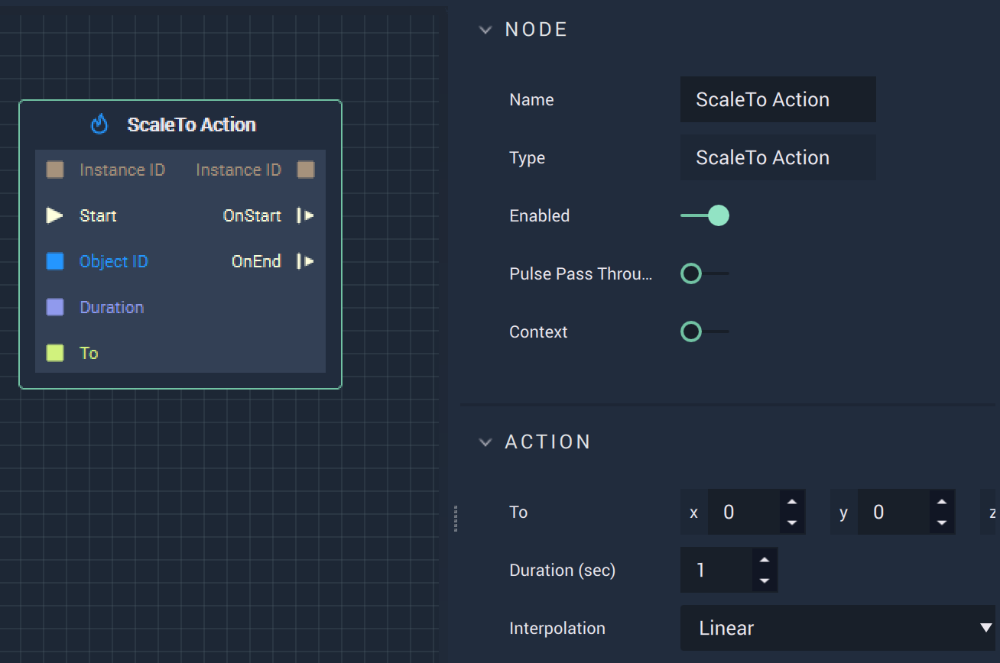

# Overview

The **ScaleTo Action Node** scales an **Animation** to the *xyz* coordinates specified in `To` for the `Duration` (in seconds), in either **Attributes** or **Inputs**.
.

# Attributes

|Attribute|Type|Description|
|---|---|---|
|`To`|**Vector3**| The *xyz* coordinates to scale to.|
|`Duration`|**Float**|The total time of the **Action**.|
|`Interpolation`|**Dropdown**|The `Interpolation` type. Can be Linear, Sine Ease In, Sine Ease Out, or Sine Ease In Out.|

# Inputs

|Input|Type|Description|
|---|---|---|
|`Instance ID`| **InstanceID** | The assigned **Instance** of an **Object**.|
|(►) `Start`|**Pulse**|A standard **Input Pulse**, to trigger the execution of the **Node**.|
|`Object ID`|**ObjectID**|The ID of the target **Object**.|
|`Duration`|**Float**|The total time (in seconds).|
|`To`|**Vector3**| The *xyz* coordinates to scale to.|

# Outputs

|Output|Type|Description|
|---|---|---|
|`Instance ID`|**InstanceID**|The assigned **Instance** of an **Object**.|
|`OnStart` (►)|**Pulse**|Flows to additional actions following **ScaleTo Action** if the **Action** is executed.|
|`OnEnd` (►)|**Pulse**|Flows to additional actions following **ScaleTo Action** if the **Action** stops.|

# See Also

* [**ScaleBy**](scalebyaction.md)
# External Links

* [*Scaling (geometry)*](https://en.wikipedia.org/wiki/Scaling_%28geometry%29) on Wikipedia.