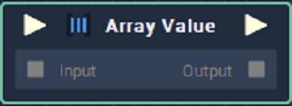

# Array Value

## Overview

The **Array Value** **Node** defines an **Array** by setting its elements.

## Attributes

### Inputs

`Inputs` - The number of **Input** elements you wish to add to the **Attribute section**. Each **Input** element represents a value that is added to the **Array Value** **Node**. The values in this section are used if no values are provided to the **Input** **Node**. The format of the section is as follows:

| Attribute | Type | Description |
| :--- | :--- | :--- |
| `Data Type` | **Drop-down** | The `Data Type` of the `Value` that you wish to add to the **Array Value** **Node**. |
| `Value` | _Defined in the_ `Data Type` _**Attribute**_. | A `Value` that you wish to add to the **Array Value** **Node**, if no value is provided in the input **Socket**. |

## Inputs

| Input | Type | Description |
| :--- | :--- | :--- |
| _Pulse Input_ \(►\) | **Pulse** | A standard **Input Pulse**, to trigger the execution of the **Node**. |
| `Input` | **Array** | An **Array** you wish to add to the **Array Value** **Node**. |

## Outputs

| Output | Type | Description |
| :--- | :--- | :--- |
| _Pulse Output_ \(►\) | **Pulse** | A standard **Output Pulse**, to move onto the next **Node** along the **Logic Branch**, once this **Node** has finished its execution. |
| `Output` | **Array** | An **Array** that holds the values that have been added to the **Array Value** **Node**. |

## Usage

## See Also

* [**Clear Array**](clear-array.md)

## External Links

* [_Arrays_](https://en.wikipedia.org/wiki/Array_data_structure#:~:text=In%20computer%20science%2C%20an%20array,one%20array%20index%20or%20key.) on Wikipedia.

