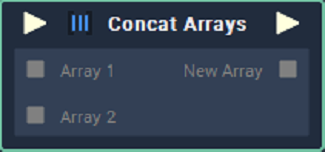

# Concat Arrays

## Overview

**Concat Arrays** merges two or more **Arrays** into one new **Array**. The **Arrays** to be merged are given as input to the node.

Note that the **Arrays** that are to be merged by this node are not sorted.

## Attributes

### Inputs

| Attribute | Type | Description |
| :--- | :--- | :--- |
| `Count` | **Int** | The number of **Arrays** you wish to merge. The default number is 2 **Arrays**. |

## Inputs

| Input | Type | Description |
| :--- | :--- | :--- |
| _Pulse Input_ \(►\) | **Pulse** | A standard **Input Pulse**, to trigger the execution of the **Node**. |
| `Array`  _\(`Count` \*Attribute_\) | **Array** | Two or more **Input** **Arrays** you wish to merge. |

## Outputs

| Output | Type | Description |
| :--- | :--- | :--- |
| _Pulse Output_ \(►\) | **Pulse** | A standard **Output Pulse**, to move onto the next **Node** along the **Logic Branch**, once this **Node** has finished its execution. |
| `New Array` | **Array** | The merged **Array**. |

## See Also

* [**Array Value**](array-value.md)

## External Links

* [_Array Concatenation_](https://www.tutorialspoint.com/learn_c_by_examples/array_concatenation_program_in_c.htm) on tutorialspoint.

