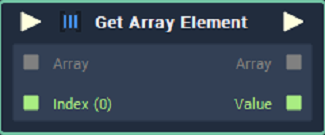
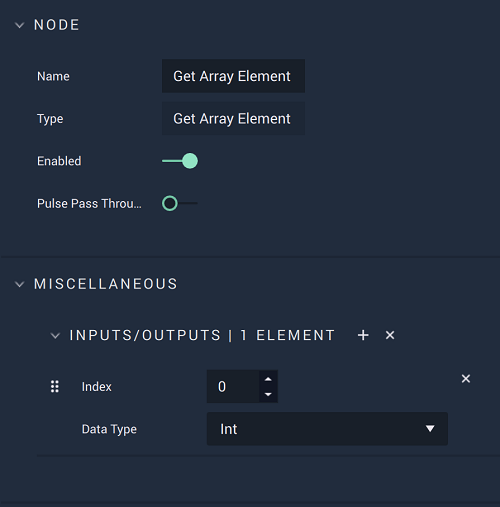

# Get Array Element

## Overview

**Get Array Element** is used for accessing elements in an **Array**. The **Node** accepts an **Array** and the _index/indices_ of the desired element/s in the **Array** and returns the desired element/s and the **Array** itself.

## Attributes

### Miscellaneous

`Inputs/Outputs` - The number of elements you want to get from the **Array**. Each element has the following **Attributes**:

| Attribute | Type | Description |
| :--- | :--- | :--- |
| `Default Index` | **Int** | The `Index` of the element you wish to return if no value is provided to the `Index` **Input** **Socket**. |
| `Data Type` | **Drop-down** | The `Data Type` of the `Index` element you wish to return. |

## Inputs

| Input | Type | Description |
| :--- | :--- | :--- |
| _Pulse Input_ \(►\) | **Pulse** | A standard **Input Pulse**, to trigger the execution of the **Node**. |
| `Array` | **Array** | The desired element/s will be returned from this **Array**. |
| `Index` | **Int** | The `Index` of the element you wish to return. |

## Outputs

| Output | Type | Description |
| :--- | :--- | :--- |
| _Pulse Output_ \(►\) | **Pulse** | A standard **Output Pulse**, to move onto the next **Node** along the **Logic Branch**, once this **Node** has finished its execution. |
| `Array` | **Array** | The **Array** provided to the **Input** **Socket**. |
| `Value` | _Defined in the_ `Data Type` _**Attribute**_. | The **Output** value accessed from the **Array**. |

## See Also

* [**Array Value**](array-value.md)

