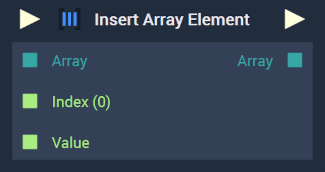

# Overview

The **Insert Array Element Node** adds an element, or elements, to an **Array**. These are inserted at a specified index and given a specified value.  

For example, an **Array** is populated as follows: $$[0,6,12]$$. If the *indices* $$1$$ and $$3$$ are given and the values $$3$$ and $$9$$ are defined, the elements at those *indices* are inserted and the user is left with a new **Array**: $$[0,3,6,9,12]$$. 

[**Scope**](../overview.md#scopes): **Project**, **Scene**, **Function**, **Prefab**.

# Attributes

|Attribute|Type|Description|
|---|---|---|
|`Index [n]`|**Drop-down**|Specifies each new element's `Index` in the **Array**, if one is not provided in the **Input Socket**.|
|`Data Type [n]`|**Drop-down**|Specifies each new element's `Data Type`, if one is not provided in the **Input Socket**.|
|`Value [n]`|**Drop-down**| Specifies each new element's `Value`, if one is not provided in the **Input Socket**.|

# Inputs

|Input|Type|Description|
|---|---|---|
|*Pulse Input* (►)|**Pulse**|A standard **Input Pulse**, to trigger the execution of the **Node**.|
|`Array`|**Array**|The starting **Array** to have element(s) added.|
|`Index (i)[n]`|**Int**|The index `i` where the element will be inserted. `n` determines the number of **Input Sockets** available.|
|`Value`|**Int**|The value(s) of the element(s) to be added.|

# Outputs

|Output|Type|Description|
|---|---|---|
|*Pulse Output* (►)|**Pulse**|A standard **Output Pulse**, to move onto the next **Node** along the **Logic Branch**, once this **Node** has finished its execution.|
|`Array`|**Int**|The resulting **Array** with the inserted element(s).|

# See Also 

* [**Remove Array Element**](remove-array-element.md)