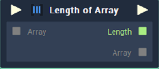

# Length of Array

## Overview

**Length Of Array** returns the total number of elements in an **Array**.

[**Scope**](../overview.md#scopes):
*  **Project**, **Scene**, **Function**, **Prefab**

## Inputs

| Input | Type | Description |
| :--- | :--- | :--- |
| _Pulse Input_ \(►\) | **Pulse** | A standard **Input Pulse**, to trigger the execution of the **Node**. |
| `Array` | **Array** | The **Array** whose length you wish to return. |

## Outputs

| Output | Type | Description |
| :--- | :--- | :--- |
| _Pulse Output_ \(►\) | **Pulse** | A standard **Output Pulse**, to move onto the next **Node** along the **Logic Branch**, once this **Node** has finished its execution. |
| `Length` | **Int** | The total number of elements in the **Input** **Array**. |
| `Array` | **Array** | The **Array** supplied to the **Input** **Socket**. |

## See Also

* [**Array Value**](array-value.md)

