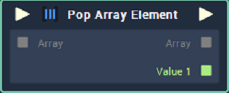

# Pop Array Element

## Overview

**Pop Array Element** removes element/s from an **Array** supplied to the **Node** and returns the resulting **Array** and the removed element/s. The element/s can be removed from either the _front_ or _back_ of the **Array**.

## Attributes

### Outputs

`Outputs` - The number of elements you wish to remove from the **Input** **Array**. Each element has the following **Attributes**:

| Attribute | Type | Description |
| :--- | :--- | :--- |
| `Data Type` | **Drop-down** | The `Data Type` of the element/s you wish to remove from the **Array**. |

### Mode

| Attribute | Type | Description |
| :--- | :--- | :--- |
| `Pop end` | **Bool** | If the _toggle_ is switched on, the desired element/s will be removed from the _back_ of the **Array**, otherwise they will be removed from the _front_ of the **Array**. |

## Inputs

| Input | Type | Description |
| :--- | :--- | :--- |
| _Pulse Input_ \(►\) | **Pulse** | A standard **Input Pulse**, to trigger the execution of the **Node**. |
| `Array` | **Array** | The **Array** whose element/s you wish to remove. |

## Outputs

<table>
  <thead>
    <tr>
      <th style="text-align:left">Output</th>
      <th style="text-align:left">Type</th>
      <th style="text-align:left">Description</th>
    </tr>
  </thead>
  <tbody>
    <tr>
      <td style="text-align:left"><em>Pulse Output</em> (&#x25BA;)</td>
      <td style="text-align:left"><b>Pulse</b>
      </td>
      <td style="text-align:left">A standard <b>Output Pulse</b>, to move onto the next <b>Node</b> along the <b>Logic Branch</b>,
        once this <b>Node</b> has finished its execution.</td>
    </tr>
    <tr>
      <td style="text-align:left"><code>Array</code>
      </td>
      <td style="text-align:left"><b>Array</b>
      </td>
      <td style="text-align:left">The resulting <b>Array</b> after the desired element/s are removed.</td>
    </tr>
    <tr>
      <td style="text-align:left">
        
<code>Value</code>
        

        
<code>[n]</code>
        

      </td>
      <td style="text-align:left"><em>Defined in the</em>  <code>Data Type</code>  <em><b>Attribute</b></em>.</td>
      <td
      style="text-align:left">The element/s removed from the <b>Array</b>.</td>
    </tr>
  </tbody>
</table>

## See Also

* [**Array Value**](array-value.md)
* [**Push Array Element**](push-array-element.md)

